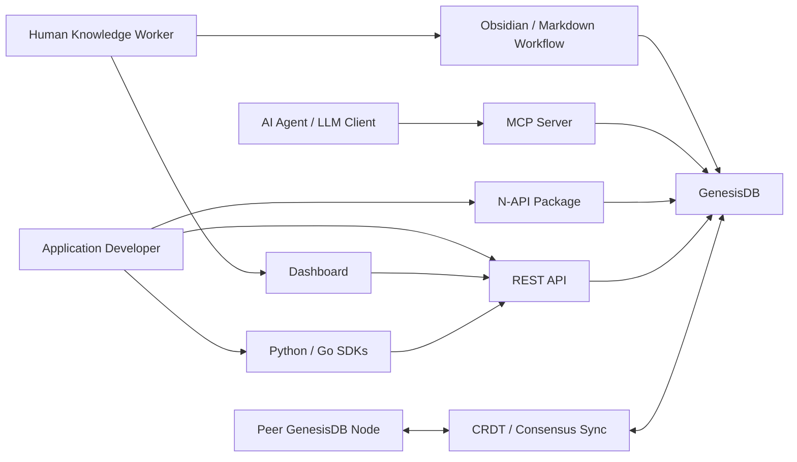
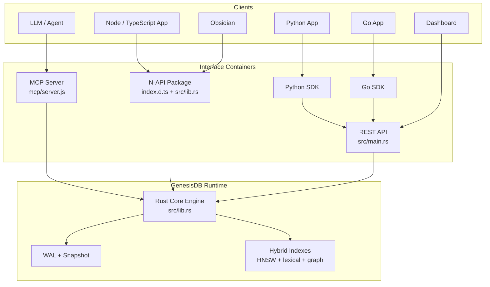

# C4--GENESISDB-ARCHITECTURE

> **Positioning & evidence (2026-06-21):** GenesisDB is an **embedded
> analytics / agent-memory graph + vector engine** (comparators: Kuzu,
> DuckDB+graph, RocksDB+graph; Neo4j/Qdrant as references). Measured performance
> & competitive results: [REPORT--2026-06-21-PERFORMANCE-AND-COMPETITIVE.md](REPORT--2026-06-21-PERFORMANCE-AND-COMPETITIVE.md)
> (audits P14–P25). Prior "<30 µs / 120 TPS" figures are retracted.

## 1. Purpose

เอกสารนี้เป็น architecture index และ SSOT map สำหรับ GenesisDB ในรูปแบบ C4:

- C1 - System Context
- C2 - Container
- C3 - Component
- C4 - Code / Low-Level

เอกสารนี้ไม่แทนที่ `docs/MASTER-SPEC--GENESIS-DB.md` แต่ทำหน้าที่เป็นแผนที่เชื่อมระหว่าง master spec, ADR, feature specs, interface docs, tests และ source code
เพื่อให้ agent และ maintainer เห็นว่า architecture แต่ละระดับควรอ่านจากไฟล์ใด และ drift ใดต้องถูกแก้หรือบันทึกไว้

## 2. SSOT Hierarchy

| Layer | Primary SSOT | Supporting Sources | Notes |
|---|---|---|---|
| C1 System Context | `docs/MASTER-SPEC--GENESIS-DB.md` | `README.md`, `docs/WHITEPAPER--GENESIS-DB.md`, `docs/WHITEPAPER--GENESIS-KNOWLEDGE-SYSTEM.md`, `ARCHITECTURE.md` | Defines GenesisDB as local-first hybrid knowledge engine for human-machine collaboration. |
| C2 Container | This document | `src/main.rs`, `mcp/server.js`, `index.d.ts`, SDK docs, dashboard docs | Container map is currently reconstructed from code and scattered docs. |
| C3 Component | `docs/SPEC--*.md`, `docs/DESIGN--*.md`, ADRs | `src/lib.rs`, `src/query/*`, tests | Component ownership is distributed by feature/spec. |
| C4 Code / Low-Level | Source code and targeted design docs | `src/lib.rs`, `src/main.rs`, `hql.pest`, `index.d.ts`, SDK clients | Low-level truth is code, but public behavior must be reflected upward into specs. |
| Governance | `AGENT.md`, `docs/TDD--DOCUMENTATION-GOVERNANCE-SSOT-ENFORCEMENT.md` | `.github/workflows/*`, future validator | Enforcement is designed but not yet implemented. |

## 3. C1 - System Context

GenesisDB is a local-first hybrid semantic-graph database engine. Its core responsibility is backend runtime behavior: durable storage, WAL/snapshot persistence, in-memory embedding storage, vector/HNSW indexing, symbolic graph relationships, graph traversal, HQL/AST execution, hybrid search, retrieval, community detection, and synchronization primitives.

### External Actors

| Actor | Goal | Interfaces |
|---|---|---|
| Human knowledge worker | Inspect or operate knowledge through optional clients | Obsidian plugin, dashboard, Markdown-facing flows |
| AI agent / LLM tool caller | Store, retrieve, and reason over structured knowledge | MCP server, REST API, N-API |
| Application developer | Embed GenesisDB into apps and tools | N-API package, Python SDK, Go SDK, REST |
| Peer GenesisDB node | Synchronize knowledge and participate in consensus | CRDT/gossip/consensus primitives |

### System Context Diagram



## 4. C2 - Containers

| Container | Responsibility | Current Source | Primary Docs |
|---|---|---|---|
| Rust Core Engine | Storage, WAL, indexing, graph traversal, HQL, reasoning, CRDT, consensus primitives | `src/lib.rs`, `hql.pest` | `MASTER-SPEC--GENESIS-DB.md`, feature specs, ADRs |
| Axum REST Server | HTTP API for bulk ingest, HQL, node/edge mutation, search, context, status | `src/main.rs` | `docs/API_REFERENCE.md` |
| N-API Package | Native Node/TypeScript bindings over Rust core | `src/lib.rs`, `index.d.ts`, `index.js` | `docs/API_REFERENCE.md`, NPM package metadata |
| MCP Server | Tool interface for LLM clients | `mcp/server.js` | `docs/MCP-GUIDE.md`, `docs/SPEC--MCP-SERVER.md` |
| Python SDK | Python REST client | `genesisdb-python/genesisdb/client.py` | `docs/PYTHON-SDK-GUIDE.md`, `docs/SPEC--PYTHON-SDK.md` |
| Go SDK | Go REST client | `genesisdb-go/client.go` | `docs/SPEC--GO-SDK.md` |
| Dashboard | Optional operational UI consuming status/search APIs | `dashboard/` | `docs/AUDIT--DASHBOARD-E2E.md` |
| Obsidian Plugin | Optional human-facing PKM bridge consuming engine interfaces | `obsidian-plugin/` if present | `docs/SPEC--OBSIDIAN-UI-INTEGRATION.md`, dual-track TDD |

### Container Diagram



## 5. C3 - Components

### Rust Core Engine Components

| Component | Responsibility | Source / Entry Points | Related Docs |
|---|---|---|---|
| Storage Model | Node/edge persistence, WAL, snapshots, recovery | `src/lib.rs` | master spec, batch atomicity, WAL ADR |
| In-Memory Embedding Arena | Runtime vector storage and embedding-backed retrieval state | `src/lib.rs` | master spec, HNSW hybrid index design |
| Hybrid Search | Vector and lexical retrieval with ranking | `src/lib.rs`, HNSW design | HNSW hybrid index design |
| Graph Retrieval Layer | Tiered context retrieval by hop budget and fuzzy matching | `src/lib.rs::retrieve_context` | `SPEC--GRAPH-RETRIEVAL-LAYER.md` |
| HQL Engine | Parse and execute search/traverse/context/infer queries | `src/lib.rs::execute_hql`, `hql.pest` | HQL section in master spec, API docs |
| Symbolic Graph / AST Boundary | Symbolic relationships, query grammar, and structured traversal semantics | `src/lib.rs`, `hql.pest` | master spec, HQL docs |
| K-Impact / Reasoning | Impact scoring, inference, structural insight, drift | `src/lib.rs` | K-impact specs, transitive inference design |
| Community Detection | Cluster/community discovery for graph insight and SuperNode generation | `src/lib.rs` | graph clustering and structural insight specs |
| Axiomatic Governance | Tier permissions and logical guardrails | `src/lib.rs` | governance ADR, axiomatic guards spec |
| CRDT / Sync | Event reconciliation and collaborative state handling | `src/lib.rs` | collaborative sync and gossip specs |
| Consensus | Proposal/vote/verification primitives | `src/lib.rs`, REST handlers if routed | neural consensus TDD |

### REST API Components

| Component | Routes | Source |
|---|---|---|
| Bulk ingest | `/v1/bulk/nodes`, `/v1/bulk/edges`, `/v1/bulk/rebuild` | `src/main.rs` |
| Query | `/v1/query/hql`, `/v1/query` | `src/main.rs` |
| Mutation | `/v1/node/add`, `/v1/node/supersede`, `/v1/edge/add` | `src/main.rs` |
| Retrieval | `/v1/search/hybrid`, `/v1/reason/context` | `src/main.rs` |
| Insight / status | `/v1/insight/drift/:cluster_id`, `/v1/status`, `/v1/swarm/status` | `src/main.rs` |

### MCP Components

| Tool | Responsibility | Source |
|---|---|---|
| `query_hql` | Execute HQL through the local GenesisDB binding | `mcp/server.js` |
| `retrieve_tiered_context` | Retrieve context for an agent target/tier | `mcp/server.js` |
| `add_knowledge` | Add node-like knowledge from an LLM client | `mcp/server.js` |

## 6. C4 - Code / Low-Level Anchors

The C4 code level is intentionally anchored to source files instead of duplicating implementation details in prose.

| Area | Code Anchor | Contract Anchor | Drift Sensitivity |
|---|---|---|---|
| Core database type and exported N-API class | `src/lib.rs` | `index.d.ts` | High |
| HQL execution | `src/lib.rs::execute_hql`, `hql.pest` | REST `/v1/query/hql`, SDK `query()` methods | High |
| REST route surface | `src/main.rs` route table | `docs/API_REFERENCE.md`, SDK clients | High |
| MCP tool surface | `mcp/server.js` tool definitions | `docs/MCP-GUIDE.md` | Medium |
| SDK request/response shapes | Python and Go SDK clients | API reference and REST handlers | High |
| Persistence safety | WAL/snapshot code in `src/lib.rs` | WAL ADR, audit reports | High |
| Optional dashboard status contract | `dashboard/` hooks/components and REST status routes | dashboard audit docs | Medium |

## 7. Known Architecture Drift

These findings are intentionally listed here until the governance validator can track them mechanically.

| Drift | Evidence | Expected Resolution |
|---|---|---|
| HQL REST body shape mismatch | REST handler accepts raw JSON string; Python/Go SDKs send `{ "query": hql }` | Decide one contract, update API docs, SDKs, and tests together |
| Dashboard audit target mismatch | Audit doc and e2e target URL differ | Align audit doc, Playwright config/spec, and dashboard scripts |
| Governance rules are documented but not enforced | No validator script, CI gate, or active git hook | Implement governance TDD Phase 2 |
| Some specs retain open DoD/review text while code exists | Multiple `SPEC--*.md` files | Baseline audit, then update status/changelog |
| Low-level C4 view is source-anchored only | No generated module map or symbol index | Add validator/report that extracts code anchors |

## 8. Change Rules

When changing architecture-relevant files:

1. If `src/lib.rs`, `src/main.rs`, `mcp/server.js`, `index.d.ts`, or SDK clients change, check this C4 index for affected layer.
2. If a public contract changes, update `docs/API_REFERENCE.md` and the related SDK/MCP docs.
3. If a component responsibility changes, update the C3 table and related spec/ADR.
4. If a container is added or removed, update the C2 diagram and SSOT hierarchy.
5. If agent workflow/governance changes, update `AGENT.md` and the governance TDD/changelog.

## 9. Validation Target

This file should eventually be validated by the governance checker:

```text
npm run governance:check
```

Expected checks:

- all C2 containers point to existing paths or explicit planned paths
- all high-drift anchors have at least one test or audit reference
- known drift entries are either open, waived, or closed with evidence
- public interface changes include docs and SDK updates

## CHANGELOG

| Version | Date | Status | Summary | Commit Hash | Agent |
|---------|------|--------|---------|-------------|-------|
| 0.1.2b | 2026-06-14 | candidate | Clarified GenesisDB as backend DB/runtime engine first and marked dashboard/Obsidian as optional consumers. | working-tree | ATHER |
| 0.1.1b | 2026-06-14 | candidate | Updated C1 supporting sources after moving the GKS whitepaper into docs. | 4101228 | ATHER |
| 0.1.0b | 2026-06-13 | candidate | Initial C4 architecture index and SSOT map. | 9b1ced3 | ATHER |
