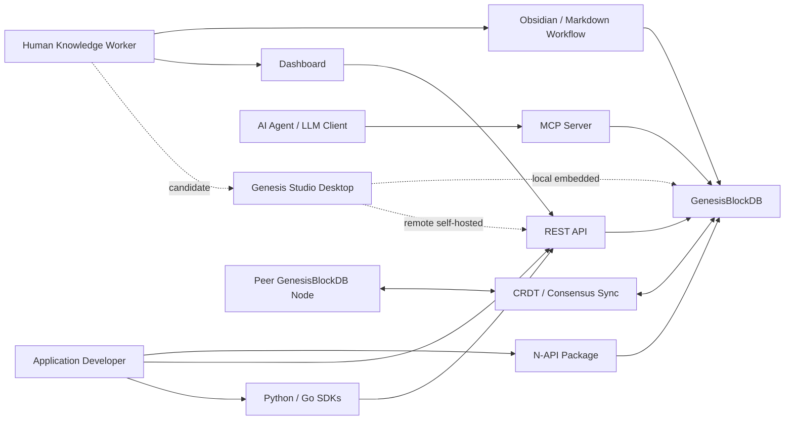
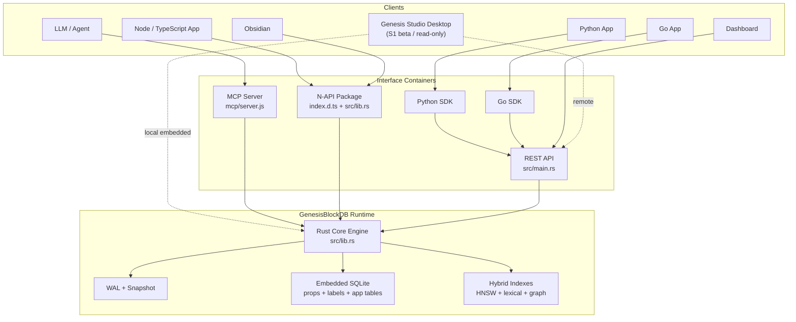
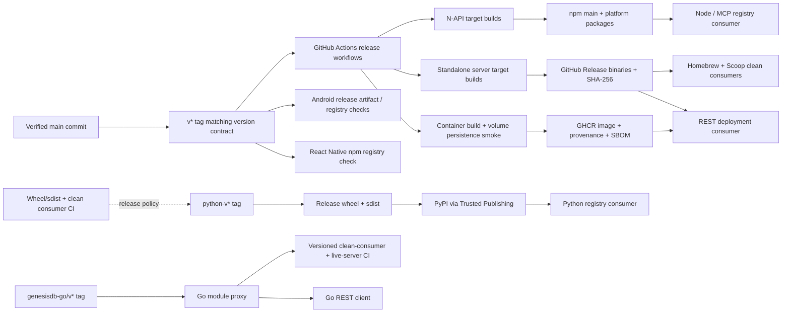

# C4--GENESISDB-ARCHITECTURE

The staged UEE-HQL2 query architecture is governed by the owner-approved
[HQL2 execution ADR](adr/ADR--GENESISDB-HQL2-EXECUTION-BOUNDARY.md).
The reference interpreter is test-only; explicit v2 production binding,
planning and execution require their own verified phase evidence.
The owner-approved [G4 shared-pipeline ADR](adr/ADR--GENESISDB-HQL2-G4-SHARED-PIPELINE.md)
defines the review boundary for one parity-proven HQL1/HQL2/Query IR v2
binder, deterministic first planning, plan-only `EXPLAIN` and measured
read-only `ANALYZE`. The current implementation slice adds stable planner
metadata and a shared plan hash to `EXPLAIN`/`ANALYZE`; G4 remains partial.
HQL compatibility, `query-ir.v1`, public transport, persistence and release
boundaries remain unchanged.
The [P8 core checkpoint](REPORT--HQL2-P8-CORE-2026-09-28.md) introduces
`src/query/hql2/` plus one serialized Storage boundary.
Core execution now combines scalar kernels, revision-bound Node/Edge/Row/
Annotation scans, AnnotationLookup, exact KNN and Original Rerank. Vector reads
use original schema-v6 revisions under the P6 lease and H2-D11 collection-space
fingerprint; transport parity remains a separate open gate.
The owner-approved [H2-D11 contract](adr/ADR--GENESISDB-HQL2-DURABLE-REVISIONS-ANNOTATIONS.md)
defines durable record revisions, row registry IDs, annotation authorization and an explicit
schema-v6 migration path. Local graph and relational row revisions, KeyCodec
registry persistence, replay and cold projection rebuild have fixture-backed
implementation evidence. The amended schema-v5-to-v6 migration/recovery path
now passes 19 dedicated tests using temporary fixtures, including resume,
fold/rebuild authority and peer isolation. Vector writes now persist durable
owner-bound revisions and collection-space fingerprints with 2/2 focused tests.
Annotation CAS writes now normalize separate target/evidence rows, reject
unverified lineage/cycles before WAL append, and store version-2 annotation ACL
policy events; 8 focused tests pass. Node/Edge/Row/Annotation scans now return
lease-bound revision references with source filters, bounded keyset pagination,
row-catalog checks, annotation reference ACL, and budgeted selective property
projection through binder-issued `FieldIdV2`/`ExecBatchV2` batches. Dynamic field
names and stable row-key alignment are covered; whole JSON payloads are no longer
retained in query rows. A focused HQL/IR differential confirms Node/Edge/Row
property hydration: RowScan reads columns from the H2-D11 `after_image`, while
`r.id` remains the UUIDv4 revision distinct from the relational primary key.
The regression and correction are recorded in local RCA `.brain/rca/RCA--HQL2-ROW-SOURCE-PROPERTY-HYDRATION.md`.
AnnotationLookup matches targets only, checks
target/evidence resources under its P6 lease, applies frozen/live revision
binding and supports optional/required forms. The pre-Match P8/P6/H2-D11 fixture
baseline passed 206 tests across 21 targets, with zero failures and one ignored
parser child entrypoint exercised by its parent. Compact and structural
multi-segment Sequence Expand now work through HQL and typed IR under one P6
lease, with bounded per-step hops, global path uniqueness, optional results,
per-step aliases, typed paths, deterministic ordering and graph-work counters.
Structural root Match now runs compact/Sequence patterns through HQL and typed
IR, including deterministic SHORTEST selection per endpoint pair. Typed-IR
anchors compare full validated RecordRefs without a direct lookup and filter
before SHORTEST deduplication; focused Match/value tests pass 12/12 and 6/6.
Sequence node-ID, conjunctive-label and exact JSON node/edge property
constraints now execute through HQL and typed IR under one P6 lease. Missing,
null and mismatched values remain distinct; selective property hydration and
per-candidate work limits are tested, with filtering before deterministic
SHORTEST selection, including the constrained-edge regression. Compact
constraints remain unsupported and fail closed.
HistoryScan and ChangeScan now enumerate exact retained schema-v6 revisions under
the P6 ReadView with source floors and recursive current reference ACL.
Annotation subjects in source scans and ChangeScan additionally require explicit
Annotation(Read), separate from the Namespace(Read) query grant; the broad
namespace grant still authorizes same-namespace references. Their
focused target now passes 17/17, including one selected transaction frontier
across HQL/IR source scans, graph/vector/annotation operators, hydration and
`Snapshot.tx`. HQL2/IR `tx_as_of` fails closed below history/source floors and
never falls back to current rows; the validated P6 generation and current
policy remain pinned. Five focused targets pass 56/56; a five-window
ChangeScan P7 differential verifies exclusive-after/inclusive-through bounds,
including empty bounds and selected transaction frontiers. The current
35-target HQL2 regression sweep passes 394/0/1; selected P6 peer tests pass
45/0/0 across seven targets. The earlier separate 11-target P6/schema-v6/
compatibility sweep passes 194/0/0. These are local regression results, not
broad P8/P13, transport, hosted CI or independent-review acceptance.
Storage-backed HQL/typed-IR HistoryScan bags for Node, Edge, Row, Vector and
Annotation match independent P7 catalogs assembled from WAL-derived revision
facts and captured transaction/valid-time windows; endpoint, vector-owner and
annotation-reference ACL dependencies are covered. Artifact HistoryScan remains
unsupported. P7 graph and combined targets pass 39/39 and 130/130; the annotation
source/ACL target passes 7/7.
Structural unsigned HQL parameters now bind only
exact typed `DecimalU64` values for TAKE/SKIP/CHANGE/KNN/RERANK, without casts;
KNN/RERANK bounds are checked before lowering. Omitted HQL2 null placement now
defaults to NULLS LAST in both sort directions; explicit placement remains
unchanged. Approved P8 addendum D1-D5 now has local implementation evidence:
D1 preserves P6 authorization before parse; D2 registers immutable
`unicode-whitespace-bm25-v1` and exact lease-visible ranking; D3 emits
`unicode-scalar-v1` context with source hash and scalar offsets; D4 evaluates
Sequence node/edge JSON properties under the lease before SHORTEST; D5 binds
contextual NULL/list/JSON values with exact serialized-size preflight. The
preflight accounts for JSON syntax, primitive values and escaped UTF-8 strings;
three lowerer unit tests cover the size boundary. The focused P8 completion
target passes 10/10. The D7 actor-scoped bridge accepts differential-tested
zero-hop ID projections (unlabeled or with one plain-ASCII label), one
unlabeled zero-hop single-property projection, bounded unlabeled one-hop ID
projections, and exact-seed depth-one `TRAVERSE` ID projection over one
physical relation or `ANY` in default/out/in/both directions, through
`Storage::query_v2`. Property reads preserve missing/explicit-null values and
legacy bag multiplicity; traversal excludes the seed and deduplicates projected
target IDs. Existing one-hop endpoint-ID filtering and projected-ID ordering
remain supported; other unproven shapes stay fail-closed. Legacy parser
resources are preflighted and reserved before AST construction. Adapter,
property, ordering and labeled-filter targets pass 13/13, 2/2, 2/2 and 2/2;
the fresh root-HQL2 sweep passes 404/0/1 across 39 targets and U9 restore passes
7/7. Independent review found no runtime parity or authorization defect in
the earlier labeled-ID extension; independent review of this D7 extension
remains pending. A storage-backed
HQL/typed-IR scalar differential matches the
independent P7 interpreter for all 81 four-value nullable bags (1/1 test, 162
executions). A storage-backed aggregate differential covers 121 nullable bags
of lengths 0-4 and seven functions (1/1 test, 242 executions). A storage-backed
HQL and typed-IR Join differentials match independent P7 for Inner/Left/Semi/Anti
with duplicate, missing-property NULL and JSON-null keys (5/7/3/2 output rows).
HQL `JOIN TABLE` lowers to the existing RowScan/Join contract; bare JOIN
defaults to Inner and Semi/Anti do not export the right scope. The explicit
root-HQL2 sweep passes 404/0/1 across all 39 root targets. A test-only optional
Sequence edge-property-miss differential matches independent P7, preserving
four input rows and NULL-extending endpoint/edge aliases. The nested-JSON
Sequence property differential also matches exact node/edge objects and arrays
(including nested JSON null) through HQL and typed IR against P7, excluding
near-match candidates. The HQL/typed-IR
`Values`/`UnionAll` differential matches independent P7 for 169 nullable bag
pairs (338 Storage executions), retaining NULL and duplicate multiplicity.
A second scalar-pipeline differential adds six fixtures and 12 Storage
executions for HQL/typed-IR projection, arithmetic, filtering, distinct,
ordering, offset and take; both frontends match independent P7 and each other.
The storage-backed HQL/typed-IR Node/Edge/Row source-scan bags also match
independent P7, excluding wrong labels/relations and retaining two row keys;
the focused storage-source target passes 10/10.
These remain test-only results, not broad P8 acceptance.
A separate earlier 11-target P6/schema-v6/compatibility
group passes 194/0/0. The legacy parser preflight correction is recorded in the
Local RCA: `.brain/rca/RCA--HQL1-ADAPTER-PARSER-RESERVATION.md`.
The ignored parser
child entrypoint is exercised by its parent. Independent read-only review found
no concrete static defect in the earlier D1-D6 slice; D7 independent review
remains pending. These are local regression results, not broad exact-oracle,
shared-runtime, resource/cancellation, transport, or full P8/P13 acceptance;
those gates remain open.
No user database has been migrated. The owner
approved ADR R6a v0.4.0b on 2026-09-29; migration implementation is restricted
to temporary fixtures and is not release qualification.

> **Positioning & evidence (2026-06-21):** GenesisBlockDB is an **embedded
> analytics / agent-memory graph + vector engine** (comparators: Kuzu,
> DuckDB+graph, RocksDB+graph; Neo4j/Qdrant as references). Measured performance
> & competitive results: [REPORT--2026-06-21-PERFORMANCE-AND-COMPETITIVE.md](REPORT--2026-06-21-PERFORMANCE-AND-COMPETITIVE.md)
> (audits P14–P25). Prior "<30 µs / 120 TPS" figures are retracted.

## 1. Purpose

เอกสารนี้เป็น architecture index และ SSOT map สำหรับ GenesisBlockDB ในรูปแบบ C4:

- C1 - System Context
- C2 - Container
- C3 - Component
- C4 - Code / Low-Level

เอกสารนี้ไม่แทนที่ `docs/MASTER-SPEC--GENESIS-DB.md` แต่ทำหน้าที่เป็นแผนที่เชื่อมระหว่าง master spec, ADR, feature specs, interface docs, tests และ source code
เพื่อให้ agent และ maintainer เห็นว่า architecture แต่ละระดับควรอ่านจากไฟล์ใด และ drift ใดต้องถูกแก้หรือบันทึกไว้

## 2. SSOT Hierarchy

| Layer | Primary SSOT | Supporting Sources | Notes |
|---|---|---|---|
| C1 System Context | `docs/MASTER-SPEC--GENESIS-DB.md` | `README.md`, `docs/WHITEPAPER--GENESIS-DB.md`, `docs/WHITEPAPER--GENESIS-KNOWLEDGE-SYSTEM.md`, `ARCHITECTURE.md` | Defines GenesisBlockDB as local-first hybrid knowledge engine for human-machine collaboration. |
| C2 Container | This document | `src/main.rs`, `mcp/server.js`, `index.d.ts`, SDK docs, dashboard docs | Container map is currently reconstructed from code and scattered docs. |
| C3 Component | `docs/SPEC--*.md`, `docs/DESIGN--*.md`, ADRs | `src/lib.rs`, `src/query/*`, tests | Component ownership is distributed by feature/spec. |
| C4 Code / Low-Level | Source code and targeted design docs | `src/lib.rs`, `src/main.rs`, `hql.pest`, `index.d.ts`, SDK clients | Low-level truth is code, but public behavior must be reflected upward into specs. |
| Governance | `AGENT.md`, `docs/TDD--DOCUMENTATION-GOVERNANCE-SSOT-ENFORCEMENT.md` | `.github/workflows/*`, future validator | Enforcement is designed but not yet implemented. |

## 3. C1 - System Context

GenesisBlockDB is a local-first relational + graph + vector database operational boundary. Its Rust runtime owns signed-WAL durability, an embedded SQLite relational projection, native graph traversal, per-collection vector/HNSW indexes, typed/native APIs, HQL compatibility execution, retrieval, and synchronization primitives. Typed Query IR is the accepted primary query boundary but remains planned until its conformance gate passes; free-form NL interpretation remains outside the engine.

### External Actors

| Actor | Goal | Interfaces |
|---|---|---|
| Human knowledge worker | Inspect or operate knowledge through optional clients | Obsidian plugin, dashboard, planned Genesis Studio, Markdown-facing flows |
| AI agent / LLM tool caller | Store, retrieve, and reason over structured knowledge | Current MCP/REST/N-API; planned external NL adapter producing typed Query IR |
| Application developer | Embed GenesisBlockDB into apps and tools | N-API package, Python SDK, Go SDK, REST |
| Peer GenesisBlockDB node | Synchronize knowledge and participate in consensus | CRDT/gossip/consensus primitives |

### System Context Diagram


```mermaid
flowchart LR
    human["Human Knowledge Worker"] --> obsidian["Obsidian / Markdown Workflow"]
    human --> dashboard["Dashboard"]
    human -. candidate .-> studio["Genesis Studio Desktop"]
    agent["AI Agent / LLM Client"] --> mcp["MCP Server"]
    app["Application Developer"] --> napi["N-API Package"]
    app --> rest["REST API"]
    app --> sdk["Python / Go SDKs"]
    peer["Peer GenesisBlockDB Node"] <--> sync["CRDT / Consensus Sync"]

    obsidian --> core["GenesisBlockDB"]
    dashboard --> rest
    studio -. local embedded .-> core
    studio -. remote self-hosted .-> rest
    mcp --> core
    napi --> core
    rest --> core
    sdk --> rest
    sync <--> core
```

## 4. C2 - Containers

| Container | Responsibility | Current Source | Primary Docs |
|---|---|---|---|
| Rust Core Engine | Unified lifecycle, signed WAL, SQLite projection, native graph/vector indexes, HQL compatibility, reasoning, CRDT, consensus primitives | `src/lib.rs`, `src/query/*` | `MASTER-SPEC--GENESIS-DB.md`, unified-boundary spec, feature specs, ADRs |
| Axum REST Server | HTTP API for bulk ingest, HQL, node/edge mutation, search, context, status | `src/main.rs`, `src/router.rs` | `docs/API_REFERENCE.md` |
| N-API Package | Native Node/TypeScript bindings over Rust core | `src/lib.rs`, `index.d.ts`, `index.js` | `docs/API_REFERENCE.md`, NPM package metadata |
| GenesisRAG17 TEST worker | Separate client integration process for physical Stage 13/15/16 writes, six-lane readback, publication and loopback query | `genesisrag17-worker/` | `docs/ADR--GENESISRAG17-SEPARATE-WORKER-PUBLICATION.md`, `docs/FLOW--GENESISRAG17-PIPELINE.md` |
| MCP Server | Tool interface for LLM clients | `mcp/server.js` | `docs/MCP-GUIDE.md`, `docs/SPEC--MCP-SERVER.md` |
| Python SDK | Python REST client | `genesisdb-python/genesisdb/client.py` | `docs/PYTHON-SDK-GUIDE.md`, `docs/SPEC--PYTHON-SDK.md` |
| Go SDK | Go REST client | `genesisdb-go/client.go` | `docs/SPEC--GO-SDK.md` |
| Dashboard | Optional operational UI consuming status/search APIs | `dashboard/` | `docs/AUDIT--DASHBOARD-E2E.md` |
| Genesis Studio Desktop (S1 beta) | Tauri + React read-only controller with fixture, exclusive local embedded and API-key-capable remote transports; bounded graph/entity/HQL/logical-relational contracts are core-owned | `studio/`, `src/lib.rs`, `src/router.rs` | `docs/SPEC--GENESIS-STUDIO-DESKTOP.md` |
| Obsidian Plugin | Optional human-facing PKM bridge consuming engine interfaces | `obsidian-plugin/` if present | `docs/SPEC--OBSIDIAN-UI-INTEGRATION.md`, dual-track TDD |

### Container Diagram


```mermaid
flowchart TB
    subgraph clients["Clients"]
        llm["LLM / Agent"]
        ts["Node / TypeScript App"]
        py["Python App"]
        go["Go App"]
        ui["Dashboard"]
        studio["Genesis Studio Desktop\n(S1 beta / read-only)"]
        obs["Obsidian"]
    end

    subgraph interfaces["Interface Containers"]
        mcp["MCP Server\nmcp/server.js"]
        napi["N-API Package\nindex.d.ts + src/lib.rs"]
        rest["REST API\nsrc/main.rs"]
        sdkpy["Python SDK"]
        sdkgo["Go SDK"]
    end

    subgraph engine["GenesisBlockDB Runtime"]
        core["Rust Core Engine\nsrc/lib.rs"]
        wal["WAL + Snapshot"]
        sqlite["Embedded SQLite\nprops + labels + app tables"]
        index["Hybrid Indexes\nHNSW + lexical + graph"]
    end

    llm --> mcp
    ts --> napi
    py --> sdkpy --> rest
    go --> sdkgo --> rest
    ui --> rest
    studio -. remote .-> rest
    studio -. local embedded .-> core
    obs --> napi
    mcp --> core
    napi --> core
    rest --> core
    core --> wal
    core --> sqlite
    core --> index
```

### Distribution and Release Flow

The distribution boundary packages one engine through independent release
channels. `Cargo.toml` anchors the engine build version. `scripts/version.mjs`
checks `Cargo.lock`, `package.json`, `package-lock.json`, and `modules.json`;
`docs/VERSION.md` is the human-readable record maintained alongside them. The
Python SDK has its own `python-v*` tag, the Go submodule uses
`genesisdb-go/v*`, and mobile SDK versions remain independent.


```mermaid
flowchart LR
    main["Verified main commit"] --> engineTag["v* tag matching version contract"]
    engineTag --> releaseActions["GitHub Actions release workflows"]
    releaseActions --> napiBuild["N-API target builds"]
    napiBuild --> npm["npm main + platform packages"]
    releaseActions --> serverBuild["Standalone server target builds"]
    serverBuild --> ghRelease["GitHub Release binaries + SHA-256"]
    releaseActions --> containerSmoke["Container build + volume persistence smoke"]
    containerSmoke --> ghcr["GHCR image + provenance + SBOM"]
    engineTag --> android["Android release artifact / registry checks"]
    engineTag --> rn["React Native npm registry check"]
    ghRelease --> packageManagers["Homebrew + Scoop clean consumers"]

    pythonCi["Wheel/sdist + clean consumer CI"] -. release policy .-> pythonTag["python-v* tag"]
    pythonTag --> pypiBuild["Release wheel + sdist"]
    pypiBuild --> pypi["PyPI via Trusted Publishing"]
    goTag["genesisdb-go/v* tag"] --> goProxy["Go module proxy"]
    goProxy --> goCheck["Versioned clean-consumer + live-server CI"]

    npm --> consumerNpm["Node / MCP registry consumer"]
    ghRelease --> consumerServer["REST deployment consumer"]
    ghcr --> consumerServer
    pypi --> consumerPython["Python registry consumer"]
    goProxy --> consumerGo["Go REST client"]
```

The diagram shows the artifact routes, while release status is verified
separately against the hosted registries. The `v0.2.7` release publishes the
main npm package (including the MCP CLI), standalone server binaries with
SHA-256 sidecars, and the public GHCR image. The GHCR image was anonymously
pulled and passed a volume persistence smoke. Homebrew and Scoop install those
checksummed release binaries in clean consumer jobs. The Go submodule tag
`genesisdb-go/v0.1.0` passed proxy resolution and a live-server consumer check.

The Python package `genesisblockdb-client==0.1.0` is now published on PyPI.
After the pending publisher was configured, the `python-v0.1.0` tag publish
passed in [run 36305930749](https://github.com/Freshair129/GenesisBlock/actions/runs/36305930749).
A clean public registry consumer passed in
[run 36322437144](https://github.com/Freshair129/GenesisBlock/actions/runs/36322437144).
The root Rust crate remains source-only by the accepted crates.io ADR. The iOS
release-asset path remains the published binary path; no root-level SwiftPM
package is claimed.

## 5. C3 - Components

### Rust Core Engine Components

| Component | Responsibility | Source / Entry Points | Related Docs |
|---|---|---|---|
| Storage Model | One operational boundary over signed WAL, SQLite projection, native snapshots, replay/recovery, commit publication and embedded opaque backup/clean-target restore | `src/lib.rs` | master spec, unified-boundary spec, SQLite substrate ADR, `SPEC--GENESISDB-BACKUP-RESTORE-U9`, [Wave A commit contract](SPEC--WAVE-A-COMMIT-CORRECTNESS.md) |
| Relational Projection | Paged node properties, normalized labels, versioned app schemas, typed mutation batches and bounded named joins; SQLite remains a WAL-rebuildable internal projection | `src/lib.rs` (`projection_*`, `register_relational_schema`, `apply_relational_batch`, `execute_named_query`) | `SPEC--SQLITE-SUBSTRATE-S0-S1`, `SPEC--GENESISDB-RELATIONAL-APPLICATION-CONTRACT-U2` |
| Vector Collections | Per-model/dim isolated vector spaces (`collections: DashMap<String, Arc<VectorCollection>>`, each with its own arena + metadata + HNSW + metric); a `default` collection always exists. Async indexing thread (off the write path), plus explicit structural source-to-HNSW coverage validation. | `src/lib.rs` | master spec, HNSW hybrid index design, `ADR--GENESISDB-MULTI-COLLECTION`, `ADR--GENESISDB-ASYNC-INDEXING`, `ADR--GENESISDB-INDEX-COVERAGE-LIFECYCLE` |
| Hybrid Search | Per-collection vector + lexical retrieval with ranking; query dim validated against the collection | `src/lib.rs`, HNSW design | HNSW hybrid index design |
| Graph Retrieval Layer | Tiered context retrieval by hop budget and fuzzy matching | `src/lib.rs::retrieve_context` | `SPEC--GRAPH-RETRIEVAL-LAYER.md` |
| Typed Query IR Boundary (partial) | Validate and dispatch versioned structured search/traverse, linear `match_path` and target-id context queries consistently across public surfaces | `src/lib.rs::execute_query_ir`, `src/router.rs` `/v1/query/ir`; query-vector/temporal context and relational named queries remain planned or unsupported | `ADR--GENESISDB-TYPED-QUERY-IR-AGENT-BOUNDARY`, `SPEC--GENESISDB-TYPED-QUERY-IR-V1` |
| HQL Compatibility Frontend | Parse and execute current search/traverse/path/context queries without owning storage semantics | `src/lib.rs::execute_hql`, `src/query/*` | HQL section in master spec, API docs |
| Symbolic Graph / AST Boundary | Symbolic relationships, query grammar, and structured traversal semantics | `src/lib.rs`, `hql.pest` | master spec, HQL docs |
| K-Impact / Reasoning | Impact scoring, inference, structural insight, drift | `src/lib.rs` | K-impact specs, transitive inference design |
| Community Detection | Cluster/community discovery for graph insight and SuperNode generation | `src/lib.rs` | graph clustering and structural insight specs |
| Axiomatic Governance | Tier permissions and logical guardrails | `src/lib.rs` | governance ADR, axiomatic guards spec |
| CRDT / Sync | Event reconciliation and collaborative state handling | `src/lib.rs` | collaborative sync and gossip specs |
| Consensus | Proposal/vote/verification primitives | `src/lib.rs`, REST handlers if routed | neural consensus TDD |

### GenesisRAG17 TEST integration component

The GenesisRAG17 worker is an external adapter around the public native
boundary, not a new GenesisBlockDB core subsystem. It owns one native store
process and a worker-owned SQLite FTS5 lexical sidecar. MSP authenticates and
relays pipeline messages; GKS remains the passive semantic and quality
authority. The physical sequence is graph-only Stage 13 write and receipt,
GKS Stage 14 enrichment, real Stage 15 embedding, Stage 16 index/readback,
GKS Stage 17 gate, atomic worker publication and publication receipt.

| Component | Responsibility | Source / Entry Points | Related Docs |
|---|---|---|---|
| GenesisRAG17 worker adapter | Native graph/vector/SQLite readback, worker FTS5, per-generation query, durable outboxes and atomic publication for the isolated TEST flow | `genesisrag17-worker/src/worker.mjs`, `genesisrag17-worker/src/index.mjs`, `genesisrag17-worker/src/msp-stdio.mjs` | `docs/ADR--GENESISRAG17-SEPARATE-WORKER-PUBLICATION.md`, `docs/FLOW--GENESISRAG17-PIPELINE.md`, `docs/GENESISRAG17-EXTENSION-MAP.md` |

The native engine remains client-neutral. The current candidate engine source
and qualification status are recorded in the
[GenesisRAG17 worker ADR](ADR--GENESISRAG17-SEPARATE-WORKER-PUBLICATION.md);
the prior pin is retained there as historical integration evidence. This
container is TEST evidence; it does not grant the worker direct GKS, MSP
database or Edge store access.

### REST API Components

| Component | Routes | Source |
|---|---|---|
| Bulk ingest | `/v1/bulk/nodes`, `/v1/bulk/edges`, `/v1/bulk/rebuild` | `src/router.rs` |
| Query | `/v1/query/hql`, `/v1/query` | `src/router.rs` |
| Typed Query IR | `/v1/query/ir`, `/v1/query/ir/capabilities` | `src/router.rs` |
| Mutation | `/v1/node/add`, `/v1/node/supersede`, `/v1/edge/add`, `/v1/edge/retract`, `/v1/vector/add` | `src/router.rs` |
| Relational | `/v1/relational/schema/register`, `/v1/relational/schema/:namespace`, `/v1/relational/mutate`, `/v1/relational/query` | `src/router.rs` |
| Collections | `/v1/collection/create`, `/v1/collections` | `src/router.rs` |
| Retrieval | `/v1/search/hybrid`, `/v1/reason/context` | `src/router.rs` |
| Insight / status | `/v1/insight/drift/:cluster_id`, `/v1/insight/communities`, `/v1/insight/gaps`, `/v1/insight/rebuild`, `/v1/status`, `/v1/version`, `/v1/swarm/status` | `src/router.rs` |

### MCP Components

| Tool | Responsibility | Source |
|---|---|---|
| `query_hql` | Execute HQL through the local GenesisBlockDB binding | `mcp/server.js` |
| `retrieve_tiered_context` | Retrieve context for an agent target/tier | `mcp/server.js` |
| `add_knowledge` | Add node-like knowledge from an LLM client | `mcp/server.js` |

## 6. C4 - Code / Low-Level Anchors

The C4 code level is intentionally anchored to source files instead of duplicating implementation details in prose.

| Area | Code Anchor | Contract Anchor | Drift Sensitivity |
|---|---|---|---|
| Core database type and exported N-API class | `src/lib.rs` | `index.d.ts` | High |
| HQL execution | `src/lib.rs::execute_hql`, `hql.pest` | REST `/v1/query/hql`, SDK `query()` methods | High |
| Typed Query IR (partial) | `src/lib.rs::execute_query_ir`, `src/router.rs` `/v1/query/ir` | `SPEC--GENESISDB-TYPED-QUERY-IR-V1`, `index.d.ts` | High |
| REST route surface | `src/router.rs` route table | `docs/API_REFERENCE.md`, SDK clients | High |
| MCP tool surface | `mcp/server.js` tool definitions | `docs/MCP-GUIDE.md` | Medium |
| SDK request/response shapes | Python and Go SDK clients | API reference and REST handlers | High |
| Persistence safety | WAL/snapshot code in `src/lib.rs` | WAL ADR, audit reports | High |
| HNSW structural coverage | `Storage::validate_index_coverage`, `CollectionInfo.coverage` | `ADR--GENESISDB-INDEX-COVERAGE-LIFECYCLE` | High |
| Optional dashboard status contract | `dashboard/` hooks/components and REST status routes | dashboard audit docs | Medium |
| Studio S1 transport, scene and ownership contracts | `studio/src/domain/*`, `studio/src/transports/*`, `studio/src-tauri/*`, `src/lib.rs`, `src/router.rs` | `SPEC--GENESIS-STUDIO-DESKTOP` | High |

## 7. Known Architecture Drift

These findings are intentionally listed here until the governance validator can track them mechanically.

| Drift | Evidence | Expected Resolution |
|---|---|---|
| HQL REST body shape mismatch | REST handler accepts **both** via `#[serde(untagged)] HqlBody` in `src/router.rs`: raw JSON string AND `{ "query": hql }` | Resolved — both shapes accepted; covered by `tests/rest_api_tests.rs` |
| Dashboard audit target mismatch | Audit doc and e2e target URL differ | Align audit doc, Playwright config/spec, and dashboard scripts |
| Governance rules are documented but not enforced | No validator script, CI gate, or active git hook | Implement governance TDD Phase 2 |
| Some specs retain open DoD/review text while code exists | Multiple `SPEC--*.md` files | Baseline audit, then update status/changelog |
| Low-level C4 view is source-anchored only | No generated module map or symbol index | Add validator/report that extracts code anchors |
| Genesis Studio production operations remain gated | S1 read paths, bounded graph DTOs, capability negotiation and exclusive process ownership exist; lifecycle backup/restore and OIDC/JWT scoped authorization do not | Keep mutation/operations UI disabled until server-side scopes and operator contracts pass their S2-S4 reviews |
| Typed Query IR V1 is partially implemented | Search/traverse, linear `match_path` and target-id context exist in core, REST and N-API; query-vector/temporal context and relational named-query remain planned; external NL stays outside the engine | Keep capability reporting operation-specific and complete remaining operations only through separate reviewed slices |

## 8. Change Rules

When changing architecture-relevant files:

1. If `src/lib.rs`, `src/main.rs`, `src/router.rs`, `mcp/server.js`, `index.d.ts`, or SDK clients change, check this C4 index for affected layer.
2. If a public contract changes, update `docs/API_REFERENCE.md` and the related SDK/MCP docs.
3. If a component responsibility changes, update the C3 table and related spec/ADR.
4. If a container is added or removed, update the C2 diagram and SSOT hierarchy.
5. If agent workflow/governance changes, update `AGENT.md` and the governance TDD/changelog.

## 9. Validation Target

This file should eventually be validated by the governance checker:

```text
npm run governance:check
```

Expected checks:

- all C2 containers point to existing paths or explicit planned paths
- all high-drift anchors have at least one test or audit reference
- known drift entries are either open, waived, or closed with evidence
- public interface changes include docs and SDK updates

Wave A (R-01/R-08) uses a reentrant commit boundary across supported query reads,
projection/graph publication and maintenance. Unified relational constraints are
preflighted before WAL append; uncertain or durable-but-unapplied writes require
reopen and block query/write/checkpoint paths. Concurrent reads serialize; this
is not MVCC. Validation and limitations: [Wave A](SPEC--WAVE-A-COMMIT-CORRECTNESS.md).

Wave B (R-02/R-03, approved 2026-09-08) journals immutable collection definitions
including empty/default spaces and preserves calibration and exact rerank rows
through fold/recovery. Disk schema is 4; derived SQLite projection schema is 5.
Edge replacement rewires both adjacency directions and `edge_versions` selects
replica-local transaction intervals. History is available only from the reported
edge-history floor. New-reader preflight rejects unsupported complete frames;
old-engine use of a manually stripped journal-only v4 copy is unsupported.
See [Wave B contract and verification record](SPEC--WAVE-B-DURABLE-COLLECTIONS-EDGE-HISTORY.md).
These are local implementation contracts, not deployment or consumer migration evidence.

P6 (architecture correction approved 2026-09-22) specifies signed generation publication after
HNSW flush and validated snapshot, opaque fenced read leases, explicit temporal binding, signed
revision-checked ACL policy events, and schema-v5 fail-closed snapshot recovery. This is the
approved implementation target; it is not evidence that code or external consumers have passed
the P6 gates. Graph/vector records remain in the logical default namespace until an independent
entity namespace migration is approved. See [P6 generation/lease/ACL specification](SPEC--GENESISDB-P6-GENERATIONS-LEASES-ACL.md).

For schema-v6 WAL-only cold recovery, preflight signed journal authority before projection replay.
`Schema6ActivationV1` selects v6 only when identity and any linked migration/receipt proof validate;
v6-only WAL without activation fails closed. See H2-D11 ADR R6b and the P6 recovery contract.

H2-D11 R5 backup restoration validates extracted staging with full retention, requires normal
recovery to reproduce the bundle's final WAL-frame frontier, then publishes or reuses a P6
generation and independently reopens read-only to validate a lease before target exposure. A new
local receipt may advance the live
WAL frontier, while a valid receipt already at the bundle frontier is reused; `txn_frontier`
remains unchanged. Restore prepares its complete return metadata before target rename. The U9
restore target passes 7/7, restore-generation passes 3/3, revision/backup passes 1/1, and the
fresh HQL2 sweep passes 404/0/1 across 39 targets. Source-backed NodeScan plan-only EXPLAIN
remains partial; cleanup after read-only validation/rename failure is best-effort and not
fault-injected.
Broader EXPLAIN/P8/P13 and P14 rehearsal remain open.

## CHANGELOG

Version diff 0.1.71b -> 0.1.72b: distinguish the candidate GenesisRAG17 engine
source from its historical baseline and link qualification status to the worker
ADR; no stage, ownership, wire or access boundary changed, and full integration
qualification remains pending.

Version diff 0.1.70b -> 0.1.71b: reconcile the approved G4 stable plan
identity with the later D7 single-property and exact-seed depth-one
`TRAVERSE` evidence, H2-D11 restore verification and the 39-target HQL2 sweep
(404 passed, 0 failed, 1 ignored). G4/P8 remain partial; independent review,
fresh hosted checks and broader P8/P13 qualification remain open.

Version diff 0.1.68b -> 0.1.69b: extend D7 after legacy/HQL2 differential to
one exact same-alias string ID predicate on labeled zero-hop scans. The new
cases cover match/miss, wrong-label exclusion and backslash/Unicode. Adapter,
ordering and labeled-filter targets pass 11/11, 2/2 and 2/2; the explicit
35-target HQL2 sweep passes 394/0/1 and selected P6 peers pass 45/0/0 across
seven targets. PR #213 checks on code commit `1af723e` finished 40 pass,
four worker failures, five skipped and one Windows `cargo test` canceled at
the configured 15-minute job limit. Worker annotations expose exit code 1
only; exact cause remains unconfirmed. Local Windows HQL2/P6 checks pass. No
P6/schema/transport change; full
shared-runtime/P8/P13 gates remain open.

Version diff 0.1.67b -> 0.1.68b: add the test-only HQL/typed-IR ChangeScan
P7 differential across five exclusive-after/inclusive-through windows,
including equal empty bounds and selected `tx_as_of` frontiers; History/Change
passes 17/17 and the current 34-target HQL2 sweep passes 392/0/1. Record PR #210
hosted status: 11 checks pass, four worker markerless-identity failures, one
scheduled check skipped. No runtime/contract/schema/P6/transport change; broad
P8/P13 and independent review remain open.

Version diff 0.1.66b -> 0.1.67b: record the test-only HQL/typed-IR
Node/Edge/Row source-scan P7 differential (focused target 10/10) and the fresh
391/0/1 result across 34 explicit root HQL2 targets. The earlier 393 count was
not reproduced. No runtime, contract, schema, P6 or transport change; broad
P8/P13 and independent-review gates remain open.

Version diff 0.1.65b -> 0.1.66b: extend the approved D7 actor-scoped HQL1
allowlist after a legacy/HQL2 match/no-match differential for one exact
same-alias string ID predicate on unlabeled zero-hop scans. Adapter tests pass
11/11, ordering tests 2/2, and the explicit HQL2 sweep passes 393/0/1 across
34 targets. Labeled predicates, zero-hop ordering and other unproven forms
remain fail-closed. No P6 grant/lease/schema/migration or transport change;
independent D7 review and broad P8/P13 gates remain open.

Version diff 0.1.64b -> 0.1.65b: record the test-only nested-JSON Sequence
property differential against independent P7; HQL and typed IR match exact
node/edge objects and arrays, and nested near-match candidates are excluded.
Pattern target passes 11/11 and HQL2 passes 392/0/1 across 34 targets. No
runtime/contract/schema/P6/transport change; prior P6/compatibility evidence
remains 194/0/0 and broad P8/P13/hosted, review and qualification gates remain
open.

Version diff 0.1.62b -> 0.1.63b: record the test-only HQL/typed-IR scalar
pipeline P7 differential for six fixtures and 12 Storage executions, and update
the 33-target HQL2 sweep to 383/0/1. No runtime/contract/schema/transport
change; P6/compatibility evidence remains 194/0/0 and broad P8/P13, hosted,
review and qualification gates remain open.

Version diff 0.1.61b -> 0.1.62b: record D7's differential-proven
single plain-ASCII label on zero-hop HQL1 ID projections and 10/10 focused
adapter tests. HQL2 remains 382/0/1 across 33 targets; the separate P6/schema-v6/
compatibility result remains 194/0/0. No P6 contract, schema or transport change;
shared-runtime, independent review and broad P8/P13 gates remain open.

Version diff 0.1.60b -> 0.1.61b: record the test-only HQL/typed-IR
`Values`/`UnionAll` differential against P7 for 169 nullable bag pairs and 338
Storage executions. HQL2 passes 382/0/1 across 33 targets; P6/schema-v6/
compatibility passes 194/0/0 across 11. No runtime, contract, schema or
transport change; broad exact-oracle, P8/P13, hosted review and qualification
remain open.

Version diff 0.1.59b -> 0.1.60b: record storage-backed P7 HistoryScan
differentials for all five supported kinds from WAL-derived revision facts;
verify endpoint, vector-owner and annotation-reference ACL dependencies.
History/Change passes 15/15, Annotation source 7/7, P7 130/130, HQL2 379/0/1
and P6/schema-v6/compatibility 194/0/0. Artifact, broad ChangeScan/P8/P13,
hosted CI and independent review remain open.

Version diff 0.1.58b -> 0.1.59b: add the independent P7 Vector HistoryScan
differential based on WAL-derived retained revisions and H2-D11 owner ACL;
record P7 130/130, History/Change 14/14, HQL2 377/0/1 and P6/schema-v6/
compatibility 194/0/0. At prior PR #194 head `9ada855`, Windows cargo and four
worker-related checks fail and no reviews exist; the pushed source's hosted
checks are pending. Broad P8/P13 gates remain open.

Version diff 0.1.57b -> 0.1.58b: record H2-D11 R4/P6 annotation ACL
conformance for AnnotationScan, hydration and ChangeScan subjects; retain the
separate Namespace(Read) query boundary and recursive same-lease reference
checks. Local regression and 375/0/1 across 32 HQL2 targets pass, with selected
P6/schema-v6 checks at 43/0/0. The prior PR head had four worker failures and a
cancelled Windows Rust job; current hosted checks/review and broader P8/P13 gates
remain open. No schema/migration change.

Version diff 0.1.56b -> 0.1.57b: refresh PR #194 evidence at run
37083654705 on head 43cc6e8 (docs-only over code head 31168524). Linux/macOS
Rust, standard Node, docs, fmt/clippy and version checks pass; Windows Rust
fails one HQL/IR Join differential with `QUERY_BUDGET_EXCEEDED`, and all four
worker jobs fail with markerless database identity missing. The same Join
target passes locally 5/5; the exact budget dimension remains unconfirmed.
PR remains OPEN/UNSTABLE and unmerged; retain approval gates and broad P8/P13.

Version diff 0.1.55b -> 0.1.56b: synchronize the current HQL2 regression count
to 374/0/1 across 32 explicit targets and record PR #194 at head 31168524:
core CI passes, while three worker OS jobs and the rebuilt Linux addon/worker
job fail with markerless database identity missing. Keep the worker correction
approval-gated; PR remains unmerged and broad P8/P13/review gates remain open.

Version diff 0.1.54b -> 0.1.55b: implement and locally verify HQL2/IR
transaction-time selection through one no-fallback frontier S across scans,
operators, source floors, hydration and `Snapshot.tx` while retaining the
validated P6 generation/current policy. Record focused 56/56, History/Change
14/14, HQL2 373/0/1 and P6/compatibility 194/0/0; broad P8/P13, transport,
hosted CI and independent-review gates remain open.

Version diff 0.1.52b -> 0.1.53b: record the storage-backed typed-IR Join P7
differential for all four join kinds and the 364/0/1 HQL2 regression sweep.
At parent head `484916b`, Rust/core and standard Node checks pass; worker checks
fail across OSes with markerless database identity missing, and no PR reviews
exist. The local Join test is not in hosted CI yet. Preserve broad oracle,
shared-runtime, resource/cancellation, review and P8/P13 gates.

Version diff 0.1.51b -> 0.1.52b: record the storage-backed HQL/typed-IR P7
aggregate differential over 121 nullable bags and the 363/0/1 HQL2 regression
sweep. Hosted Rust/core checks pass on Linux/macOS/Windows at prior head
`d4bc870`; worker checks still fail across OSes and review remains pending.
Preserve broad oracle, shared-runtime, resource/cancellation, review and P8/P13
gates.

Version diff 0.1.50b -> 0.1.51b: record the storage-backed HQL/typed-IR P7
scalar differential for 81 nullable bags and the 362/0/1 HQL2 regression
sweep; preserve broad oracle, worker CI, Windows timeout, review and P8/P13
gates.

Version diff 0.1.49b -> 0.1.50b: verify the signed schema-v6 activation and
markerless WAL recovery path, synchronize upstream Query IR V1 1.0.3 linear
`match_path`, and record 40 passing selected HQL2/durability/authority targets;
full P8/P13 qualification remains open.

| Version | Date | Status | Summary | Commit Hash | Agent |
|---------|------|--------|---------|-------------|-------|
| 0.1.72b | 2026-10-06 | current | Record GenesisRAG17 candidate engine source and historical baseline through the worker ADR; preserve TEST-only ownership/access boundaries and keep full integration qualification pending | working-tree | ATHER |
| 0.1.71b | 2026-10-06 | current | Reconcile approved G4 plan identity with the later D7/H2-D11 implementation evidence; 39-target HQL2 sweep 404/0/1, while G4/P8 and independent/hosted qualification remain partial | working-tree | ATHER |
| 0.1.70b | 2026-10-05 | current | Merge owner-approved G4 stable plan identity on `EXPLAIN`/`ANALYZE` onto the current D7 mainline; focused local verification passes, while broad G4/P8/P13, transport, hosted and independent-review gates remain open | working-tree | ATHER |
| 0.1.69b | 2026-10-04 | current | Extend D7 with differential-proven same-alias exact string-ID filter on labeled zero-hop scans; adapter 11/11, ordering 2/2 and labeled-filter 2/2 including wrong-label/backslash/Unicode cases; HQL2 394/0/1 across 35 targets, selected P6 peers 45/0/0 across 7; PR #213 code commit checks 40 pass, 4 worker failures with cause unconfirmed, 5 skipped, 1 Windows Cargo cancellation at 15-minute job limit; no P6/schema/transport change; broad shared-runtime/P8/P13 remain open | working-tree | ATHER |
| 0.1.68b | 2026-10-04 | current | Add test-only HQL/typed-IR ChangeScan P7 differential for five exclusive-after/inclusive-through windows and tx_as_of frontiers; History/Change 17/17; HQL2 392/0/1 across 34 targets; PR #210 hosted checks 11 pass, four worker markerless-identity failures, one skipped; no runtime/contract/schema/P6/transport change; broad P8/P13 and independent review remain open | working-tree | ATHER |
| 0.1.67b | 2026-10-04 | current | Add test-only HQL/typed-IR Node/Edge/Row source-scan P7 differential; storage-source target 10/10; fresh 34-target HQL2 run 391/0/1 (prior 393 count not reproduced); no runtime/contract/schema/P6/transport change; broad P8/P13 and independent review remain open | working-tree | ATHER |
| 0.1.66b | 2026-10-04 | current | Extend D7 with differential-proven same-alias exact string ID equality on unlabeled zero-hop HQL1 scans; adapter 11/11, ordering 2/2, HQL2 was reported 393/0/1 across 34 targets at that checkpoint; other forms remain fail-closed; no P6 grant/lease/schema/migration or transport change; independent review and broad P8/P13 gates remain open | working-tree | ATHER |
| 0.1.65b | 2026-10-04 | current | Record test-only nested-JSON Sequence property P7 differential for exact HQL/typed-IR node and edge object/array values with near-match exclusion; pattern 11/11, HQL2 392/0/1 across 34 targets; no runtime/contract/schema/P6/transport change; broad P8/P13/qualification gates remain open | working-tree | ATHER |
| 0.1.64b | 2026-10-04 | current | Record test-only optional Sequence edge-property-miss P7 differential; preserve four input rows and NULL-extend endpoint/edge aliases; pattern target 10/10, HQL2 389/0/1 across 34 targets; no runtime/contract/schema/transport change; broad P8/P13/qualification gates remain open | working-tree | ATHER |
| 0.1.63b | 2026-10-03 | current | Record test-only HQL/typed-IR scalar-pipeline P7 differential for six fixtures and 12 Storage executions; HQL2 383/0/1 across 33 targets and P6/compatibility 194/0/0; no runtime/contract/schema/transport change; broad P8/P13 and qualification gates remain open | working-tree | ATHER |
| 0.1.62b | 2026-10-03 | current | Record D7's differential-proven single plain-ASCII label on zero-hop HQL1 ID projections; adapter 10/10, HQL2 382/0/1 across 33 targets and separate P6/compatibility 194/0/0; no P6 contract/schema/transport change; broad gates remain open | working-tree | ATHER |
| 0.1.61b | 2026-10-03 | current | Record test-only HQL/typed-IR Values/UnionAll P7 differential for 169 nullable bag pairs and 338 Storage executions; HQL2 382/0/1 across 33 targets, P6/compatibility 194/0/0; no runtime/contract/schema/transport change; broad P8/P13 and qualification gates remain open | working-tree | ATHER |
| 0.1.60b | 2026-10-03 | current | Record WAL-derived independent P7 HistoryScan differentials for Node/Edge/Row/Vector/Annotation; History/Change 15/15, Annotation source 7/7, P7 130/130, HQL2 379/0/1, P6/schema-v6/compatibility 194/0/0; Artifact/broad P8/P13/hosted review remain open | working-tree | ATHER |
| 0.1.59b | 2026-10-03 | current | Add independent P7 Vector HistoryScan differential; P7 130/130, History/Change 14/14, HQL2 377/0/1, P6/schema-v6/compatibility 194/0/0; at prior PR head five checks fail and review is absent; broad P8/P13 open | working-tree | ATHER |
| 0.1.58b | 2026-10-03 | current | Record H2-D11 R4/P6 annotation ACL conformance for scans and ChangeScan subjects; HQL2 375/0/1 and selected P6/schema-v6 43/0/0 pass locally; possible ChangeScan budget side channel, prior PR worker failures and cancelled Windows Rust remain open | working-tree | ATHER |
| 0.1.57b | 2026-10-03 | current | Refresh PR #194 run 37083654705 at docs-only head 43cc6e8: Windows Join budget failure and four worker bootstrap failures; local Join target 5/5; PR unmerged, broad P8/P13 gates open | working-tree | ATHER |
| 0.1.56b | 2026-10-03 | current | Synchronize HQL2 regression to 374/0/1 across 32 targets and current PR #194 worker-CI failures; keep worker correction approval-gated and PR unmerged | working-tree | ATHER |
| 0.1.55b | 2026-10-03 | current | Implement HQL2/IR `tx_as_of` with one no-fallback frontier across scans, operators, hydration and snapshot; focused 56/56, History/Change 14/14, HQL2 373/0/1 and P6/compatibility 194/0/0; broader gates remain open | working-tree | ATHER |
| 0.1.54b | 2026-10-03 | current | Implement HQL JOIN lowering through the approved RowScan/Join contract for four kinds and bare JOIN default; HQL/typed IR match independent P7 for duplicate, missing-property NULL and JSON-null result bags; record 365/0/1 across 31 targets; keep P8/P13/review gates open | working-tree | ATHER |
| 0.1.53b | 2026-10-03 | current | Record storage-backed typed-IR Join P7 differential for four kinds and 364/0/1 across 30 HQL2 targets without expanding HQL JOIN; parent head 484916b core checks pass but worker CI fails across OSes and review is absent; retain broad oracle, review and P8/P13 gates | working-tree | ATHER |
| 0.1.52b | 2026-10-03 | current | Record storage-backed HQL/typed-IR P7 aggregate differential over 121 nullable bags and 363/0/1 across 29 HQL2 targets; hosted Rust/core checks pass on Linux/macOS/Windows, worker CI fails across OSes and review remains pending; retain broad oracle, review and P8/P13 gates | working-tree | ATHER |
| 0.1.51b | 2026-10-03 | current | Record storage-backed HQL/typed-IR P7 scalar differential over 81 nullable bags and 362/0/1 across 28 HQL2 targets; retain broad oracle, worker CI, Windows timeout, review and P8/P13 gates | working-tree | ATHER |
| 0.1.50b | 2026-10-02 | current | Verify H2-D11 R6b schema-v6 WAL-only recovery and integrate upstream typed linear match_path; 40 selected HQL2/durability/authority targets pass; full P8/P13 gates remain open | 0135c29 | ATHER |
| 0.1.49b | 2026-10-02 | current | Index owner-approved H2-D11 R6b schema-v6 activation and WAL-only recovery contract; implementation pending | working-tree | ATHER |
| 0.1.48b | 2026-10-02 | current | Add D7's differential-proven one-hop endpoint-ID exact string filter; record 9/9 focused tests, 361/0/1 across 27 HQL2 targets and 190/0/0 across 11 compatibility targets; retain shared-runtime/review/P8/P13 gates | working-tree | ATHER |
| 0.1.47b | 2026-10-02 | current | Extend D7 with differential-proven one-hop HQL1 and pre-parse resource reservation; record 8/8 focused tests, 361/0/1 across 27 HQL2 targets and 190/0/0 across 11 compatibility targets; retain broad shared-runtime/review/P8/P13 gates | working-tree | ATHER |
| 0.1.46b | 2026-10-02 | current | Record D7's initial actor-scoped HQL1 adapter, 5/5 focused tests and 354/0/1 across 27 root HQL2 targets; retain broad shared-runtime, review and P8/P13 gates | working-tree | ATHER |
| 0.1.45b | 2026-10-02 | current | Record 10/10 P8 completion tests, 349/0/1 across 26 HQL2 targets and separate 190/0/0 across 11 P6/schema-v6/compatibility targets; independent static review found no concrete defect; retain broad P8/P13 gates | working-tree | ATHER |
| 0.1.44b | 2026-10-02 | current | Truth-sync approved P8 D1-D5 implementation and 37-target local sweep; retain independent review and broad P8/P13 gates | working-tree | ATHER |
| 0.1.43b | 2026-10-02 | current | Index owner-approved P8 completion addendum D1-D6; mark runtime work, independent review and broader qualification open | working-tree | ATHER |
| 0.1.42b | 2026-09-30 | current | Truth-sync lease-bound HQL/typed-IR Sequence node-ID/label implementation, 7 focused passes and 338/0/1 across 25 root HQL2 targets; retain property/Compact and P8 gates | working-tree | ATHER |
| 0.1.41b | 2026-09-30 | current | Index the delegated HQL/typed-IR Sequence node-ID/label contract under the P6 snapshot; runtime implementation and verification remain pending | working-tree | ATHER |
| 0.1.40b | 2026-09-30 | current | Truth-sync HQL root Match differential against independent P7 graph bag; record 331/0/1 across 24 root HQL2 targets; retain broad exact-oracle, constrained-pattern, Lexical/Context, transport, P8 and release gates | working-tree | ATHER |
| 0.1.39b | 2026-09-30 | current | Truth-sync HQL/IR exact-KNN and Original Rerank differentials against independent P7 ranking; record 330/0/1 across 23 root HQL2 targets; retain broad exact-oracle, constrained-pattern, Lexical/Context, transport, P8 and release gates | working-tree | ATHER |
| 0.1.38b | 2026-09-30 | current | Truth-sync a passing HQL/IR exact-KNN P7 oracle differential and 329/0/1 across 23 root HQL2 targets; retain broad exact-oracle, constrained-pattern, Lexical/Context, transport, P8 and release gates | working-tree | ATHER |
| 0.1.37b | 2026-09-30 | current | Truth-sync checked HQL `%`/typed-IR `rem`, 79 focused passes and 328/0/1 across 22 targets; retain constrained patterns, Lexical/Context, transport, P8 and release gates | working-tree | ATHER |
| 0.1.36b | 2026-09-30 | current | Truth-sync HQL2 NULLS LAST default and exact DecimalU64 structural parameters; record 58 focused passes and 325/0/1 across 22 targets; retain constrained-pattern, Lexical/Context, transport, P8 and release gates | working-tree | ATHER |
| 0.1.35b | 2026-09-30 | current | Truth-sync structural unsigned HQL parameters using typed DecimalU64/no-cast binding and 323/0/1 across 22 targets; retain constrained-pattern, Lexical/Context, transport, P8 and release gates | working-tree | ATHER |
| 0.1.34b | 2026-09-30 | current | Truth-sync exact typed-IR root Match anchors, 12/12 + 6/6 focused tests and 319/0/1 across 22 targets; retain constrained-pattern, Lexical/Context, transport, P8 and release gates | working-tree | ATHER |
| 0.1.33b | 2026-09-30 | current | Truth-sync lease-bound HistoryScan/ChangeScan, recursive reference ACL, 9/9 focused tests and 318/0/1 across 22 HQL2 targets; retain Lexical/Context, constrained-pattern, transport, P8 and release gates | working-tree | ATHER |
| 0.1.32b | 2026-09-29 | current | Truth-sync exact KNN/Original Rerank on lease-bound original vectors and 307/0/1 HQL2 sweep; retain History/Change, other operator, P8 and release gates | working-tree | ATHER |
| 0.1.31b | 2026-09-29 | current | Truth-sync the RowScan after_image correction and then-current 296/3/1 HQL2 sweep; retain remaining operator, P8 and release gates | working-tree | ATHER |
| 0.1.30b | 2026-09-29 | current | Truth-sync focused RowScan property-hydration RED and preserve the correction approval gate; retain separate annotation evidence/ACL behavior | working-tree | ATHER |
| 0.1.29b | 2026-09-29 | current | Truth-sync structural HQL/IR root Match and deterministic SHORTEST; retain anchor, pattern-constraint, six-operator, P8 and release gates | working-tree | ATHER |
| 0.1.28b | 2026-09-29 | current | Truth-sync structural Sequence Expand and 206 passing P8/P6/H2-D11 tests across 21 targets; retain pattern-constraint, P8 and release gates | working-tree | ATHER |
| 0.1.27b | 2026-09-29 | current | Truth-sync constrained HQL/IR Expand, separate AnnotationPut evidence fixture/oracle, and 199 passing P8/P6/H2-D11 tests across 20 targets; retain P8 partial status | working-tree | ATHER |
| 0.1.26b | 2026-09-29 | current | Truth-sync HQL/IR AnnotationLookup, frozen/live and optional/required semantics, and 194 passing P8/P6/H2-D11 tests across 19 targets; retain P8 partial status | working-tree | ATHER |
| 0.1.25b | 2026-09-29 | current | Truth-sync selective typed HQL2 field hydration and 188 passing P8/P6 fixture tests; retain P8 partial status | working-tree | ATHER |
| 0.1.24b | 2026-09-29 | current | Truth-sync four revision-bound source scans, P6 annotation reference checks, payload-budget precharge and 133/133 selected P8/P6 tests; keep P8 partial | working-tree | ATHER |
| 0.1.23b | 2026-09-29 | current | Truth-sync annotation CAS writer, normalized target/evidence rows, policy-event v2 and 8/8 tests; keep read ACL/source-adapter gates open | working-tree | ATHER |
| 0.1.22b | 2026-09-29 | current | Truth-sync durable vector revision write evidence; retain vector-read, annotation/ACL, source-adapter and transport gates | working-tree | ATHER |
| 0.1.21b | 2026-09-29 | current | Truth-sync 19/19 fixture migration/recovery evidence; retain vector, annotation/ACL, source-adapter and transport gates | working-tree | ATHER |
| 0.1.20b | 2026-09-29 | current | Record owner approval of amended H2-D11 R6a v0.4.0b and fixture-only migration implementation authority; existing user DB migration remains unauthorized. | working-tree | ATHER |
| 0.1.19b | 2026-09-28 | current | Distinguish owner-approved R6a v0.3.0b from the amended fold/reopen, local-only peer and receipt-revalidation candidate; migration remains gated. | working-tree | ATHER |
| 0.1.18b | 2026-09-28 | current | Clarify that schema-v6 migration source-coordinate and WAL chunk/commit details remain a candidate approval gate; migration remains unimplemented. | working-tree | ATHER |
| 0.1.17b | 2026-09-28 | beta | Truth-sync fixture-backed graph and relational row revision implementation while keeping vector, annotation, adapter and migration gates open. | working-tree | ATHER |
| 0.1.16b | 2026-09-28 | beta | Register the owner-approved H2-D11 durable revision, annotation, history-floor and schema-v6 target without claiming implementation completion. | working-tree | ATHER |
| 0.1.13b | 2026-09-22 | beta | Registered the owner-approved P6 generation, lease, temporal, ACL and snapshot integrity target without claiming implementation completion. | working-tree | ATHER |
| 0.1.12b | 2026-09-08 | beta | Registered Wave B collection journal and edge history contracts. | working-tree | ATHER |
| 0.1.11b | 2026-09-08 | beta | Registered Wave A commit publication, preflight and recovery-required contracts with validation limits. | working-tree | ATHER |
| 0.1.14b | 2026-09-28 | beta | Register accepted HQL2 execution ADR; implementation and qualification remain stage-gated. | working-tree | ATHER |
| 0.1.15b | 2026-09-28 | beta | Record explicit-v2 scalar/core module ownership and checkpoint evidence without promoting storage or surface completion. | working-tree | ATHER |
| 0.1.9b | 2026-08-14 | beta | Registered the accepted Typed Query IR boundary as planned, retained HQL compatibility, and kept NL interpretation outside the engine. | working-tree | ATHER |
| 0.1.10b | 2026-08-14 | beta | Truth-synced partial Query IR search/traverse implementation across core, REST and N-API. | working-tree | ATHER |
| 0.1.11b | 2026-09-08 | beta | Added the separate GenesisRAG17 TEST worker container, physical publication boundary and extension-map references without changing the neutral core. | working-tree | RWANG |
| 0.1.8b | 2026-08-14 | beta | Added embedded opaque U9 backup/clean-target restore to the storage-model contract; REST/N-API lifecycle endpoints remain out of scope. | working-tree | ATHER |
| 0.1.7b | 2026-07-22 | beta | Truth-synced Studio S1 read-only local/remote adapters, bounded core APIs and process ownership while retaining S2-S4 gates. | working-tree | ATHER |
| 0.1.6b | 2026-07-21 | beta | Truth-synced the verified fixture-only Studio S0 shell while retaining S1+ API gaps. | working-tree | ATHER |
| 0.1.5b | 2026-07-21 | candidate | Added planned Genesis Studio Desktop container, local/remote boundaries and explicit runtime API gaps. | working-tree | ATHER |
| 0.1.4b | 2026-07-21 | beta | Truth-synced U2 relational app schemas, mutation batches, named joins, recovery ownership and public routes. | working-tree | ATHER |
| 0.1.2b | 2026-06-14 | candidate | Clarified GenesisBlockDB as backend DB/runtime engine first and marked dashboard/Obsidian as optional consumers. | working-tree | ATHER |
| 0.1.1b | 2026-06-14 | candidate | Updated C1 supporting sources after moving the GKS whitepaper into docs. | 4101228 | ATHER |
| 0.1.0b | 2026-06-13 | candidate | Initial C4 architecture index and SSOT map. | 9b1ced3 | ATHER |
