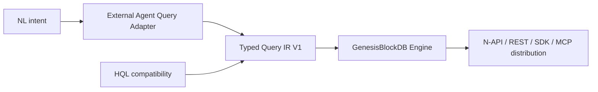
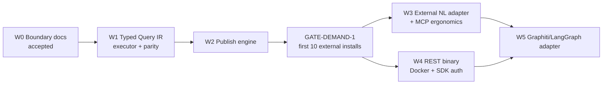

# MASTER_PLAN — GenesisBlock Engine-Wedge and Typed Query Boundary

## 0. Approved direction

GenesisBlockDB remains an engine-wedge-first product. The approved query architecture is now:

This plan is approved at the architecture/document level. It does not mark the typed executor or NL
adapter as implemented. The governing decisions are:

- `ADR--ENGINE-WEDGE-FIRST`: productization and distribution remain the commercial sequence.
- `ADR--GENESISDB-TYPED-QUERY-IR-AGENT-BOUNDARY`: Typed Query IR is primary; HQL is compatibility;
  NL conversion is a separate adapter.
- `SPEC--GENESISDB-TYPED-QUERY-IR-V1`: normative V1 request, result, validation and conformance gates.

## 1. Current baseline

| Item | Truth status |
|---|---|
| HQL P0 correctness work | Implemented and merged on `main`; retained as compatibility baseline. |
| HQL P1/P2/P3 expansion | Deferred; not required for the primary public contract. |
| Typed Query IR ADR/spec | Accepted by owner on 2026-08-14. |
| Typed Query IR executor/API | Partial: `search` and `traverse` implemented across core, REST and N-API; remaining operation kinds planned. |
| NL-to-Query-IR adapter | Planned outside the engine; not implemented. |
| Engine package/release | Remains a productization gate; acceptance requires registry/install evidence. |

## 2. Dependency and critical path

W1 is a pre-publish public-contract gate: a new package should lead with the typed boundary rather
than establish HQL as the preferred integration. W3 remains after publishing and the demand gate so
model/provider work cannot block the database engine or leak into its core.

## 3. Work waves

| Wave | Scope | Deliverable | Exit criteria |
|---|---|---|---|
| W0 | Architecture boundary | Accepted ADR/spec, registry/C4/parent-doc alignment, this plan | Documentation validators pass; implementation status remains truthful. |
| W1 | Typed Query IR | Closed V1 schema, Rust typed executor, N-API/REST bindings, capability reporting, HQL mapping | Search/traverse vertical slice passes core, REST and N-API parity; HQL compatibility fixtures pass. |
| W2 | Publish engine | Release tag/matrix, platform prebuilds, package docs/security/version alignment | Clean-machine install and smoke evidence; no path-dependent dependency. |
| GATE-DEMAND-1 | Demand evidence | First-10-external-installs record over an owner-defined measurement window | Owner records proceed, pivot or stop before expensive adapter/channel work. |
| W3 | External NL adapter | Separate provider-neutral adapter package producing `QueryRequestV1`; MCP prefers typed operations | Schema/capability/auth rejection and ambiguous-intent fail-closed tests pass; engine has no LLM dependency. |
| W4 | Server distribution | REST binary, Docker image, SDK auth, health and graceful shutdown | Container and authenticated SDK smoke tests pass. |
| W5 | Channel adapters | Graphiti/LangGraph adapter based on verified upstream contract | Contract fit documented; conformance tests pass without expanding HQL by default. |

## 4. Requirement mapping

| Work | Requirement IDs | Notes |
|---|---|---|
| W1 typed envelope and executor | `GB-SRS-QRY-001`, `GB-SRS-QRY-003..005`, `TQIR-001..008` | Primary machine contract. |
| W1 HQL compatibility | `GB-SRS-QRY-002`, `TQIR-010` | Preserve P0 behavior; no P1/P2/P3 dependency. |
| W1 cross-surface parity | `GB-SRS-API-001..004`, `TQIR-008` | Rust, N-API, REST first; SDK/MCP by declared support. |
| W3 NL adapter | `TQIR-009`, ADR agent-boundary rules | Outside engine, schema-validated and fail closed. |
| W2/W4 distribution | `GB-SRS-NFR-005`, `GB-SRS-NFR-007..008` | Installability, compatibility and security evidence. |

## 5. First implementation slice (W1)

The first slice is deliberately bounded:

1. Freeze JSON Schema plus Rust request/result enums for `search` and `traverse`.
2. Add RED tests for validation, unsupported versions, bounds and collection mismatch.
3. Implement one typed core dispatcher over existing storage methods.
4. Expose N-API and REST routes with equivalent envelopes.
5. Map HQL `SEARCH` and `TRAVERSE` to the typed dispatcher and run parity fixtures.
6. Report operation support through capability/version output.

`match_path`, `context` and `relational_named_query` are reserved V1 operation kinds but require their
own closed schemas and acceptance tests before being reported as implemented.

## 6. Milestones

| ID | Milestone | Gate |
|---|---|---|
| M0 | Query boundary approved | ADR/spec current, plan aligned, docs validation passes. |
| M1 | Typed vertical slice | `search` + `traverse` work through core/N-API/REST; HQL parity passes. |
| M2 | Installable engine | Stranger can install the package on a clean supported machine. |
| M3 | Demand decision | First-10-install evidence reviewed by owner. |
| M4 | NL adapter | NL produces validated Query IR without engine model/provider dependencies. |
| M5 | Self-hosted channel | Docker/authed SDK surface and channel adapter pass conformance. |

## 7. Risk register

| ID | Risk | Prob. | Impact | Score | Mitigation |
|---|---|---:|---:|---:|---|
| R1 | Query IR duplicates existing operation types and drifts | 3 | 4 | 12 | One typed dispatcher; generate or share transport fixtures. |
| R2 | HQL compatibility changes observable behavior | 3 | 4 | 12 | Golden parity tests; retain direct path until equivalent. |
| R3 | NL model emits valid-looking unauthorized queries | 4 | 5 | 20 | Treat output as untrusted; schema, capability and caller-policy validation; fail closed. |
| R4 | V1 becomes an unrestricted JSON escape hatch | 3 | 5 | 15 | Closed discriminated types; reject unknown fields; no generic payload. |
| R5 | Cross-surface contract version drift | 3 | 4 | 12 | Shared fixtures and capability-version conformance in CI. |
| R6 | Query-contract work delays installability indefinitely | 3 | 4 | 12 | Limit W1 to search/traverse vertical slice; reserve other operations. |
| R7 | No external demand after publish | 3 | 5 | 15 | Preserve GATE-DEMAND-1 before expensive adapter/channel work. |
| R8 | Graphiti requires broader Cypher semantics | 3 | 3 | 9 | Inspect upstream contract before W5; adapt typed IR rather than expanding HQL automatically. |

## 8. Scope boundaries

In scope now: architecture docs, V1 contract, master-plan alignment and the completed W1
`search`/`traverse` vertical slice. Remaining V1 operations require separate slices.

Out of scope until its wave is approved/executed:

- embedding an LLM/provider in the Rust engine;
- removing HQL or breaking existing HQL callers;
- HQL P1/P2/P3 language expansion;
- arbitrary SQL/Cypher/JSON execution;
- client ontology or authority policy in GenesisBlockDB;
- claiming Query IR or the NL adapter shipped from document approval alone.

## 9. Review gates

1. M0 document validation closes the approved documentation slice.
2. W1 implementation requires tests before code and an architecture review before merge.
3. W2 requires clean-install and release evidence.
4. GATE-DEMAND-1 requires an explicit owner decision before W3-W5 investment.
5. Each public-surface addition requires API/SDK/MCP parity review proportional to declared support.

## 10. Planning artifact state

The previous `33_TASK_BREAKDOWN.md`, `36_TASK_EXECUTION_ORDER.md`, `PHASE_6_REVIEW.md`,
`queue/IMPLEMENTATION_QUEUE.json` and `queue/PROJECT_GRAPH.json` describe the superseded HQL-first
sequence. They are retained as historical evidence with `source_of_truth: false` where machine-readable.

The next planning action is to decompose W1 from the accepted Query IR V1 requirements and submit the
replacement queue/graph for review. Until that happens, no old `ready: true` flag authorizes dispatch.

## CHANGELOG

| Version | Date | Status | Summary | Commit Hash | Agent |
|---|---|---|---|---|---|
| 0.2.0 | 2026-08-14 | current | Approved Typed Query IR as pre-publish contract, retained HQL compatibility and moved NL conversion to an external post-publish adapter wave. | working-tree | ATHER |
| 0.2.1 | 2026-08-14 | current | Recorded completion of the W1 search/traverse vertical slice across core, REST and N-API while retaining remaining V1 operations as planned. | working-tree | ATHER |
| 0.1.0 | 2026-07-07 | superseded | Initial engine-wedge distribution plan centered on HQL P0 and four distribution waves. | historical | ATHER |
