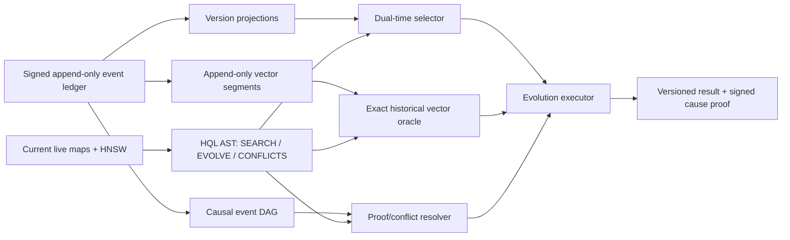

# Proposal - HQL Causal Semantic Evolution

## Decision request

Develop HQL around one market problem:

> Reconstruct and compare how the meaning and relationships of data evolved across
> valid time, system time, embedding-model spaces, and distributed signed history,
> without permitting invalid cross-space similarity and while returning the events
> that caused each change.

This proposal explicitly excludes agent context, prompt budgets, context compression,
and RAG packet assembly. Those belong to `PROPOSAL--AGENT-CONTEXT-CONTRACT.md`.

[ASSUMPTIONS]

1. HQL should differentiate on correctness that the engine can enforce, not on broader
   general-purpose syntax than Cypher, GQL, SQL, or SurrealQL.
2. Original signed history may become a retained authoritative source while SQLite and
   ANN structures remain rebuildable projections.
3. The market-gap conclusion remains a falsifiable hypothesis until Phase H0 reproduces
   the five target query templates against competing systems.

## 1. Feasibility verdict

**Possible, but not as a grammar-only refinement.** It requires a historical storage
and indexing architecture before new syntax can be truthful.

The defensible opportunity is not "graph + vector + time in one query." Current
products already cover large parts of that space:

- Neo4j Cypher combines graph patterns with native vector `SEARCH`.
- SurrealQL combines graph, vector, hybrid fusion, and versioned/time-travel queries.
- XTDB makes valid-time and system-time query semantics first-class.
- TerminusDB provides immutable versioned graph history, diff/branch/merge, and a
  separate VectorLink semantic indexer.
- LanceDB provides versioned vector tables and time travel.
- Qdrant supports named vectors and live embedding-model migration.

The reviewed products do not expose one first-class query contract that combines all
of the following:

1. dual-time historical graph state;
2. historical vector versions tied to model identity;
3. model-safe semantic drift and neighborhood-shift measurement;
4. structural graph diff in the same query;
5. signed cause/event proof for every change;
6. unresolved concurrent peer states rather than only the LWW winner.

This is a market-gap hypothesis, not a uniqueness claim. It must survive the benchmark
and falsifier in this proposal.

## 2. User problem

Existing systems can usually answer one or two of these questions:

- What did the record or graph look like at time T?
- Which current items are vector-similar?
- What fields or triples changed between commits?
- Which model-generated vector is active now?

The unsolved operational question is broader:

> What changed in meaning and structure, when was each version valid, when did each
> peer learn it, which embedding model produced each representation, which signed
> events caused the transition, and which concurrent claims remain unresolved?

Use cases are not agent-specific:

- regulated decision and model audit;
- incident and dependency evolution analysis;
- scientific knowledge/version lineage;
- embedding-model migration regression;
- offline-first collaborative data conflict analysis;
- signed data provenance and consensus audit.

## 3. Market comparison

| System | Graph | Vector | Historical query | Native bitemporal | Model-safe semantic diff | Signed peer-causal conflict |
|---|---:|---:|---:|---:|---:|---:|
| Neo4j/Cypher | yes | yes | application-modeled versions | no native system-versioned graph contract found | no | no |
| SurrealDB/SurrealQL | yes | yes | `VERSION` on versioned storage | yes, current positioning | no first-class model-lineage drift contract found | no |
| XTDB SQL/XTQL | relational/dynamic | no native ANN found | yes | yes | no | no |
| TerminusDB/WOQL | yes | VectorLink sidecar | yes, immutable commits | commit history rather than dual-time vector semantics | no integrated historical vector diff found | branch/merge, not signed CRDT observation query |
| LanceDB | no graph | yes | versioned tables/time travel | no | table-version comparison only | no |
| Qdrant | limited graph-like ANN | yes | live state/snapshots | no | named-vector migration, no historical drift query | no |

"Not found" means absent from the reviewed official query contracts as of 2026-07-20;
it is not proof that no extension or application implementation exists.

## 4. HQL language boundary

HQL must not compete with Cypher/GQL on general graph expressiveness. It should retain
its existing commands and add only three fixed historical query families:

1. dual-time `SEARCH`/`MATCH` selection;
2. `EVOLVE` for semantic + structural change;
3. `CONFLICTS` for divergent signed peer states.

Each family dispatches to a fixed executor. No arbitrary stage graph, cost-based join
planner, subquery language, or user-defined procedure system is introduced in vNext.

## 5. Proposed semantics

### 5.1 Standard dual-time selection

Reuse SQL:2011 terminology where possible:

```hql
SEARCH "concept:auth" K 20 IN "bge-m3@2026-04"
  FOR VALID_TIME AS OF "2026-05-01T00:00:00Z"
  FOR SYSTEM_TIME AS OF "2026-05-03T12:00:00Z"
```

`VALID_TIME` means when the fact was effective in the modeled world. `SYSTEM_TIME`
means when GenesisBlockDB recorded that version. Both apply to node, edge, property,
and vector versions participating in the query.

### 5.2 Semantic and structural evolution

```hql
EVOLVE "concept:auth"
  FROM (VALID_TIME "2026-01-01T00:00:00Z", SYSTEM_TIME "2026-01-02T00:00:00Z")
  TO   (VALID_TIME "2026-07-01T00:00:00Z", SYSTEM_TIME "2026-07-02T00:00:00Z")
  IN VECTOR SPACE "bge-m3@sha256:ab12..."
  GRAPH REL depends_on|supersedes|caused_by DEPTH 2
  MEASURE CONTENT_DIFF, GRAPH_DIFF, SEMANTIC_DRIFT, NEIGHBORHOOD_SHIFT
  WHY
```

Result components:

- property/label diff;
- edges added, removed, or validity-changed;
- semantic distance when both vectors share one exact space id;
- top-k neighborhood overlap/rank shift;
- signed events and cause chain that produced each delta;
- explicit missing/unavailable measurements.

### 5.3 Distributed conflict inspection

```hql
CONFLICTS FOR "concept:auth"
  OBSERVED BY ANY PEER
  AT LOGICAL FRONTIER "frontier:2026-07-20T10:00Z"
  RETURN CANDIDATES, CAUSAL_PARENTS, SIGNATURES, RESOLUTION
```

This query returns concurrent candidates before reconciliation, their causal parents,
signers, and whether consensus/LWW resolved them. It must never manufacture true
causality from the current `(lamport_time, peer_id)` total order.

## 6. Model-space safety

Every vector version belongs to an immutable `VectorSpaceId` containing at least:

```text
model_provider
model_id
model_artifact_hash
dimension
distance_metric
normalization
quantization_source
embedding_recipe_hash
```

Rules:

1. Direct vector distance is legal only inside the same exact `VectorSpaceId`.
2. Equal dimensions do not imply comparable spaces.
3. Different model/version spaces require an explicit, versioned `BridgeArtifact`.
4. A bridge records transformation hash, calibration corpus hash, quality metrics, and
   validity interval; the query must name it with `USING BRIDGE`.
5. Without a bridge, HQL may compare identity-based neighbor overlap but must label it
   `NEIGHBORHOOD_SHIFT`, never `SEMANTIC_DRIFT`.
6. Cross-space misuse is a hard query error, not an empty result or warning.

This safety contract is the strongest candidate for genuine language-level value: it
prevents a common class of semantically meaningless but numerically valid queries.

## 7. Required storage architecture

### 7.1 Immutable signed event ledger

The authoritative ledger must retain original `SignedEvent`s across compaction. Live
state and projections may compact; historical proof may not be rewritten into newly
signed current-state events.

Each event needs:

- stable `event_id = SHA256(canonical_event + signer)`;
- original signature and signer;
- system-time interval;
- valid-time interval;
- one or more causal parent event ids;
- vector-space id for vector events;
- consensus/resolution links where applicable.

### 7.2 Historical projections

SQLite may maintain rebuildable projections such as:

```text
node_versions
edge_versions
vector_versions
event_causes
peer_observations
model_spaces
bridge_artifacts
```

SQLite is not authoritative. Rebuild must reproduce every row from immutable ledger
segments and verify event signatures/hashes.

### 7.3 Historical vector source

Historical vectors require append-only vector segments keyed by event id and space id.
The current live arena/HNSW remains the current-state acceleration path.

The first correct historical executor may use exact/brute-force search over temporally
filtered versions. Historical HNSW/segment indexes are a later optimization and must be
validated against the exact oracle.

### 7.4 Causal frontier

Lamport time plus peer id provides deterministic LWW ordering but does not identify
concurrent events. `CONFLICTS` therefore requires causal parents, dotted version vectors,
or an equivalent change DAG. HQL must not ship peer-causal syntax until this exists.

## 8. Current repo readiness and gaps

Reusable foundations:

- nodes/edges already carry valid-time intervals;
- edges carry `recorded_at`;
- events are signed and identify the signer peer;
- per-collection model/dim/metric isolation already blocks obvious cross-space search;
- vector events carry logical clocks;
- CRDT reconciliation and consensus primitives already exist;
- SQLite projection bootstrap/rebuild exists for current props/labels.

Blocking gaps:

- nodes have no `recorded_at` or system-time interval;
- supersession overwrites the resident node slot;
- vector mappings point to the latest arena row, not a version history;
- current compaction rewrites only live nodes/edges/latest vectors and discards historical
  versions needed by this proposal;
- compaction re-signs live state, so original event proof is not preserved in the compacted
  WAL alone;
- Merkle vector entries prove only `(collection, node)` presence, not embedding content;
- reconciliation collapses to an LWW winner and does not retain queryable concurrent losers;
- Lamport clocks do not encode causal concurrency;
- HQL supports point valid-time only, not dual-time or interval history.

## 9. Requirements and acceptance criteria

### H1 - Dual-time correctness

WHEN data is corrected retroactively THEN a query with the same valid time but different
system times SHALL return the historically correct versions.

### H2 - Historical vector correctness

WHEN a historical vector search runs THEN its top-k result SHALL match an exact oracle
over vector versions visible at both selected times.

### H3 - Model safety

WHEN two vectors have different space ids THEN direct similarity SHALL fail unless the
query names a valid bridge. Equal dimension SHALL NOT bypass this rule.

### H4 - Evolution completeness

WHEN `EVOLVE` compares two states THEN it SHALL report property, label, graph, and vector
changes or explicitly mark a component unavailable. It SHALL NOT silently omit a class.

### H5 - Verifiable cause

WHEN `WHY` is requested THEN every reported change SHALL link to original signed events;
signature and event-hash verification SHALL pass after save, reload, and compaction.

### H6 - Concurrent conflict visibility

WHEN two causally concurrent peer events target the same entity THEN `CONFLICTS` SHALL
return both candidates even if the live view has already selected an LWW winner.

### H7 - Rebuild invariant

WHEN all SQLite/history indexes are deleted THEN replaying immutable ledger segments SHALL
rebuild identical historical results and roots.

### H8 - Separation from agent context

WHEN HQL vNext ships THEN no syntax or result type SHALL depend on prompt tokens, context
packets, agent tiers, or RAG compression.

## 10. Architecture



## 11. Delivery sequence after approval

### Phase H0 - Market-gap and corpus freeze

- Freeze five real evolution/conflict query templates.
- Implement competitor reproductions or document the required application glue.
- Define GO/FREEZE metrics before architecture work.

### Phase H1 - History authority ADR

- Decide immutable ledger segmentation, retention, compaction, signatures, and rebuild.
- Resolve conflict with current live-state WAL compaction.
- No HQL syntax ships in this phase.

### Phase H2 - Model-space and causal schemas

- Freeze `VectorSpaceId`, vector-version record, event id, causal parents, and bridge
  artifact contracts.
- Add migration and backward-compatibility rules.

### Phase H3 - Reference executor

- Implement dual-time exact selection and brute-force historical vector oracle.
- Add `EVOLVE` AST/executor only after history tests pass.

### Phase H4 - Cause and conflict

- Preserve concurrent candidates and event DAG.
- Add `WHY` and `CONFLICTS` only after signature/causality proofs pass.

### Phase H5 - Performance indexes and exposure

- Add historical ANN only if exact-query profiling requires it.
- Wire NAPI/REST/SDK/MCP parity and benchmark current vs historical paths separately.

## 12. Benchmark and falsifier

Compare against the strongest combinations, not strawmen:

- SurrealDB versioned graph + vector query;
- TerminusDB history/diff + VectorLink;
- LanceDB historical vectors + a versioned graph layer;
- XTDB bitemporal query + external vector index;
- Neo4j vector `SEARCH` + explicitly modeled graph versions.

Metrics:

- dual-time result correctness;
- historical ANN recall against exact oracle;
- cross-space misuse rejection rate (target 100%);
- signed cause coverage (target 100% for reported changes);
- conflict recall before/after reconciliation;
- deterministic replay after compaction;
- ingest overhead, storage amplification, p50/p99, and RSS.

Proceed only if the preregistered real templates show that HQL removes at least two
application-level reconciliation passes while uniquely enforcing model-space and signed
cause correctness, with acceptable storage/latency costs.

Freeze this HQL direction if:

- a reviewed competitor exposes equivalent model-safe historical semantic diff and signed
  cause/conflict semantics natively before implementation starts;
- fewer than 80% of real templates fit the three fixed query families;
- immutable vector/event history has unacceptable storage amplification for target devices;
- preserving concurrent causal state requires a general distributed query planner;
- the same value is achieved more safely as typed APIs over an existing QL.

## 13. Risk assessment

**Risk: HIGH.** This changes authoritative history, compaction, vector persistence,
distributed reconciliation, public query semantics, and storage growth.

The project must not call the current store fully bitemporal or causally queryable until
H1-H7 pass. A grammar demo without historical storage proof would be a false capability.

## 14. Sources reviewed

Repository:

- `src/lib.rs`: `NodeOutput`, `EdgeOutput`, `SignedEvent`, `VectorEvent`,
  `VectorCollection`, `supersede_node`, `reconcile_state`, `get_merkle_root`, `compact`.
- `docs/MASTER-SPEC--GENESIS-DB.md`.
- `docs/SPEC--HQL-V2.md`.
- `docs/BENCH-SPEC--HQL-MOAT-AND-EXPRESSIVENESS.md`.

Current primary references, accessed 2026-07-20:

- Neo4j vector `SEARCH`:
  https://neo4j.com/docs/cypher-manual/current/indexes/semantic-indexes/vector-indexes/
- SurrealDB vector/hybrid functions:
  https://surrealdb.com/docs/reference/query-language/functions/database-functions/search
- SurrealDB graph time travel:
  https://surrealdb.com/blog/graph-traversals-and-time-travel-incident-response-in-one-query-language
- XTDB bitemporality:
  https://docs.xtdb.com/intro/what-is-xtdb.html
- TerminusDB versioned graph:
  https://terminusdb.org/docs/knowledge-graph-version-control/
- TerminusDB VectorLink:
  https://terminusdb.org/docs/set-up-vectorlink/
- LanceDB versioning:
  https://docs.lancedb.com/tables/versioning
- Qdrant model migration:
  https://qdrant.tech/documentation/tutorials-operations/embedding-model-migration/

## Version diff

| From | To | Change |
|---|---|---|
| none | `0.1.0b` | Candidate HQL direction for model-safe causal-temporal semantic evolution; agent context explicitly excluded. |

## CHANGELOG

| Version | Date | Status | Summary | Commit Hash | Agent |
|---|---|---|---|---|---|
| `0.1.0b` | 2026-07-20 | candidate | Initial market-gap analysis, semantics, architecture, acceptance gates, and falsifier; no implementation authorized. | working-tree | ATHER |
