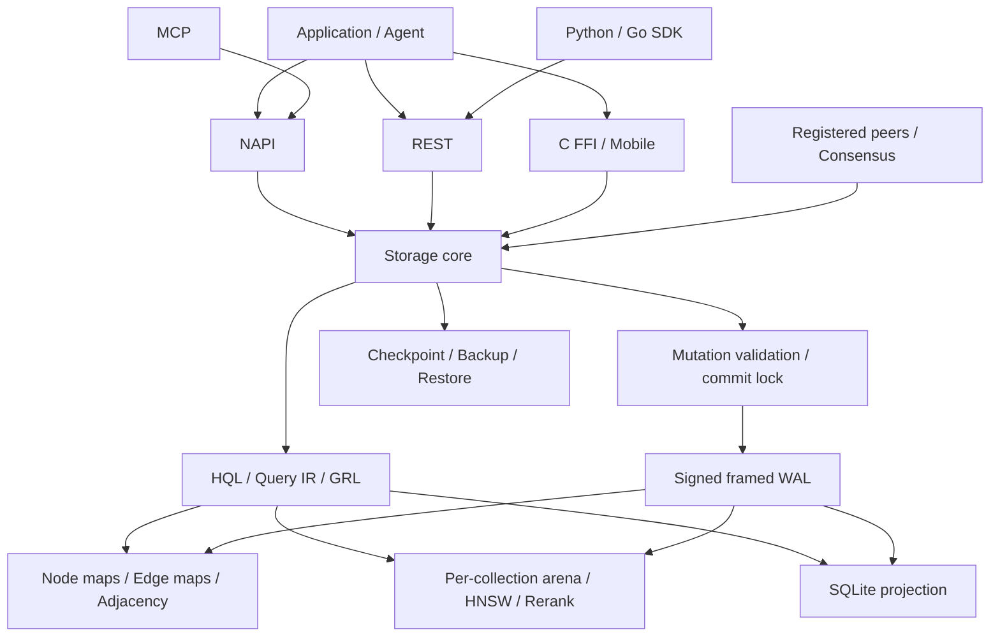
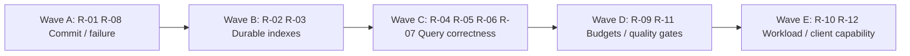

# GenesisBlockDB — Graph / Vector System Review and Refinement

สถานะ 2026-09-08: findings ด้านล่างเริ่มจาก baseline ของ 79b41a3. Wave A (R-01/R-08)
ผ่านใน branch `codex/wave-a-commit-correctness`; Wave B (R-02/R-03) ผ่าน local
verification และ benchmark correction ใน branch `codex/wave-b-durable-index-design`
ที่ commits `28b58cb` และ `44d0252`. Wave C (R-04/R-05/R-06/R-07) มี local
implementation checkpoint `d8ef9af` และอยู่สถานะ beta; exact filtered-oracle churn
matrix, rebuilt N-API/MCP runtime campaign และ full Rust sweep ผ่าน local evidence
แล้ว เหลือ quality interpretation ของ BQ. Wave D–E ยังเป็นข้อเสนอ ไม่ใช่
production/release claim.

ตรวจจาก source commit `79b41a3f4ae4026d086b634c631f4f4a7ccbd142`, engine 0.2.5, Windows x64
วันที่ 2026-09-07 โดยใช้ skill `using-graph-databases` และ `vector-databases` เป็นกรอบตรวจ
งานระดับ C-3; ข้อเสนอด้าน WAL/schema/visibility มีความเสี่ยง HIGH เมื่อเข้าสู่ implementation

## 1. ผลประเมินและขอบเขต

**โครงสร้างเหมาะกับ embedded hybrid graph/vector engine แต่ยังไม่ควรรับรองความถูกต้อง
ของ write/recovery และ query ทุกเส้นทาง:** พบ failure ที่ทำให้ฐานข้อมูลเปิดใหม่ไม่ได้
และผล query เปลี่ยนความหมายหลัง recovery รวมถึง edge traversal ที่สร้างเส้นทางผิด
จึงควรแก้ correctness ก่อนเพิ่ม query language, index algorithm หรือช่องทาง distribution

การตรวจครั้งนี้ครอบคลุมแนวสถาปัตยกรรมและ public paths ของ storage/WAL/projection,
graph/vector indexes, HQL/Query IR/GRL, REST/NAPI/FFI/MCP/SDK, backup, temporal history,
sync/governance และ CI/evaluation ไม่ใช่การพิสูจน์ทุก interleaving หรือทุก method

- `src/lib.rs` SHA-256: `299B248E14876861F035149D36D61A0AE40C574E7B6BA82086B6A60AA4E00972`
- Local main ตามหลัง origin/main 1 README commit ณเริ่ม audit; ไม่รวม PR #167–171
  ที่ยังเปิดอยู่จากการตรวจ GitHub ใน task นี้
- มีงาน Security Audit ที่อนุมัติและแก้ไว้ก่อนหน้าใน working tree; ไม่แก้ทับ
- `tests/zz_probe_discriminates.rs` เป็นไฟล์เดิมที่ยังไม่ commit; ไม่รวมในการรันแบบเลือก suite
- ไม่เปลี่ยน engine, API, SDK, schema หรือ dependency ในรอบ review นี้
- Diagnostic probe อยู่ใน `.brain/audit/graph-vector-2026-09-07/` ใช้ฐานข้อมูลใหม่ใน run1/run2
  การทดสอบ crash ใช้ child process ออกด้วย `process::exit(0)` เพื่อข้าม Drop/checkpoint
  จึงจำลอง process termination หลัง ACK ไม่ใช่ power-loss simulation

## 2. เกณฑ์ที่ใช้

ใช้เกณฑ์จากความต้องการของระบบเองก่อน ไม่บังคับให้ทำทุกฟีเจอร์เหมือน Neo4j/Qdrant
หรือเปลี่ยนไปใช้ฐานข้อมูลอื่นตามคำแนะนำทั่วไปใน skill

| มิติ | เกณฑ์รับงาน |
|---|---|
| Graph model | Node/edge identity, direction, relation properties และ adjacency ต้องสอดคล้องกันหลัง upsert/retract/replay |
| Transactions | Rejected write ไม่สร้าง durable event ที่ replay ไม่ได้; partial state ไม่ปรากฏเป็น committed result |
| Graph query | Traversal มีขอบเขต; limit มีนิยาม; pattern expansion ไม่ใช้ทรัพยากรไร้เพดาน |
| Temporal | valid-time และ transaction-time แยกชัด; timezone เทียบด้วย instant; visibility ทุก surface ตรงกัน |
| Vector schema | model/dim/metric/quantization เป็นสัญญาของ collection และต้องคงอยู่หลัง recovery |
| Retrieval | Candidate eligibility/filtering ไม่ทำให้ผลว่างเทียม; recall วัดเทียบ exact ground truth |
| Hybrid/GRL | Context ไม่ใช้ความสัมพันธ์ที่ถูก retract; score/budget/coverage เปิดเผยและมีความหมายสม่ำเสมอ |
| Durability/ops | ACK, journal, snapshots, projection และ backup มี recovery contract ที่ทดสอบได้ |
| Interfaces | Capability, validation, error, consistency และ authentication ใช้ได้จริงข้าม transport |
| Evaluation | วัด recall, shortfall, latency tail, RAM/disk, restart และ churn ตาม workload ไม่อาศัยค่าเฉลี่ยอย่างเดียว |

แหล่งอ้างอิงภายนอกที่ตรวจสด:

- [Neo4j transaction management](https://neo4j.com/docs/operations-manual/current/database-internals/transaction-management/):
  ใช้เป็นกรอบแยก atomicity/isolation/durability และ transaction lifetime
- [Neo4j concurrent access](https://neo4j.com/docs/operations-manual/current/database-internals/concurrent-data-access/):
  ใช้เทียบความชัดเจนของ isolation contract ไม่ได้อ้างว่า Genesis ต้องใช้ isolation ระดับเดียวกัน
- [Qdrant indexing](https://qdrant.tech/documentation/manage-data/indexing/):
  ใช้แนวคิดแยก vector/payload indexes และประเมิน filter cardinality เพื่อเลือก search strategy

ข้อเสนอและ priority ด้านล่างเป็นข้อวิเคราะห์ของ audit นี้ ไม่ใช่ข้อสรุปจาก vendor

## 3. แผนที่ระบบที่ตรวจ

นี่คือองค์ประกอบและ ownership ที่พบ ไม่ได้หมายความว่า write ordering ทุก method ตรงตามลูกศร;
R-01/R-08 ด้านล่างระบุจุดที่ละเมิดสัญญานี้

## 4. ข้อบกพร่องที่ยืนยันด้วย runtime

### R-01 — P1: Rejected unified transaction ทำให้เปิด DB ใหม่ไม่ได้

**หลักฐาน:** insert PK เดียวกันสองครั้งใน transaction ที่มี graph node ด้วย
`commit_transaction` ตอบ `UNIQUE constraint failed: app_audit__rows.id` แต่ frontier เปลี่ยน 1 → 2
ออกจาก child ก่อน Drop แล้วเปิดใหม่ได้ error UNIQUE เดิม; node ยังไม่ปรากฏก่อนออก

**สาเหตุ:** `validate_row_mutation` ตรวจรูปแบบ/ชนิด ไม่ทดลอง constraints กับข้อมูลจริง;
`commit_transaction` เรียก `persist` ก่อน SQLite apply ตรวจ uniqueness/FK ครบ
จึงมี invalid committed frame; projection recovery พยายาม apply frame เดิมและหยุดด้วย error

**ตำแหน่ง:** `src/lib.rs:4096`, `src/lib.rs:6522`, `src/lib.rs:6660`,
`src/lib.rs:6318`, `src/lib.rs:4627`, `src/lib.rs:4780`

**Refinement:** preflight relational operations ด้วย transaction/savepoint ที่ตรวจ constraints
ทั้งหมดภายใต้ write serialization ก่อน append WAL; ออกแบบ durable-but-projection-failed outcome
แยกจาก validation rejection; ไม่ใช้การข้าม invalid WAL แบบเงียบเพื่อซ่อนปัญหา

**Acceptance:** duplicate PK/unique/FK/not-null rejection ไม่เพิ่ม frontier; graph/row/vector
ไม่เปลี่ยน; restart และ retry ยังคงทำงาน; ทดสอบ failure ก่อนและหลัง WAL fsync แยกกัน
ฐานข้อมูลที่เคยมี poisoned frame ต้องมี recovery design ที่เก็บหลักฐานก่อน repair

### R-02 — P1: Collection configuration สูญหายเมื่อไม่มี checkpoint

**หลักฐาน:** ก่อน exit: `cos / model-x / dim=2 / Cosine / f16 / ef_search=123`;
หลัง reopen: `cos / recovered / dim=2 / L2 / none / ef_search=null` แม้ node write ACK แล้ว

**สาเหตุ:** `create_collection` ใส่ config ใน memory แต่ไม่มี durable schema event;
vector replay auto-provision จาก embedding โดยเลือก L2/None/default metadata

**ตำแหน่ง:** `src/lib.rs:3006`, `src/lib.rs:3201`

**Refinement:** journal collection definition ก่อนตอบสำเร็จ; replay/sync/fold/backup
ต้องรักษา model, dimension, metric, quantization, rerank และ default search parameters
legacy recovery ต้องระบุว่า config ไม่ทราบ แทนการอ้างว่ากู้ semantics ครบแล้ว

**Acceptance:** empty collection และ collection ที่มี vector คง config ทุก field หลัง
process termination ก่อน checkpoint, snapshot reload, journal-only rebuild และ peer sync
ใช้ non-unit vectors ที่ Cosine/L2 จัดอันดับต่างกันเพื่อทดสอบความหมาย ไม่ใช่แค่จำนวน node

### R-03 — P1: Reuse edge ID ทิ้ง adjacency เก่าและสร้างเส้นทางปลอม

**หลักฐาน:** เขียน `e:A→B` แล้ว `e:C→D`; `neighbors(A)` คืน node C พร้อม path edge C→D

**สาเหตุ:** `index_edge_internal` เพิ่ม key ลง endpoint ใหม่โดยไม่ลบจาก endpoint เดิม;
`edges.insert` ทับ payload แต่ traversal เชื่อ candidate จาก adjacency เก่า

**ตำแหน่ง:** `src/lib.rs:7091`, `src/lib.rs:7178`, `src/lib.rs:8960`

**Refinement:** กำหนด upsert/rebind contract ชัด แล้วเปลี่ยน edge map และ adjacency
เป็น publication เดียว; เก็บ historical endpoint mapping ให้ tx-time query;
เพิ่ม defensive endpoint membership check ฝั่ง traversal

**Acceptance:** add/batch/transaction/reconcile/replay ให้ผลเหมือนกัน;
old endpoint ไม่คืน edge ใหม่; in/out/both/self-loop และ historical view ถูกต้อง

### R-04 — P1: Top-k ได้ผลว่างทั้งที่มี live vectors

**หลักฐาน:** ใส่ 50 vectors, flush, retract 30 ที่ใกล้ query; ขอ k=3 ได้ 0 ทั้งที่ live nodes=20
เกิดซ้ำใน run1 และ run2

**สาเหตุ:** current-view ANN เลือก `k*2` จากทุก slot ก่อน แล้วค่อยตัด retired rows;
shortfall fallback เช็กจำนวน raw ANN hits ก่อน visibility/dedup จึงไม่ทำงานกรณีนี้
ส่วน tx-time path มี predicate และ selective exact fallback อยู่แล้ว

**ตำแหน่ง:** `src/lib.rs:8737`, `src/lib.rs:8808`, `src/lib.rs:8825`, `src/lib.rs:8890`

**Refinement:** นำ live eligibility เข้า candidate generation; หรือเติม candidates
แบบมี budget จนได้ k/หมดผู้สมัคร; ใช้ exact fallback ตาม selectivity และขนาด
แยก `insufficient eligible data` จาก `ANN shortfall` ใน telemetry

**Acceptance:** delete/re-embed churn 0/10/50/90%, k และ quantization หลายค่า;
หากมี eligible vectors ≥ k ต้องไม่คืนศูนย์เพราะ tombstone shortlist;
ตรวจ recall เทียบ exact filtered oracle พร้อม latency budget

**สถานะ Wave C:** implemented in `d8ef9af`; the 28-cell 0/10/50/90% churn ×
quantizer oracle matrix returns the requested eligible rows in every cell. The
matrix is recorded in [`AUDIT--WAVE-C-FILTERED-ORACLE-2026-09-08.md`](AUDIT--WAVE-C-FILTERED-ORACLE-2026-09-08.md).
Lossy BQ recall remains a separate Wave D quality-gate decision.

### R-05 — P1: Temporal visibility ต่างกันระหว่าง search/traversal/GRL

**หลักฐานสามกรณี:**

- Node valid_from ปี 2099 ปรากฏใน current vector search
- valid_from `2026-01-01T01:00:00+07:00` ควรมีผล ณ `2025-12-31T19:00:00Z`
  แต่ search คืน 0 เพราะเทียบข้อความ
- Retract edge แล้ว `neighbors` คืน 0 แต่ `retrieve_context(H1)` ยังมี edge=1, nodes=2

**สาเหตุ:** `is_valid_as_of(None)` ยอมรับทุก valid window; timestamp เทียบ String;
GRL เดิน adjacency โดยไม่ใช้ visibility predicate แบบ `neighbors`

**ตำแหน่ง:** `src/lib.rs:8626`, `src/lib.rs:8653`, `src/lib.rs:8889`, `src/lib.rs:10081`

**Refinement:** normalized temporal value และ predicate กลางสำหรับ current/valid-at/tx-at;
GRL/metadata summaries ต้องใช้ eligibility เดียวกับ graph query;
นิยาม TTL ว่า query-time expiry หรือ maintenance-time removal ให้ตรงทุก surface

**Acceptance:** UTC/offset ที่แทน instant เดียวกันให้ผลเท่ากัน; future/retracted/expired
entities ไม่เข้าผล current view; historical query ยังเห็นเมื่ออยู่ใน window;
ทดสอบ nodes, edges, vectors, MATCH และ GRL ข้าม NAPI/REST/FFI

**สถานะ Wave C:** normalized RFC3339, current/future/expiry predicate, GRL
edge filtering and malformed selector errors are implemented in `cbe5a04`.
Core and REST regression suites pass; rebuilt NAPI/MCP/FFI runtime evidence is
still pending.

### R-06 — P2: Collection input ถูกเปลี่ยนความหมายเงียบ

**หลักฐาน:** create dim=65537, metric=`bogus`, quant=`bogus` ตอบ Ok;
ค่าที่เก็บเป็น dim=1, metric=L2, quant=none

**สาเหตุ:** `u32 as u16` ตัดบิต และ parse enum ใช้ fallback เมื่อไม่รู้จักค่า

**ตำแหน่ง:** `src/lib.rs:1329`, `src/lib.rs:1373`, `src/lib.rs:3025`, `src/lib.rs:3044`

**Refinement:** checked dimension bounds และ strict enum parsing ที่ core boundary;
ตรวจ finite/range ของ vector และ alpha/ef/oversample ให้ตรงทุก entrypoint
NaN/Infinity ยังไม่ได้พิสูจน์ runtime ใน audit นี้ จึงเป็น acceptance ที่ต้องเพิ่ม

**Acceptance:** dim 0/65536/65537 และ unknown metric/quant ถูกปฏิเสธก่อน mutation;
ค่าที่รองรับ round-trip ตรง; ปฏิเสธ vector ที่ไม่ finite โดยไม่ poison WAL/index

**สถานะ Wave C:** strict finite vector/query controls and frontier-preserving
rejection are implemented in `cbe5a04`; collection boundary behavior remains
covered by Wave B plus Wave C core/REST tests.

### R-07 — P2: Batch ทิ้ง valid_from ของ edge

**หลักฐาน:** EdgeInput valid_from=2030 แต่ execute_batch output เป็นเวลาปัจจุบัน

**สาเหตุ:** batch edge constructor สร้าง `Utc::now()` แทนอ่าน input

**ตำแหน่ง:** `src/lib.rs:11563`

**Refinement:** ใช้ temporal mapping เดียวกับ add_edge/transaction; ตรวจ supersede
และ field อื่นที่แต่ละ transport อาจรับแต่ไม่ใช้งาน

**Acceptance:** ส่ง EdgeInput เดียวกันทาง add/batch/transaction ได้ temporal semantics เดียวกัน;
replay และ snapshot รักษา valid_from ที่ caller ให้

**สถานะ Wave C:** batch `valid_from` preservation is implemented and covered by
core and REST regressions in `cbe5a04`. Existing `supersede` input behavior was
left unchanged and is recorded as out of scope for this checkpoint.

### R-08 — P1: WAL failure ทิ้ง uncommitted node ใน memory

**หลักฐาน:** fault injection เปลี่ยน WAL sender เป็น channel ที่ receiver ปิด;
add_node ตอบ `wal disconnected` แต่ `node_view(uncommitted)` ยังได้ node
เป็น injected transport failure ไม่ใช่การจำลอง disk เต็มจริง

**สาเหตุ:** `insert_node_lean` มาก่อน `persist`; error propagation ไม่ rollback memory
พบ ordering แบบเดียวกันใน add_edge; readers ไม่ถือ commit lock ตัวเดียวกับ writers
ประเด็น partial visibility ของ multi-item transaction ยังไม่ได้พิสูจน์ด้วย concurrency probe

**ตำแหน่ง:** `src/lib.rs:7169`, `src/lib.rs:7194`, `src/lib.rs:6303`, `src/lib.rs:5748`

**Refinement:** stage/validate → durable journal → coherent publication;
กำหนด read isolation ให้ครบ SQL/graph/vector โดยยังคง vector indexing เป็น eventual
และให้ read-your-write เป็น explicit consistency barrier

**Acceptance:** WAL disconnect/fsync failure ไม่เผย uncommitted state;
reader ไม่เห็น graph/row คนละ commit; failure หลัง durable commit มีผลลัพธ์ที่แยกได้
และ recovery/retry ไม่ทำให้ state แตกแขนง

## 5. ช่องว่างเชิงออกแบบและการตรวจรับ

### R-09 — P2: Query budget ไม่สม่ำเสมอและ REST ทำ blocking work บน async worker

`NeighborInput.limit=0` คืน 1 ใน probe; limit ตรวจหลัง push (`src/lib.rs:9089`)
Query IR จำกัด k≤1000/depth≤32 แต่ไม่ใช่ budget ของ expanded nodes/edges/memory
HQL MATCH เก็บ intermediate Cartesian frontiers แล้วจึง truncate LIMIT
(`src/lib.rs:7475`, `src/lib.rs:7639`)
REST handlers เรียก Storage synchronous (`src/router.rs:626`) ต่างจาก NAPI ที่ใช้
spawn_blocking (`src/lib.rs:13102`); SQL มี 5s/10k rows/32MiB budget อยู่แล้ว

**Refinement:** core query budget ของ visited edges/candidates/bytes/deadline;
strict zero/overflow validation; admission control และ blocking execution pool สำหรับ REST
เลือก anchor จาก ID/label/property index เมื่อมีประโยชน์ตาม cardinality

**Acceptance:** supernode/high-degree/dense-cycle queries หยุดตาม budget พร้อม typed error;
status request ยังตอบได้เมื่อมี expensive queries; วัด p95/p99 ภายใต้ concurrent load
ยังไม่มี load test ยืนยัน worker starvation ในรอบนี้

### R-10 — Planned capability: Filtered hybrid search และ GraphRAG contract ยังไม่ครบ

Query IR ประกาศ search/traverse implemented และ match_path/context/relational_named_query planned
(`src/lib.rs:7802`); namespace ถูกปฏิเสธอย่างชัดเจน (`src/lib.rs:7867`)
ไม่ใช่ข้อบกพร่องที่ต้องเพิ่ม full Cypher/GQL โดยอัตโนมัติ

Hybrid score ปัจจุบันเป็น vector similarity + optional K-Impact ไม่ใช่ BM25+dense fusion;
`similarity=1-distance` ทำให้ scale ของ L2 และ cosine ต่างกันเมื่อใช้ alpha>0
GRL เป็น radius expansion และ budget fallback ไป meta_nodes ทั้งชุด ไม่ใช่การรับประกัน
prompt token budget หรือ filtered vector→graph pipeline ที่จบใน query เดียว

**Refinement ที่ต้องตัดสินใจตาม workload:** typed metadata predicates → cardinality-aware
candidate selection → vector search → temporal graph expansion → deterministic ranking →
serialize และตรวจ budget ทั้ง nodes/edges/summaries; lexical fusion เพิ่มเมื่อมี requirement
ต้องระบุ score semantics และ cross-model comparability ให้ชัด

### R-11 — P2: Quality gate ยังไม่เท่ากับ per-index readiness

Recall guard ปัจจุบันยอมให้แต่ละ build recall@10 ต่ำถึง 0.50 ถ้า median 5 builds ≥0.95
(`tests/vector_collections.rs:476`); เป็นการออกแบบ test ที่ตั้งใจและเปิดเผย
แต่ผ่าน test ไม่ได้แปลว่า deployment หนึ่ง index มี recall≥0.95
CI scientific-audit gate ตรวจ ingestion ≥100 nodes/s ไม่ครอบคลุม retrieval tail/churn

**Refinement:** quality envelope แยก dataset/dim/metric/quant/filter/update pattern;
วัดต่อ index build และ query distribution, recall@k, shortfall, p50/p95/p99,
RSS/arena/HNSW/sidecar bytes, flush lag, checkpoint/reopen cost
ทดสอบ real embeddings และ skewed graph เพิ่มจาก synthetic tiny datasets
กำหนด SLA ก่อนปรับ HNSW parameters; runtime self-check เป็นงานต้องพิสูจน์ oracle ก่อนเสนอใช้

### R-12 — P2: Client capability และ distribution ยังต้องตรวจ end-to-end

NAPI↔REST parity suite ตรวจ source declarations/routes ไม่ได้พิสูจน์ behavioral parity
Python/Go บน main มี query/add_node/context เป็นหลัก; Python requests ไม่มี timeout/API-key
interface; Go มี timeout 30s และ client ปรับแต่งได้ แต่ไม่มีชุด graph/vector capability ครบ
MCP ใช้ HQL เป็นหลักและเปิด default dim=1536 (`mcp/server.js:19`)
FFI มี Query IR และ flush_index แต่ต้องแยก mobile artifact acceptance จาก local core tests

**Refinement:** capability matrix แบบระบุ supported/unsupported ต่อ SDK/version;
เพิ่ม consumer fixtures ที่ใช้ API key, collection, read-your-write, errors และ recovery;
ประสาน PR distribution ที่เปิดอยู่ก่อนสร้างงานซ้ำ

## 6. สิ่งที่มีหลักฐานรองรับและควรรักษา

| ส่วนระบบ | สิ่งที่พบ | ขอบเขตหลักฐาน |
|---|---|---|
| Graph | Explicit edge properties, out/in adjacency, cycle protection, direction/relation filters | Source + graph/direction suites |
| Vector | Per-collection metric/dim, async flush barrier, quantization/sidecar, retired epoch metadata | Source + collection/add-vector/async/epoch suites |
| Query IR | Versioned envelope, unknown-field/version rejection, capability disclosure, read-your-write option | Source + Query IR suite |
| SQL/projection | Read-only connection, authorizer, parameter binding, query budget; edges projected | Source + extended SQL/edge suites |
| Backup | Isolated restore, manifest/schema checks, checksums and path checks | 7 backup tests; ไม่ใช่ power-loss proof |
| Temporal history | Retention horizon, explicit beyond_horizon, normalized current/valid-time visibility and node/vector/retired-edge epoch paths | Epoch E1/E2 plus Wave C temporal/GRL suites; exact cross-surface runtime campaign remains |
| Transport | Loopback default, optional API key, request size/CORS guards, /metrics | REST tests; ไม่ได้ตรวจ internet deployment |
| Governance/sync | Signed peer events, LWW/tombstones, vote verification มี implementation/tests | Extended suites; ไม่ใช่ HA/partition/security certification |
| CI | Security fix ที่อนุมัติมี local tests/audit/lint ผ่านจากรอบก่อน | ยังไม่ push หรือ hosted acceptance |

## 7. Refinement roadmap ที่เสนอเพื่ออนุมัติ

| Wave | ขอบเขต | Risk | Exit gate |
|---|---|---|---|
| A | rejected transaction, WAL failure, publication/isolation | HIGH | ไม่มี poisoned WAL/partial rejected state; restart และ retry ผ่าน fault matrix |
| B | durable collection schema, edge identity/adjacency | HIGH | crash/replay/sync/backup คืน schema และ graph เดิม |
| C | candidate eligibility, temporal/GRL parity, input bounds, batch fields | MEDIUM–HIGH | implementation checkpoint `cbe5a04`; focused conformance passes, exact oracle/runtime campaign pending |
| D | query budgets, REST execution control, per-build quality evidence | MEDIUM | bounded failure + measured latency/recall/memory envelopes |
| E | product-specific hybrid retrieval และ SDK/distribution integration | MEDIUM | clean external consumer ใช้ published capability ได้ตาม contract |

ให้เริ่ม Wave A ก่อน และทำแต่ละ ID เป็น scoped change พร้อม RCA/RED test
Wave B เปลี่ยน journal schema ต้องมี compatibility/fold/migration design ก่อนลงมือ
ไม่เสนอ split src/lib.rs เพียงเพราะไฟล์ใหญ่: repo ตั้งใจให้ storage core อยู่ไฟล์เดียว
ไม่เสนอเปลี่ยน DB backend, เพิ่ม sharding หรือทำ full Cypher โดยไม่มี workload รองรับ

## 8. Verification record

Diagnostic probes: `probe.rs`, `probe-output.txt`, `probe-output-2.txt` อยู่ที่
`.brain/audit/graph-vector-2026-09-07/`; run2 รวม 11 scenarios:
edge rebind, limit zero, vector shortfall, future visibility, timezone ordering,
collection bounds/parser, batch timestamp, WAL failure visibility, GRL retraction,
collection recovery และ rejected-transaction recovery (บาง observation มีหลายบรรทัด)

Selected regression suites 14 ชุด: add_vector, async_indexing, backup_restore_u9,
batch_atomicity, epoch_e1, epoch_e2, graph_traversal, multi_collection,
napi_rest_parity, neighbors_direction_rels, query_ir, rest_api,
unified_transaction_u3, vector_collections — **137 tests ผ่านทั้งหมด**, process exit 0

Extended 7 suites: governance, CRDT sync, consensus vote signatures, journal format,
read-only SQL, edge projection, GRL — **46 tests ผ่านทั้งหมด**, process exit 0; log ใน `extended-tests.txt`

รวม **21 suites / 183 tests ผ่าน**; vector_collections ใช้ 335.75s ใน debug profile
เวลานี้ไม่ใช่ production latency benchmark; diagnostic probe outcomes แยกจาก test pass count

ไม่รัน full npm suite, real mobile artifacts, long soak, competitor benchmarks,
power-cut หรือ network-partition campaign ในรอบนี้; จึงไม่อ้าง production readiness,
HA, performance superiority หรือไม่มี regression ทุกส่วน

Wave C local checkpoint `d8ef9af` adds the large-collection refill regression,
capability disclosure and the final 28-cell oracle evidence. Rebuilt N-API/MCP
passes 26/26; host mobile and mobile+FFI checks pass; the final
`cargo test --no-default-features` sweep passes with three pre-existing ignored
soak tests. BQ recall/latency still needs explicit Wave D quality limits, so
this does not promote the system to production readiness.

## 9. Parent / peer impact

Parent: MASTER-SPEC, C4 architecture index และ unified operational boundary ต้องอัปเดต
truth table หลังแต่ละ Wave ผ่าน ไม่ promote design-only capabilities ก่อน acceptance
Peer: batch atomicity, multi-collection, epoch HNSW, temporal, GRL, backup/journal contracts
ต้องใช้ identity/commit/visibility definitions เดียวกัน

เอกสาร AGENT/C4 บางคำอธิบายยังตาม code ไม่ทัน เช่น REST batch route มีแล้ว และ Query IR
บางส่วน implemented แล้ว; ใช้ source/capabilities/tests เป็นหลักใน review นี้

## Version Diff / Changelog

| From | To | Change |
|---|---|---|
| none | 0.1.0b | System review, runtime evidence, 8 confirmed defect groups, 4 refinement/gap groups and acceptance roadmap |
| 0.1.0b | 0.1.1b | Record user approval of Wave A; other waves remain proposed |
| 0.1.1b | 0.1.2b | Record verified Wave B delivery and register the Wave C query-correctness candidate |
| 0.1.2b | 0.1.3b | Record approved Wave C checkpoint `cbe5a04`, focused conformance evidence and remaining beta gates |
| 0.1.3b | 0.1.4b | Record large-collection refill fix `d8ef9af`, 28-cell oracle evidence and rebuilt N-API/MCP pass |

ผู้ใช้อนุมัติ Wave A (R-01 และ R-08) เมื่อ 2026-09-07, Wave B (R-02/R-03)
และ Wave C (R-04/R-05/R-06/R-07) เมื่อ 2026-09-08; implementation/verification
อยู่ในสเปกของแต่ละ wave. Wave C อยู่ beta ตาม checkpoint `d8ef9af`; Wave D–E
ยังไม่เริ่ม.

