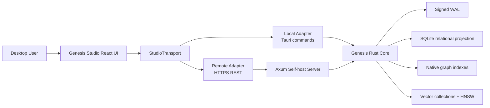

# SPEC - Genesis Studio Desktop

## 1. Approval และ implementation status

Owner อนุมัติเอกสาร `0.1.0b` เมื่อ 2026-07-21 และ **S0 Contract and prototype shell** ถูก implement
และ verify แล้วใน `studio/` ขอบเขตที่อนุมัติให้สร้าง **Genesis Studio Desktop** เป็น controller และ data explorer สำหรับ
GenesisBlockDB โดยใช้ Tauri v2 + React และรองรับสอง deployment modes ผ่าน product contract เดียว:

- **Local Embedded:** Studio เปิด Genesis Rust core ใน process ของตนเอง;
- **Remote Self-hosted:** Studio เชื่อม Axum REST server ผ่าน HTTPS;
- **Relational workspace:** ดู schema, rows และผล named joins แบบ Supabase Studio แต่ไม่เปิด raw SQLite;
- **Graph workspace:** สำรวจ graph แบบ Neo4j Browser/Bloom และ Obsidian local/global graph;
- **Vector workspace:** ดู collection, nearest neighbors, score และ index lag;
- **Three-space inspector:** เลือก entity เดียวแล้วเห็น relational, graph, vector และ temporal/causal evidence ในบริบทเดียวกัน.

S0 ใช้ deterministic mock transport เท่านั้น ส่วน S1 beta เพิ่ม local embedded และ remote REST แบบ read-only,
capability negotiation, bounded graph/entity DTOs, logical named queries และ exclusive process lock แล้ว.
S2-S4 ยังอยู่หลัง phase gates ของตน โดยเฉพาะ mutation, lifecycle operations และ scoped OIDC/JWT authorization.

[ASSUMPTIONS]

1. Desktop เป้าหมายแรกคือ Windows/macOS/Linux ส่วน mobile app ยังอยู่ใน track แยก.
2. `dashboard/` ปัจจุบันเป็น operational prototype และไม่ใช่ฐานที่จะขยายตรง ๆ เป็น database IDE.
3. Local mode ต้องใช้งาน offline ได้ทั้งหมดและไม่ต้องมี OAuth ภายใน embedded engine.
4. Remote mode v1 เป็น single-node self-hosted และต้องรองรับ API key ปัจจุบันก่อน จากนั้นเพิ่ม OIDC/JWT resource-server validation.
5. S1 เป็น read-only เพื่อพิสูจน์ transport parity, graph usability และ process ownership ก่อนเปิด mutation.
6. SQLite เป็น internal relational projection; Studio ไม่เห็น file, connection หรือ arbitrary SQL surface.
7. HQL เป็น query frontend สำหรับ graph/search/context ไม่ใช่ภาษา admin หรือ raw relational SQL.

## 2. Classification และ risk

| Item | Decision |
|---|---|
| Complexity | **C-3 Architecture-Driven** |
| Change risk | **HIGH** |
| เหตุผล | เพิ่ม desktop container, local lifecycle owner, remote security boundary และ public scene/read contracts |
| Approval boundary | S0/S1 approved and implemented as beta; S2-S4 remain gated by mutation, operator and security reviews |

ความเสี่ยงหลักไม่ใช่ UI แต่คือการเปิด data directory ซ้ำจาก Studio และ server, การสร้าง remote admin
surface ที่ authorization ไม่พอ และการโหลด graph ทั้งฐานจน memory/UI ล่ม

## 3. Parent และ peer alignment

### 3.1 Parent contracts

| Parent | Constraint ที่ Studio ต้องรักษา |
|---|---|
| `MASTER-SPEC--GENESIS-DB` | Genesis core และ signed WAL ยังคงเป็น authority |
| `SPEC--GENESISDB-UNIFIED-OPERATIONAL-BOUNDARY-V1` | ผู้ใช้จัดการ database boundary เดียว ไม่จัดการ SQLite/graph/vector แยกกัน |
| `C4--GENESISDB-ARCHITECTURE` | UI เป็น client/container; storage semantics อยู่ใน Rust core |
| `SPEC--GENESISDB-RELATIONAL-APPLICATION-CONTRACT-U2` | ใช้ typed schema/mutation/named-query contract; ห้าม raw SQLite และ arbitrary SQL writes |
| `SPEC--MOBILE-SDK` | ใช้ engine source/version เดียวกัน แต่ desktop Studio ไม่อ้าง planned mobile APIs ว่ามีแล้ว |

### 3.2 Peer boundaries

| Track | Relationship |
|---|---|
| Existing `dashboard/` | คงไว้เป็น lightweight operational client ระหว่าง migration; reuse เฉพาะ component/UX idea ที่คุ้มค่า |
| Obsidian plugin | เป็น PKM integration ไม่ใช่ admin controller; Studio ยืม graph interaction pattern ไม่ยึด vault model |
| HQL | S1 เปิด read-only workbench สำหรับ command ที่ parser/executor รองรับจริง; ไม่ขยาย grammar ใน Studio track |
| SQLite S0/S1 + U2/U3 | Studio เรียก logical Genesis APIs เท่านั้น; ไม่เปิด projection internals |
| Self-host U5/U8 | Remote Studio เป็น consumer ของ auth, lifecycle และ backup contracts ที่ track เหล่านี้ต้องส่งมอบ |
| Distribution `MASTER_PLAN` | Studio เป็น candidate program แยกจาก frozen W0-W4; ห้ามแทรกเข้า roadmap เดิมโดยไม่มี architecture change approval |

## 4. Problem statement

GenesisBlockDB มี relational, graph และ vector capability อยู่ใต้ operational boundary เดียว แต่ผู้ใช้
ยังต้องประกอบ REST calls, HQL และ custom visualization เองเพื่อเข้าใจข้อมูล การมี dashboard ที่แสดง
status/insight ยังไม่เท่ากับ database controller เพราะยังขาด:

1. connection และ lifecycle management สำหรับ local/remote instance;
2. schema/data browsing แบบ bounded และปลอดภัย;
3. query result frames แบบ Graph/Table/JSON;
4. graph exploration ที่ expand/filter/pin ได้โดยไม่โหลดทั้งฐาน;
5. การเชื่อม entity เดียวข้าม relational + graph + vector + time;
6. operator workflows เช่น health, index lag, backup/restore และ audit;
7. authorization model สำหรับ self-hosted deployment.

การสร้าง UI แยกสามตัวจะย้อนกลับไปสู่ปัญหาเดิม คือผู้ใช้ต้อง maintain mental model สามระบบ ดังนั้น
Studio ต้องสะท้อน **หนึ่ง entity identity และหนึ่ง consistency frontier** ไม่ใช่แค่รวมแท็บสามฐานข้อมูล.

## 5. Product goals

1. ผู้ใช้เปิด local database หรือ connect remote server จาก desktop app เดียว.
2. ผู้ใช้สำรวจ relational, graph และ vector data โดยไม่แตะ internal files.
3. ผู้ใช้เลือก entity แล้วตรวจ evidence ข้ามสาม spaces และ temporal history ได้จาก inspector เดียว.
4. Local และ remote mode ให้ผลลัพธ์เชิง semantic เหมือนกันผ่าน `StudioTransport` contract.
5. Graph rendering bounded, cancellable และ responsive กับฐานข้อมูลขนาดใหญ่.
6. Read paths มาก่อน write/admin paths เพื่อลด blast radius.
7. Self-host mode เก็บ credential อย่างปลอดภัยและรองรับ least-privilege scopes.
8. ทุกหน้าต้องแสดง freshness/frontier และไม่ทำให้ eventual index state ดูเหมือน strongly current.

## 6. Non-goals

- ไม่สร้าง Supabase clone หรือ multi-project cloud control plane.
- ไม่สร้าง full SQL IDE และไม่ expose raw SQLite connection/DDL/DML.
- ไม่สร้าง full Cypher/GQL compatibility หรือ general-purpose query planner.
- ไม่โหลด full graph โดยอัตโนมัติและไม่รับประกัน visualization ทุก node พร้อมกัน.
- ไม่ให้ Studio เป็น owner ของ storage semantics, migrations หรือ authorization policy.
- ไม่เพิ่ม multi-node HA, tenant billing, team invitation หรือ hosted control plane.
- ไม่แทน Obsidian เป็น note editor และไม่แก้ mobile UX ใน spec นี้.
- ไม่เปิด mutation, compact, restore หรือ destructive operation ใน S1.

## 7. Personas และ primary jobs

| Persona | Primary job |
|---|---|
| Local app developer | เปิดฐาน local, inspect schema/data, query และ debug entity links |
| Self-host operator | connect server, ดู health/frontier/index lag, ตรวจ auth และจัดการ lifecycle ที่อนุญาต |
| Knowledge worker | สำรวจ local/global graph, search, group/filter และตาม causal history |
| AI engineer | ตรวจ vector collection, nearest neighbors, retrieval context และ graph evidence |

## 8. Architecture decision

### 8.1 Container model



### 8.2 Repository boundary

หลังอนุมัติ ให้สร้าง `studio/` เป็น product shell ใหม่ ไม่เปลี่ยนชื่อหรือย้าย `dashboard/` ใน wave แรก.

```text
studio/
  src/                    React application
  src/domain/             mode-neutral DTOs and use cases
  src/transports/local/   Tauri invoke adapter
  src/transports/remote/  REST adapter
  src/features/           explorer, query, graph, vectors, operations
  src-tauri/              desktop shell and local engine ownership
```

`dashboard/` ยังคง build ได้ระหว่าง transition และอาจถูก deprecate หลัง Studio มี operational parity
พร้อม migration decision แยกต่างหาก

### 8.3 Transport invariant

UI feature code ห้ามเรียก `fetch`, Tauri `invoke` หรือ Rust binding โดยตรง แต่เรียก interface เดียว:

```text
StudioTransport
  getCapabilities()
  getStatus()
  listCollections()
  listRelationalSchemas()
  executeNamedQuery()
  executeReadOnlyHql()
  loadGraphScene()
  expandGraphScene()
  inspectEntity()
```

Method names เป็น logical contract ของ Studio ไม่ใช่การประกาศว่า engine methods เหล่านี้มีอยู่แล้ว.
Local/remote adapters ต้อง map ไปยัง core/API ที่ approved และผ่าน contract tests ชุดเดียวกัน.

## 9. Connection และ lifecycle model

### 9.1 Local Embedded

1. ผู้ใช้เลือกหรือสร้าง Genesis data root ผ่าน native file picker.
2. Tauri backend validate path, format/version และสิทธิ์ก่อนเปิด.
3. Studio process เป็น lifecycle owner เพียงรายเดียวตลอด session.
4. Engine ต้องถือ exclusive OS-level lock หรือ equivalent lease บน data root.
5. ถ้า server/process อื่นถือ lock อยู่ Studio ต้องเปิดไม่ได้และแสดง owner/action ที่ปลอดภัย.
6. ปิด app ต้อง flush ตาม engine contract, release lock และไม่ terminate ระหว่าง critical operation.

### 9.2 Remote Self-hosted

1. Profile เก็บ display name, HTTPS base URL, trust policy และ auth mode.
2. Secret/token เก็บใน OS credential store ไม่อยู่ใน repository, config export หรือ logs.
3. Connection test ต้องตรวจ version, capabilities, auth challenge และ latency.
4. Studio ห้าม assume ว่า remote มีทุก API; navigation/actions ต้อง derive จาก capability document.
5. Certificate bypass อนุญาตเฉพาะ explicit development profile พร้อม persistent warning.

### 9.3 Ownership invariant

Studio local mode และ standalone server **ห้ามเปิด data root เดียวกันพร้อมกัน** จนกว่า engine จะมี
พิสูจน์ multi-process locking/coordination ที่รองรับ การมี SQLite WAL ไม่ได้ทำให้ native WAL, snapshots,
graph และ vector files ปลอดภัยต่อ multi-process writer โดยอัตโนมัติ.

## 10. Information architecture

| Workspace | Core purpose | S1 |
|---|---|---|
| Home / Connections | local roots, remote profiles, recent sessions, capability check | Yes |
| Overview | version, counts, frontier, index lag, storage/health summary | Yes |
| Data | namespaces, schemas, tables/views, bounded rows, named-query results | Yes, read-only |
| Graph | search seed, scene expand, filters, groups, pin, timeline | Yes, read-only |
| Vectors | collections, metric/dim/count, nearest-neighbor probe | Yes, read-only |
| Query | HQL editor, history, Graph/Table/JSON result frames | Yes, read-only commands |
| Entity Inspector | three-space + temporal/causal evidence | Yes |
| Operations | save/compact/backup/restore/logs | Status only in S1; actions later |
| Access | API key/OIDC profile, scopes, namespace grants | Connection state only in S1 |

## 11. Three-space entity inspector

นี่คือ product differentiator หลัก ไม่ใช่การวางสามแท็บข้างกัน เมื่อผู้ใช้เลือก entity Studio ต้องสร้าง
`EntityInspection` ที่อ้าง canonical entity id และ frontier เดียวกัน:

| Pane | Evidence |
|---|---|
| Relational | logical schema rows/properties/labels และ named relationships ที่ผูก entity |
| Graph | bounded incoming/outgoing neighborhood, relation type, direction และ validity |
| Vector | collection, vector presence, nearest neighbors, score/metric และ index freshness |
| Time/Cause | valid/system time, supersession, caused-by path, logical clock/frontier |

ทุก pane ต้องแสดงหนึ่งในสถานะ `available`, `not_present`, `not_authorized`, `stale`, `unsupported`
แทนการซ่อนความแตกต่าง ผู้ใช้ต้องรู้ว่า “ไม่มีข้อมูล” ต่างจาก “API ยังไม่รองรับ”.

### 11.1 Cross-space interactions

- เลือก row แล้ว focus node ที่ canonical id เดียวกัน.
- เลือก graph node แล้วเปิด relational evidence และ vector neighbors.
- เลือก vector neighbor แล้วเพิ่มเข้า scene โดยไม่ reset graph layout.
- เปลี่ยน `as_of` แล้วทุก pane ที่รองรับ time ต้อง refresh ภายใต้ request context เดียว.
- Copy/export ต้องแนบ query parameters, frontier และ staleness metadata.

## 12. Graph explorer contract

### 12.1 Interaction model

Graph workspace รวม pattern ที่มีคุณค่าจาก Neo4j และ Obsidian:

- seed ด้วย id, text/vector search, HQL result หรือ selected relational row;
- local neighborhood expansion ต่อ node และ direction;
- bounded “global perspective” ตาม labels, relation types, collection, time และ sampling policy;
- filters, groups, color/size rules, pin/unpin, hide, focus และ shortest visible path;
- Graph/Table/JSON views ของ result set เดียวกัน;
- scene state เป็น client artifact แยกจาก database state.

### 12.2 Bounded scene

S1 default budgets:

| Budget | Default | Hard behavior |
|---|---:|---|
| Initial scene nodes | 500 | server/core ต้อง truncate พร้อม continuation |
| Scene node ceiling | 1,000 | UI หยุด expansion และเสนอ filter/refine |
| Scene edge ceiling | 3,000 | dense relations aggregate หรือ truncate แบบ explicit |
| Expansion nodes/action | 100 | cancellable; deduplicate กับ scene ปัจจุบัน |
| Query timeout | 10 s local / 15 s remote | cancel และคง scene เดิม |

ตัวเลขเป็น initial product budget ต้อง benchmark ก่อน promote เป็น stable ไม่ใช่ engine capacity claim.

### 12.3 Renderer decision

ใช้ Sigma.js/WebGL เป็น renderer candidate สำหรับ Studio เพราะเหมาะกับ interactive graph ที่ bounded;
ห้ามยึด `react-force-graph-2d` ของ dashboard เป็น architecture dependency Layout worker และ renderer
ต้องแยกจาก query/scene model เพื่อเปลี่ยน renderer ได้โดยไม่เปลี่ยน engine contract.

### 12.4 Required scene DTO

```text
GraphScene {
  scene_id, request_id, frontier,
  nodes[], edges[], groups[],
  truncated, continuation?, warnings[],
  capabilities
}
```

Node/edge DTO ต้องมี stable id, display fields, type/labels, validity, style hints ที่ไม่ executable และ
source evidence ห้ามส่ง arbitrary HTML/script จาก database เข้า WebView.

## 13. Relational workspace

Relational UX คล้าย Supabase Studio ในด้าน discoverability แต่ contract ต่างกันอย่างตั้งใจ:

1. schema tree มาจาก versioned logical schema packages;
2. data grid ใช้ bounded typed reads/named queries;
3. join results แสดง logical columns และ query identity;
4. S1 ไม่มี row edit, raw SQL console, projection table browser หรือ SQLite pragma;
5. write UX ใน S2 ต้อง generate typed `RelationalMutationBatch` และแสดง validation ก่อน commit;
6. internal tables เช่น projection metadata ต้องไม่ปรากฏเป็น application tables.

หาก read/list endpoint ยังไม่มี ห้ามแก้ด้วยการเปิด raw SQL; ต้องออกแบบ logical read API ใน engine track.

## 14. Query workbench

### 14.1 S1 behavior

- editor รองรับเฉพาะ HQL commands ที่ runtime parser รองรับจริง;
- client-side command classification ป้องกัน known writes แต่ server/core ยังต้อง enforce read-only mode;
- result แสดง Graph/Table/JSON เมื่อ shape รองรับ;
- query history local-only และ redact secrets/large embeddings;
- explain/plan tab แสดง `unsupported` จนมี engine contract จริง;
- examples versioned ตาม server capability/version ไม่ hard-code marketing syntax.

### 14.2 Safety rule

Client-side filtering ไม่ใช่ security boundary Remote server และ local Tauri command ต้องใช้ explicit
read-only entry point หรือ structured allowlist ห้ามส่ง arbitrary query เข้า `execute_hql` แล้วหวังว่า UI
จะปิดปุ่ม write ได้เพียงอย่างเดียว.

## 15. Vector workspace

S1 รองรับ:

- list collection name, dimension, metric, count และ index lag/freshness;
- nearest-neighbor probe จาก selected entity หรือ supplied vector ที่ dimension ถูกต้อง;
- score explanation ตาม metric โดยไม่แปล score เป็น confidence;
- add search results เข้า graph scene ผ่าน canonical entity id;
- clear state สำหรับ vector missing, index pending และ collection mismatch.

S1 ไม่แสดง raw vector ทุก dimension โดย default และไม่อนุญาต vector mutation/rebuild.

## 16. Operations workspace

### 16.1 S1 read-only

- engine/server version และ negotiated capabilities;
- node/edge/collection counts;
- stable frontier/logical clock;
- index lag และ last refresh;
- remote reachability/auth state;
- current local lock owner/session;
- warnings ที่ engine ส่งแบบ structured.

### 16.2 Later gated actions

Save, compact, backup, restore, index rebuild และ shutdown ต้องมีทั้งหมดดังนี้ก่อนเปิด UI:

1. dedicated typed API;
2. authorization scope;
3. preflight + impact summary;
4. progress/cancellation semantics;
5. audit event;
6. success verification;
7. rollback/recovery procedure.

Restore ห้ามเป็น generic file copy และห้ามเปิดใน remote mode จน self-host lifecycle contract รองรับ.

## 17. Capability negotiation

Studio ต้องเริ่ม session ด้วย capability document ที่ versioned และ cache เฉพาะ session:

```text
StudioCapabilities {
  protocol_version,
  engine_version,
  mode,
  read_features[],
  write_features[],
  auth_features[],
  limits,
  consistency,
  unsupported_reasons
}
```

Remote server และ local adapter ต้องคืน semantics เดียวกัน Feature ที่ไม่มีต้อง disabled พร้อมเหตุผล
ไม่ใช่ยิง request แล้วใช้ HTTP 404 เป็น capability discovery.

## 18. Current API gap matrix

ตารางนี้แยก runtime truth ออกจาก planned contract ณ วันที่สร้างเอกสาร:

| Studio need | Core | REST | Decision |
|---|---|---|---|
| Status/version/swarm | มี | มี | ใช้ใน S1 หลัง normalize DTO |
| List vector collections/index lag | มี | collections มี; lag อยู่ใน status | ใช้ใน S1 |
| Hybrid search/context | มี | มี | ใช้ใน S1 |
| HQL execute | มี | มี | ต้องเพิ่ม read-only enforcement ก่อน workbench |
| Relational schema get/named query | มี | มี | ตรวจว่ามี bounded list/read shape ครบก่อน Data grid |
| Bounded graph scene/snapshot | ไม่มี canonical contract | ไม่มี | ออกแบบ API ใหม่; ห้ามอ้าง planned `get_graph_snapshot()` จาก mobile spec |
| Incremental scene expansion DTO | neighbors มีใน core/NAPI | ไม่มี dedicated REST scene API | เพิ่ม parity contract |
| Entity inspection ข้ามสาม spaces | ไม่มี aggregate contract | ไม่มี | compose จาก bounded reads หรือเพิ่ม endpoint หลัง benchmark |
| Capability negotiation | ไม่มี | ไม่มี | required ก่อน local/remote parity |
| Change stream/SSE/WebSocket | ไม่มี | ไม่มี | polling bounded ใน S1; stream เป็น S3 |
| Backup/restore lifecycle | primitives/partial | ไม่มี operator API | operations phase เท่านั้น |
| Exclusive multi-process data-root lock | ยังไม่มี proof | ไม่มี | blocker สำหรับ local mode release |
| API key | N/A ใน embedded | มี bearer shared secret | remote bootstrap only |
| OIDC/JWT + scoped ACL | ไม่มี | ไม่มี | dependency ก่อน production multi-user remote |

## 19. Authentication และ authorization

### 19.1 Local mode

Local embedded mode ใช้ OS user/session และ filesystem permissions เป็น primary trust boundary แต่ยังต้อง:

- validate paths และป้องกัน symlink/path traversal;
- ไม่ render database content เป็น unsanitized HTML;
- จำกัด Tauri command allowlist และ CSP;
- เก็บ recent path metadata โดยไม่ leak sensitive contents;
- require confirmation สำหรับ future destructive operations.

### 19.2 Remote mode

GenesisBlockDB ควรเป็น **OAuth 2.0 Resource Server** ที่ validate JWT จาก external OIDC provider
ไม่สร้าง identity provider เองใน scope นี้ Initial scopes:

| Scope | Capability |
|---|---|
| `genesis.read` | status, schema/data read, query, graph/vector inspection |
| `genesis.write` | typed mutations |
| `genesis.schema` | schema package registration/migration |
| `genesis.sync` | sync/event surfaces |
| `genesis.admin` | lifecycle, backup/restore, compact, access policy |

Authorization ต้องบังคับ server-side และขยายได้ถึง namespace/collection grants API key ปัจจุบันใช้เป็น
bootstrap/single-operator mode ได้ แต่ไม่เพียงพอสำหรับ production multi-user self-host.

### 19.3 Secret handling

- token เก็บใน OS credential store;
- logs/telemetry ห้ามบันทึก Authorization header, query secrets หรือ full embeddings;
- export profile ไม่รวม secret;
- logout/revoke ต้อง clear cached token และ in-memory sensitive state;
- WebView ไม่มี direct network permission นอก allowlisted origins; remote calls ควรผ่าน hardened adapter.

## 20. Consistency และ freshness UX

ทุก result envelope ต้องมี `request_id`, `frontier`, `generated_at`, `truncated` และ warnings ที่เกี่ยวข้อง.
Vector result ต้องแสดง index lag; temporal read ต้องแสดง `as_of`; mixed-pane inspection ต้องแจ้งเมื่อแต่ละ
projection อยู่คนละ frontier แทนการรวมผลแล้วอ้างว่า atomic.

Studio ห้ามใช้สีเขียวหรือคำว่า “synced/current” หากไม่มี stable-frontier evidence จาก engine.

## 21. Performance และ resource budgets

| Area | Candidate S1 target |
|---|---|
| Cold launch to connection screen | <= 3 s บน reference desktop |
| Local connection readiness | <= 2 s สำหรับ test fixture หลัง lock acquired |
| Overview refresh | p95 <= 500 ms local, <= 1.5 s remote LAN |
| Graph interaction | >= 30 FPS ที่ scene ceiling บน reference hardware |
| Main-thread long task | ไม่มี task > 100 ms ระหว่าง pan/zoom ปกติ |
| App memory overhead | <= 300 MB ที่ 1,000 nodes / 3,000 edges ไม่รวม engine data |
| Cancellation | stale request ต้องไม่ replace newer scene/result |

Targets ต้องมี reproducible fixture และ hardware record; ไม่ใช้เป็น marketing claim จน audit ผ่าน.

## 22. Observability

Studio ต้องมี structured local diagnostic log ที่ redact secrets และประกอบด้วย:

- session/mode/engine/protocol version;
- request id, operation, duration, result count และ truncation;
- connection/auth/capability failures;
- local lock acquisition/release;
- renderer node/edge count, layout duration และ dropped-frame summary;
- operation audit id สำหรับ future admin actions.

Telemetry ออกนอกเครื่องเป็น opt-in เท่านั้นตาม local-first posture.

## 23. Testing strategy

| Layer | Required proof |
|---|---|
| Domain | DTO validation, capability gating, stale-response suppression, scene merge/dedup |
| Transport contract | ชุด test เดียวรันกับ local adapter และ remote test server |
| Rust/Tauri | path validation, lock contention, lifecycle close/crash recovery, command allowlist |
| API | auth scopes, pagination/budgets, truncation, malformed filters, timeout/cancel |
| UI component | result frames, unavailable/stale/not-authorized states, keyboard navigation |
| E2E | connect -> inspect row -> graph expand -> vector neighbor -> time context |
| Performance | 1k/3k scene, dense graph, slow remote, rapid cancel/refine |
| Security | token redaction, XSS payloads, malicious labels/props, certificate policy, privilege denial |
| Compatibility | supported Windows/macOS/Linux matrix และ protocol N/N-1 policy |

## 24. Rollback strategy

1. `studio/` เป็น additive container; rollback ได้โดยหยุด distribution โดยไม่เปลี่ยน database format.
2. S1 เป็น read-only จึงไม่ต้อง migrate user data จาก Studio.
3. Public API ใหม่ต้อง versioned/additive และ server เก่าตอบ capability unsupported ได้.
4. ถ้า local lock/lifecycle proof ไม่ผ่าน ให้ ship remote-only preview แทนการลด safety.
5. ถ้า renderer target ไม่ผ่าน ให้ลด scene budget หรือเปลี่ยน renderer adapter โดยไม่เปลี่ยน engine API.
6. ห้าม rollback ด้วยการเปิด raw SQLite/raw files เพื่อชดเชย API ที่ขาด.

## 25. Implementation roadmap

### S0 - Contract and prototype shell

- [x] Approve spec/C4 และ freeze `StudioTransport` v0 mock contract.
- [x] สร้าง Tauri + React shell, connection screen และ mock transport.
- [x] Define capability/result/error/scene DTOs และ contract tests.
- [x] Prototype Sigma scene ด้วย generated fixture; ไม่มี engine mutation.

Exit: **PASS on Windows development host.** App build, mock E2E และ graph budget baseline มี evidence ดังนี้:

| Evidence | Result |
|---|---|
| `npm test` | 2 files, 8 tests passed |
| `npm run build` | TypeScript + Vite production build passed |
| `npm run test:e2e` | 4 Playwright cases passed: desktop + mobile Chromium |
| `cargo test --manifest-path studio/src-tauri/Cargo.toml` | 1 Rust shell invariant passed |
| `npx tauri build --debug --no-bundle` | Built `genesis-studio.exe` (12,719,616 bytes) |

S0 performance evidence เป็น functional scene budget proof ที่ 240 nodes ภายใต้ ceiling 1,000 nodes;
ยังไม่ใช่ FPS/RAM benchmark และห้ามใช้เป็น production performance claim.

### S1 - Read-only local/remote explorer

- [x] Implement exclusive local data-root ownership proof.
- [x] Wire status, collections, logical relational schema/named query และ read-only HQL.
- [x] Add capability, bounded graph scene/expand and entity inspection APIs.
- [x] Deliver Overview, Data, Graph, Vectors, Query และ Entity Inspector read-only.
- [ ] Complete packaged local/remote semantic-parity drill against the same persisted fixture.
- [ ] Complete independent architecture/security review and cross-platform packaging evidence.

Status: **BETA IMPLEMENTED; release exit remains open.** Core/REST contracts, frontend contract tests and
fixture E2E pass without raw SQLite/direct projection access. A packaged real local/remote parity drill and
independent review remain release gates.

### S2 - Governed mutations

- Add typed node/edge/relational/vector workflows ตาม existing engine contracts.
- Add validation preview, scopes, confirmation และ audit receipt.
- Keep bulk/destructive actions out จนมี dedicated review.

Exit: authorized mutation is durable/reopen-safe และ unauthorized mutation ถูกปฏิเสธ server-side.

### S3 - Operations and live updates

- Add change stream or bounded delta refresh.
- Add approved save/compact/backup operations with progress/audit.
- Add query/scene perspectives and reusable workspace state.

Exit: lifecycle drills, interruption recovery และ performance soak ผ่าน.

### S4 - Production self-host controller

- OIDC/JWT resource-server integration, scoped namespace/collection authorization.
- Restore workflow, access management และ signed update/distribution path.
- Cross-platform packaging, code signing, update policy และ support diagnostics.

Exit: threat model, restore drill, packaging matrix และ architecture review ผ่าน.

## 26. Acceptance criteria (EARS)

1. WHEN Studio เปิด local data root THEN engine SHALL acquire exclusive ownership before any read/write lifecycle action.
2. IF data root ถูก process อื่นถืออยู่ THEN Studio SHALL refuse open and SHALL NOT attempt recovery or file mutation.
3. WHEN Studio connects remote THEN it SHALL negotiate capabilities before enabling workspaces/actions.
4. WHEN capability is absent THEN UI SHALL show `unsupported` and SHALL NOT infer support from version alone.
5. WHEN S1 executes HQL THEN local and remote boundary SHALL enforce an approved read-only command set.
6. WHEN a graph request exceeds budget THEN response SHALL truncate deterministically and include continuation/warning metadata.
7. WHEN a newer scene request starts THEN completion of an older request SHALL NOT overwrite the newer scene.
8. WHEN an entity is selected THEN inspector SHALL preserve canonical id and expose availability/freshness per space.
9. WHEN vector indexing lags THEN Studio SHALL display lag and SHALL NOT present nearest-neighbor results as fully current.
10. WHEN remote authorization denies a scope THEN action SHALL remain denied even if UI state is manipulated.
11. WHEN logs are exported THEN credentials, authorization headers and full embeddings SHALL be absent.
12. WHEN Studio S1 is removed THEN no database-format migration or rollback action SHALL be required.

## 27. Dependencies

| Dependency | Needed by | Status |
|---|---|---|
| Current status/collections/search/query APIs | S1 | Available for read-only Studio transport |
| Logical relational list/read completeness | S1 | Schema registry + versioned named-query execution available |
| Bounded graph scene + expansion contract | S1 | Implemented with deterministic ceilings and continuation |
| Exclusive local process lock proof | S1 release | Implemented and contention-tested |
| Capability negotiation | S1 | Implemented; write features remain empty |
| Tauri v2 toolchain + platform WebView | S0 | New product dependency |
| Sigma.js/graphology evaluation | S0 | Candidate, benchmark required |
| OIDC/JWT resource-server spec | S4 | Missing |
| Backup/restore operator contract | S3/S4 | Planned in unified boundary, not exposed |

## 28. Risks and mitigations

| Risk | Likelihood | Impact | Mitigation |
|---|---|---|---|
| Studio/server open same data root | Medium | Critical | exclusive lock is S1 release blocker |
| UI turns into second semantic layer | Medium | High | mode-neutral DTOs; semantics remain core-owned; parity tests |
| Graph explosion/freezing | High | High | hard budgets, continuation, cancel, worker layout, WebGL |
| Raw SQL shortcut leaks SQLite | Medium | High | logical schema/query APIs only; explicit non-goal/test |
| API key mistaken for multi-user auth | Medium | High | label bootstrap mode; gate production on OIDC/JWT + scopes |
| Local and remote drift | High | High | capability negotiation + shared contract suite |
| Dashboard migration disrupts users | Low | Medium | additive `studio/`; retain dashboard until explicit deprecation |
| Cross-space panes show inconsistent state | Medium | High | frontier/freshness metadata and explicit stale states |
| Tauri/WebView content injection | Medium | High | CSP, sanitization, command/network allowlists, security tests |

## 29. Alternatives considered

| Alternative | Decision | Reason |
|---|---|---|
| Expand existing dashboard directly | Reject for S0 | current scope is small operational web client; desktop lifecycle and IDE IA would destabilize it |
| Electron | Reject initially | larger runtime footprint and weaker direct Rust integration than Tauri for this product |
| Browser-only admin app | Keep as future remote surface | cannot own local embedded lifecycle/data root safely without native bridge |
| Neo4j Browser clone | Reject | would center graph/Cypher and hide relational/vector/temporal differentiator |
| Obsidian plugin as controller | Reject | plugin sandbox/PKM lifecycle is not database operations boundary |
| Open raw SQLite for relational UI | Reject | bypasses Genesis WAL, authorization, portability and one-boundary contract |
| One custom endpoint returning entire database | Reject | unbounded, non-streaming, unsafe and impossible to authorize precisely |

## 30. Open questions for approval/implementation planning

1. Product name final: `Genesis Studio` หรือ `GenesisBlock Studio`.
2. S0 distribution target เริ่ม Windows-only แล้วขยาย หรือ build matrix ทั้งสาม OS ตั้งแต่แรก.
3. Remote preview จะรองรับ API key เท่านั้นจน S4 หรือดึง OIDC/JWT มาเป็น prerequisite ของ S2.
4. Canonical entity-to-relational-row mapping ของ app-defined schemas จะประกาศใน schema package อย่างไร.
5. “Global graph” sampling/perspective algorithm ใดให้ภาพที่มีความหมายโดยไม่โหลดทั้งฐาน.
6. Scene state/perspectives เก็บ local-only หรือเป็น Genesis application schema ใน S3.

Open questions เหล่านี้ไม่ block S0 mock/prototype แต่ข้อ 2-5 ต้องตัดสินใจก่อน wave ที่เกี่ยวข้อง.

## 31. Definition of Done

- Acceptance criteria ของ wave ที่อนุมัติผ่านครบ.
- Local/remote transport contract tests ผ่านด้วย semantic result เดียวกัน.
- ไม่มี raw SQLite/direct projection access ใน Studio surface.
- Process ownership, auth, scene budgets และ staleness ผ่าน negative tests.
- Relevant Rust, REST, frontend, E2E, security และ performance checks ผ่าน.
- C4, API reference, threat model และ packaging docs truth-sync กับ runtime.
- Independent architecture/security review ไม่มี unresolved P0/P1 finding.
- Version diff และ changelog อัปเดตพร้อม evidence.

## 32. Version diff

### `0.2.0b -> 0.3.0b`

- Added exclusive data-root ownership and a read-only WAL worker that never opens the native WAL for append.
- Added core-owned Studio capability, bounded graph, entity inspection, logical schema and read-only HQL contracts.
- Added local Tauri and remote REST transports plus versioned named-query execution without raw SQLite access.
- Kept mutations, lifecycle actions and OIDC/JWT authorization disabled pending S2-S4 server-side contracts.

### `0.1.0b -> 0.2.0b`

- Promoted document from candidate to beta after owner approval and S0 implementation.
- Added the additive `studio/` Tauri + React product shell and deterministic mock transport.
- Added mode-neutral contracts, bounded Sigma fixture scene and explicit unavailable S1 workspaces.
- Added Vitest transport/domain tests, desktop/mobile Playwright E2E and Rust shell invariant.
- Recorded the verified Windows debug executable while keeping all engine/API gaps open.

### `0.0.0 -> 0.1.0b`

- สร้าง candidate product/architecture contract สำหรับ Genesis Studio Desktop.
- กำหนด embedded/remote transport parity และ exclusive data-root ownership.
- กำหนด relational + graph + vector + temporal three-space inspector.
- กำหนด bounded graph scene, security/auth posture, S0-S4 roadmap และ rollback.
- บันทึก API gaps ตาม runtime truth โดยไม่อ้าง planned mobile graph snapshot ว่ามีแล้ว.

## CHANGELOG

| Version | Date | Status | Summary | Commit Hash | Agent |
|---------|------|--------|---------|-------------|-------|
| 0.3.0b | 2026-07-22 | beta | Implemented S1 read-only local/remote contracts and retained explicit S2-S4 safety gates. | working-tree | ATHER |
| 0.2.0b | 2026-07-21 | beta | Implemented and verified the fixture-only S0 desktop product shell. | working-tree | ATHER |
| 0.1.0b | 2026-07-21 | candidate | Initial Genesis Studio Desktop architecture and product contract. | working-tree | ATHER |

S0 is complete. S1 is implemented as beta; packaged parity and independent review remain release gates. S2-S4 remain gated.
