# SPEC — GenesisBlockDB U9 Backup and Clean-Target Restore

## 1. Purpose and boundary

This proposal closes the application-facing part of U9: one verifiable
Genesis backup bundle that restores relational, graph, vector, and
Genesis-managed blob metadata to one coherent frontier.

It introduces an embedded Rust-core lifecycle API for consumers such as FUNG.
The caller receives or supplies **one opaque Genesis bundle**; it must not read,
copy, enumerate, or reconstruct `projection.sqlite`, WAL, snapshot, graph, or
vector files. N-API, REST, SDK, and Studio operator endpoints are deliberately
out of this first slice because they need separate authorization and transport
reviews.

[ASSUMPTIONS]

1. FUNG's desktop Rust runtime links GenesisBlockDB as an embedded crate and
   can call a version-pinned Rust public API.
2. FUNG's own encryption layer will read the single opaque bundle as bytes; it
   does not gain access to Genesis's unpacked internal files.
3. Managed blob metadata currently belongs to the engine snapshot unit. Any
   future external blob payload store must register its artifact manifest and
   hashes through this contract before U9 can claim that payload is covered.

## 2. Public contract

```rust
pub struct BackupExportRequest {
    pub destination: PathBuf, // non-existing output file selected by the caller
}

pub struct BackupBundleInfo {
    pub format_version: u32,  // initially 1
    pub engine_name: String,
    pub engine_version: String,
    pub schema_version: u32,
    pub stable_frontier: u64,
    pub logical_clock: u32,
    pub created_at: String,
    pub bundle_path: PathBuf,
    pub byte_count: u64,
    pub sha256: String,
}

pub struct BackupRestoreRequest {
    pub bundle_path: PathBuf,
    pub target_root: PathBuf, // must not exist
}

impl Storage {
    pub fn export_backup(&self, request: BackupExportRequest) -> Result<BackupBundleInfo>;
    pub fn restore_backup(request: BackupRestoreRequest) -> Result<BackupBundleInfo>;
}
```

`destination` must be a new file, not the live database root or a path inside
it. `target_root` must not exist: restore never replaces, clears, or merges an
existing database. The returned digest is SHA-256 of the completed bundle.

## 3. Bundle format and integrity

The v1 bundle is a deterministic container with a UTF-8 `manifest.json` and
only the exact engine-owned artifacts named in that manifest. The manifest
contains format/engine/schema versions, stable frontier, logical clock,
creation timestamp, optional managed-blob metadata inventory, and for every
artifact its normalized relative path, byte length, and SHA-256.

The engine writes a complete temporary bundle in the destination's parent,
fsyncs it, validates every listed digest, then atomically renames it to the
requested destination. It never marks a partial file as a bundle. Archive entry
paths must be normalized relative paths; absolute paths, `..`, duplicate names,
symlinks, device paths, and unlisted artifacts are rejected.

## 4. Coherent capture and restore

The core adds one lifecycle barrier shared by all mutation entry points. Export
takes its exclusive side, flushes deferred vector indexing, records the current
stable frontier/logical clock, and captures WAL, snapshot, SQLite projection,
graph/vector artifacts, and Genesis-managed blob metadata from that same
frontier. It then releases the barrier after the bundle is complete or fails.

Restore first validates the whole bundle into a sibling staging directory. It
does not open the target, mutate a live `Storage`, or create the target until
manifest, versions, containment, sizes, and every digest pass. The engine then
atomically publishes the staging root as the non-existing `target_root`. A
fresh `Storage::open` is the proof that the result is usable.

Neither export nor restore performs encryption, remote upload, retention, or
account authorization. Those remain the caller's concerns.

```mermaid
flowchart LR
    APP["Embedded application"] --> EXP["Storage::export_backup"]
    EXP --> BARRIER["exclusive lifecycle barrier"]
    BARRIER --> SNAP["coherent engine snapshot"]
    SNAP --> MANIFEST["manifest + SHA-256"]
    MANIFEST --> BUNDLE["one opaque Genesis bundle"]
    BUNDLE --> RESTORE["Storage::restore_backup"]
    RESTORE --> VERIFY["verify in sibling staging root"]
    VERIFY --> CLEAN["publish only to non-existing target root"]
```



## 5. Required acceptance tests

1. **Round trip:** relational schema/rows, nodes, an edge, a non-default vector
   collection, and managed blob metadata export then clean-target restore; a
   fresh open proves identical identities, query results, collection metadata,
   frontier, and manifest digest.
2. **Tamper rejection:** a changed artifact, manifest, duplicate path, traversal
   path, or extra archive entry fails before target creation.
3. **Clean-target only:** an existing target and a bundle destination inside the
   live root are rejected without changing either database.
4. **Interrupted export:** a failing temporary write leaves no completed output
   and leaves the source open/queryable.
5. **Concurrent mutation boundary:** a mutation issued during export blocks at
   the lifecycle barrier; the restored result equals one declared frontier, not
   a mixture.
6. **Compatibility:** unsupported format, engine, or schema versions fail with
   a named compatibility error before target creation.

## 6. Non-goals and rollout

- No generic filesystem copy API, direct projection handle, N-API/REST lifecycle
  endpoint, cloud provider, encryption primitive, or automatic backup schedule.
- FUNG must pin the Genesis revision containing this API and keep its existing
  local filesystem adapter restricted to encrypted, test-only bundles.
- U9 is not closed until the core suite passes and FUNG demonstrates its own
  encrypted filesystem backup to a clean target. This contract alone does not
  close mobile physical-device or release gates.

## 7. Implementation evidence (2026-08-14)

The embedded Rust-core surface now provides `BackupExportRequest`,
`BackupRestoreRequest`, `BackupBundleInfo`, `Storage::export_backup`, and
`Storage::restore_backup`. The bundle format is versioned and opaque to callers;
the engine validates all listed artifact hashes in staging before publishing a
non-existing restore root. The primary local write paths share the lifecycle
barrier during export.

The current engine has no external managed blob-payload store. The v1
manifest therefore captures the complete set of current engine-owned snapshot
artifacts; future blob metadata requires a separately versioned contract.

CRDT `reconcile_state` now takes the same lifecycle barrier before applying or
persisting inbound events. Its recursive `Event::Batch` path uses an internal
unlocked helper, so the public call holds the non-reentrant barrier once without
deadlocking nested batch reconciliation.

Observed targeted evidence:

- `cargo test --no-default-features --test backup_restore_u9_tests -- --test-threads=1`
  — 6 passed (round trip; tamper, duplicate/traversal/trailing-entry, and
  compatibility rejection; plus live/existing destination rejection).
- `cargo test --no-default-features --test persistence_tests` — 1 passed.
- `cargo test --no-default-features --test relational_u2_contract_tests` — 5
  passed.
- `cargo test --no-default-features --test crdt_sync_tests` — 4 passed,
  including nested batch reconciliation under the lifecycle barrier.

FUNG still must pin a reviewed Genesis revision and prove its encrypted
filesystem transport separately. The tests above do not close U9 or release
gates by themselves.

## 8. Implementation sequence

1. Add focused RED integration tests in `tests/backup_restore_u9_tests.rs`.
2. Add the lifecycle barrier and internal snapshot/package helpers in `src/lib.rs`.
3. Implement export, then clean-target restore; keep the public surface Rust-core
   only.
4. Run targeted U9 tests, persistence/rebuild/relational suites, then the full
   Rust suite with `--no-default-features` and the mobile feature compile.
5. After merge, pin the exact Genesis revision in FUNG and begin its separately
   approved filesystem-test integration.

## 9. Approval Gate

Approval authorizes only the GenesisBlockDB U9 implementation sequence above.
It does not authorize FUNG backup UI/transport code, a direct database-file
copy, or Google Drive work.

## 10. CHANGELOG

| Version | Date | Status | Summary | Commit Hash | Agent |
| --- | --- | --- | --- | --- | --- |
| 0.1.3b | 2026-08-14 | beta | Closed the CRDT reconciliation lifecycle-barrier bypass without changing the public API; nested batch reconciliation remains safe. | working-tree | ATHER |
| 0.1.2b | 2026-08-14 | beta | Implemented embedded opaque bundle export and clean-target restore with targeted passing evidence; FUNG integration remains separate. | working-tree | ATHER |
| 0.1.1b | 2026-08-14 | beta | Boss approved the U9 embedded backup/clean-target restore contract. | N/A | ATHER |
| 0.1.0b | 2026-08-14 | candidate | Proposed embedded U9 backup/clean-target restore contract and TDD acceptance suite. No code changes. | N/A | ATHER |
