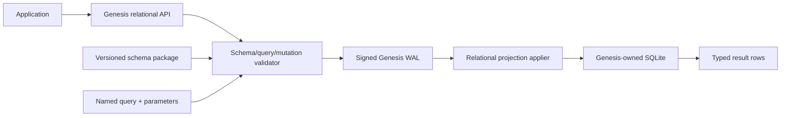

# SPEC - GenesisBlockDB Relational Application Contract U2

## 1. คำขออนุมัติ

อนุมัติให้ Phase U2 เพิ่ม relational capability ที่ application ใช้งานผ่าน GenesisBlockDB โดยตรง
ประกอบด้วย versioned schema packages, additive migrations, typed row mutation batches และ named
parameterized join queries โดยมีข้อจำกัดสำคัญดังนี้:

- application ไม่ได้รับ raw SQLite connection;
- application ไม่ส่ง raw DDL หรือ raw SQL writes;
- schema และ row mutations ต้องเข้า signed Genesis WAL ก่อน apply ลง SQLite;
- U2 transaction ครอบคลุม relational rows ภายใน batch เดียวเท่านั้น;
- cross-domain atomicity ระหว่าง row, graph และ vector รวมถึง stable frontier เป็น Phase U3;
- HQL ไม่ถูกแก้และไม่เป็น dependency ของ relational API.

เอกสารนี้เป็น candidate และเป็น approval gate ก่อน implementation ตาม `AGENTS.md` R5

[ASSUMPTIONS]

1. U2 ต้องแก้ปัญหา mobile application ที่ต้องมี tables, constraints, indexes และ joins จริง.
2. Schema ส่วนใหญ่ของ v1 สามารถ evolve แบบ additive ได้; destructive migration ยังไม่จำเป็น.
3. Named queries ครอบคลุม production read paths ได้ดีกว่าการเปิด arbitrary SQL ให้ untrusted caller.
4. Single process ยังคงเป็น writer owner เพียงรายเดียวตาม v1 deployment boundary.
5. U2 ต้องออกแบบ type/event envelope ให้ขยายเป็น `GenesisTransaction` ใน U3 ได้โดยไม่ breaking change.

## 2. Parent และ peer alignment

### 2.1 Parent contracts

เอกสารนี้อยู่ใต้ข้อกำหนดต่อไปนี้:

- `SPEC--GENESISDB-UNIFIED-OPERATIONAL-BOUNDARY-V1`: application เห็น database boundary เดียว,
  SQLite เป็น internal relational subsystem และ typed Query IR เป็น canonical direction;
- `MASTER-SPEC--GENESIS-DB`: signed WAL เป็น durability authority;
- `C4--GENESISDB-ARCHITECTURE`: Rust core เป็นเจ้าของ lifecycle และทุก public surface เป็น adapter;
- `ADR--GENESISDB-EMBEDDED-SQLITE-SUBSTRATE`: ห้าม direct external SQLite writes.

### 2.2 Peer boundaries

| Track | U2 relationship |
|---|---|
| SQLite S0/S1 | ใช้ projection connection, WAL-first apply และ recovery foundation ที่ปิดแล้ว |
| HQL P0/P1 | ไม่แก้ grammar หรือ executor; ทดสอบ independence เท่านั้น |
| U3 unified transaction | เตรียม event/type envelope แต่ไม่ทำ row+graph+vector atomic commit |
| U4 mobile proof | U2 ต้อง compile ผ่าน mobile features แต่ physical-device proof อยู่ U4 |
| U5 self-host proof | U2 เพิ่ม REST contract แต่ production load/TLS/ops gate อยู่ U5 |
| U6 SQL-backed HQL/FTS | ไม่อยู่ใน U2 และยัง demand-gated |

## 3. ปัญหาที่ต้องแก้

SQLite S0/S1 ปัจจุบันเก็บเฉพาะ engine-owned `props` และ `node_labels` จึงยังไม่สามารถแทน relational
database ของ application ได้ Application ยังไม่มีวิธีประกาศ table, foreign key, index, migration,
row mutation หรือ join โดยไม่เปิด SQLite แยกเอง

ถ้าเปิด raw SQLite API โดยตรง จะเกิดปัญหา:

1. writes ข้าม signed WAL และ recovery contract;
2. public API ผูกกับ SQLite จนเปลี่ยน backend ไม่ได้;
3. caller สามารถแตะ internal projection tables;
4. raw SQL ทำให้ authorization, resource limits และ parity ข้าม SDK ไม่ชัด;
5. U3 ไม่สามารถรวม relational mutation เข้ากับ canonical transaction ได้อย่างปลอดภัย.

## 4. เป้าหมาย

1. Application ลงทะเบียนและ upgrade relational schema แบบ versioned ผ่าน Genesis API.
2. รองรับ tables, typed columns, primary keys, foreign keys และ indexes ที่ใช้จริงบน mobile.
3. รองรับ insert, upsert, update และ delete แบบ typed, parameterized และ WAL-authoritative.
4. รองรับ read-only inner/left joins, filters, projection, ordering และ bounded aggregation ผ่าน named query.
5. Schema install, mutation replay และ batch retry ต้อง idempotent.
6. Public contract เหมือนกันระหว่าง Rust, NAPI, REST และ mobile FFI.
7. Internal SQLite names/layout เปลี่ยนได้โดยไม่เปลี่ยน logical public contract.
8. เตรียม migration path สู่ U3 โดยไม่อ้างว่ามี cross-domain atomicity แล้ว.

## 5. Non-goals

- Raw SQLite handle, raw DDL หรือ raw SQL writes.
- Arbitrary ad hoc SQL query endpoint.
- Destructive migration เช่น drop table/column, type narrowing หรือ primary-key rewrite.
- Cross-namespace joins หรือ foreign keys.
- Row-level authorization language, multi-tenancy หรือ tenant query planner.
- Stored procedures, triggers ที่ application กำหนดเอง หรือ user-defined SQL functions.
- Online migration สำหรับ multi-process/multi-node deployment.
- Cross-domain row+graph+vector transaction และ stable frontier; เป็น U3.
- HQL syntax, SQL-backed HQL, FTS5/BM25 หรือ UnifiedQuery composition.
- Encryption-at-rest decision; ต้องมี security ADR แยกก่อน production claim หาก product ต้องเก็บ PII.

## 6. Architecture



### 6.1 Authority

- Schema package registration และ row mutation เป็น logical Genesis events.
- WAL append/ack เกิดก่อน SQLite transaction.
- Named query เป็น read path จึงไม่เขียน WAL.
- SQLite registry และ application tables เป็น derived relational state ที่ rebuild จาก authoritative
  events ได้.
- U2 ยังไม่มี durable global commit sequence; response รายงาน `mutation_id` และ WAL durability เท่านั้น.
- WAL compaction ต้อง preserve relational authority โดย emit current schema package ของทุก namespace
  ตามด้วย canonical live-row upserts; ห้าม compact ทิ้ง schema/rows เพียงเพราะ SQLite snapshot มีข้อมูลอยู่.

### 6.2 Namespace isolation

- ทุก package มี logical `namespace` รูปแบบ `[a-z][a-z0-9_]{0,62}`.
- prefix `genesis`, `sqlite`, `_gb_` และ `internal` เป็น reserved.
- table/query names ใช้รูปแบบเดียวกันและ unique ภายใน namespace.
- physical SQLite table/index names เป็น implementation detailที่ engine encode เอง.
- U2 query และ foreign key อ้างได้เฉพาะ object ใน namespace เดียวกัน.

## 7. Relational schema package

```text
RelationalSchemaPackage
- namespace: Namespace
- version: u32
- previous_version: u32 | null
- package_id: UUID
- schema_hash: SHA-256
- tables: TableDefinition[]
- indexes: IndexDefinition[]
- named_queries: NamedQueryDefinition[]
- migration: MigrationOperation[]
- compatibility: CompatibilityMetadata
```

### 7.1 Version rules

1. Initial package ต้องเป็น `version = 1`, `previous_version = null`.
2. Upgrade ต้องเป็น `current + 1` และ `previous_version = current`.
3. Package เดิมที่ `package_id` และ canonical hash ตรงกัน replay ได้และคืนผล idempotent.
4. Version เดิมแต่ hash ต่างกันต้อง fail ด้วย `REL_SCHEMA_VERSION_CONFLICT`.
5. Version ข้าม, downgrade หรือ package ที่ canonical hash ไม่ตรงต้องถูกปฏิเสธก่อน WAL append.
6. Engine ต้องเก็บ package canonical form, hash, applied timestamp และ mutation identity ใน registry.

### 7.2 Logical types

| Type | Public meaning | SQLite representation |
|---|---|---|
| `Bool` | boolean | integer with check constraint |
| `I64` | signed 64-bit integer | integer |
| `F64` | finite floating point | real |
| `Text` | UTF-8 text | text |
| `Bytes` | opaque bytes | blob |
| `Json` | valid JSON value | canonical JSON text with validation |
| `Timestamp` | RFC3339 UTC instant | normalized text |
| `EntityId` | stable Genesis entity identity | text; never SQLite rowid |

U2 ไม่รองรับ implicit lossy coercion ค่า input ต้องตรง type หรือ fail ก่อน WAL append

### 7.3 Table contract

`TableDefinition` ต้องมี:

- logical table name;
- columns พร้อม type, nullability และ optional deterministic default;
- primary key 1..4 columns;
- optional unique constraints;
- foreign keys ภายใน namespace พร้อม `RESTRICT`, `CASCADE` หรือ `SET_NULL`;
- optional `entity_id` column ชนิด `EntityId` สำหรับเตรียม cross-domain identity ใน U3/U4.

ข้อจำกัด:

- ทุก table ต้องมี explicit primary key; ห้าม expose SQLite rowid เป็น identity.
- default อนุญาตเฉพาะ literal canonical value; ไม่อนุญาต random/time SQL expressions.
- `SET_NULL` ใช้ได้เฉพาะ nullable column.
- circular cascade graph ต้องถูกปฏิเสธ.
- application กำหนด trigger/generated SQL expression เองไม่ได้.

### 7.4 Index contract

- รองรับ ordered B-tree index บน 1..8 columns.
- รองรับ unique และ non-unique index.
- partial/expression index ยังไม่อยู่ใน U2.
- foreign-key child columns ต้องมี index หรือ package validation fail.
- index name unique ภายใน namespace และไม่อ้าง internal physical name.

## 8. Migration model

U2 เลือก **additive-only forward migrations** เพื่อลด data-loss และ rollback risk

### 8.1 Allowed operations

- `CreateTable`
- `AddNullableColumn`
- `AddColumnWithLiteralDefault`
- `CreateIndex`
- `AddNamedQuery`
- `ReplaceNamedQuery`

Foreign key และ primary/unique constraints ต้องประกาศตอน `CreateTable`; การเพิ่ม constraint ที่ต้อง
rebuild table ไม่อยู่ใน U2

### 8.2 Rejected operations

- drop/rename table หรือ column;
- change column type/nullability/default;
- change primary key/foreign key/unique constraint;
- execute arbitrary SQL;
- mutate existing rowsเป็นส่วนหนึ่งของ schema package.

Data backfill ใช้ typed relational mutation batches หลัง migration apply สำเร็จ ไม่ซ่อนอยู่ใน DDL

### 8.3 Apply protocol

1. Canonicalize และ validate package ทั้งหมดโดยไม่เปลี่ยน state.
2. ตรวจ current version/hash และ compile logical operations เป็น internal SQLite plan.
3. Append signed `RelationalSchemaEvent` ลง WAL.
4. Apply migration และ registry update ใน SQLite transaction เดียว.
5. คืน `SchemaApplyResult { namespace, version, package_id, mutation_id, applied }`.
6. หาก crash หลังข้อ 3 ก่อนข้อ 4 startup replay ต้อง apply package idempotently.

## 9. Typed row mutations

```text
RelationalMutationBatch
- mutation_id: UUID
- namespace: Namespace
- schema_version: u32
- operations: RowMutation[]
- actor_context: ActorContext
```

`RowMutation` รองรับ:

- `Insert { table, values }`
- `Upsert { table, key, values }`
- `UpdateByKey { table, key, set }`
- `DeleteByKey { table, key }`

### 9.1 Mutation rules

1. Batch อ้าง namespace และ schema version เดียว.
2. ทุก operation validate table, column, type, key completeness และ governance ก่อน WAL append.
3. Unknown/missing required columns, unknown fields และ non-finite floats ต้อง fail closed.
4. Update ห้ามเปลี่ยน primary key; ใช้ delete+insert แบบ explicit หากต้องการ identity ใหม่.
5. Batch apply ใน SQLite transaction เดียว: all operations succeed หรือไม่มี operation ใด visible.
6. `mutation_id` เป็น idempotency key; replay payload เดิม converge, payload ต่างกัน fail conflict.
7. Foreign-key/unique/check failure ต้องคืน named error และ rollback SQLite transaction ทั้ง batch.
8. U2 batch ห้ามมี graph/vector operation; wrapper จะขยายใน U3.

### 9.2 U2 durability response

```text
RelationalMutationResult
- mutation_id
- namespace
- schema_version
- wal_committed: bool
- projection_applied: bool
- affected_rows
```

U2 ห้ามคืนหรืออ้าง `stable_frontier` เพราะ durable global commit sequence ยังเป็นงาน U3

## 10. Named relational queries

U2 เลือก named typed query AST เป็น production read surface ไม่เปิด raw SQL

```text
NamedQueryDefinition
- name
- parameters: QueryParameter[]
- from: TableRef
- joins: JoinDefinition[]
- filter: Expression | null
- select: SelectItem[]
- group_by: ColumnRef[]
- order_by: OrderItem[]
- default_limit
- max_limit
```

### 10.1 Supported query semantics

- joins: `INNER`, `LEFT`;
- expressions: `AND`, `OR`, `NOT`, `=`, `!=`, `<`, `<=`, `>`, `>=`, `IN`, `IS_NULL`,
  `STARTS_WITH`, `CONTAINS`;
- operands: column reference, typed parameter, typed literal;
- projection: named columns and aliases;
- aggregates: `COUNT`, `MIN`, `MAX`, `SUM`, `AVG` on compatible types;
- grouping: explicit selected non-aggregate columns only;
- ordering: selected column/alias with deterministic null ordering;
- pagination: bounded `limit` and opaque continuation token; offset is not canonical pagination.

### 10.2 Query request

```text
NamedQueryRequest
- namespace
- schema_version
- query_name
- parameters
- limit: optional
- continuation: optional
```

Rules:

1. Parameter names/types ต้องตรง definition; extra/missing parameter fail.
2. Runtime values bind เป็น parameters เสมอ ห้าม string interpolation.
3. Query เข้าถึงได้เฉพาะ tables/columns ที่ definition ระบุและ package version ปัจจุบันอนุญาต.
4. Default limit ต้อง 1..100; hard max ต่อ query ไม่เกิน 1,000 rows ใน U2.
5. Engine ต้องมี execution budget และ cancel query เมื่อเกิน configured deadline.
6. Result columns มี stable logical names/types ไม่ expose SQLite-specific values.
7. Named query replacement เกิดได้เฉพาะผ่าน package version ใหม่.
8. Continuation ใช้ได้เฉพาะ query ที่มี deterministic unique ordering; token ต้องผูกกับ namespace,
   schema version, query hash และ last order keys และต้องถูกปฏิเสธเมื่อ package/query เปลี่ยน.

## 11. Public surface contract

ทุก surface ต้อง map มาที่ core methods เดียวกันและใช้ JSON/type semantics เดียวกัน

### 11.1 Rust core

- `register_relational_schema(package)`
- `get_relational_schema(namespace)`
- `apply_relational_batch(batch)`
- `execute_named_query(request)`

### 11.2 NAPI

Expose async methodsชื่อและ object contract เทียบเท่า Rust core โดยใช้ `spawn_blocking` ตาม pattern เดิม

### 11.3 REST

| Method | Route | Contract |
|---|---|---|
| `POST` | `/v1/relational/schema/register` | register/upgrade package |
| `GET` | `/v1/relational/schema/:namespace` | current logical schema metadata |
| `POST` | `/v1/relational/mutate` | apply one relational batch |
| `POST` | `/v1/relational/query` | execute one named query |

Self-host middleware ต้องใช้ body limit, auth/governance context, deadline และ result-row cap

### 11.4 Mobile FFI

เพิ่ม C ABI JSON functions สำหรับ register schema, mutate และ named query โดยใช้ ownership/error pattern
เดียวกับ FFI ปัจจุบัน Header freshness และ iOS/Android symbol checks เป็น acceptance gate

### 11.5 Parity rule

Capability จะเรียกว่า shipped ไม่ได้จน Rust/NAPI/REST/FFI contract matrix ผ่าน หรือมี approved scope
exception ระบุ surface และเหตุผลอย่างชัดเจน

## 12. Error model

Errors ต้องมี stable code, message และ optional details โดยอย่างน้อยต้องมี:

| Code | Meaning |
|---|---|
| `REL_NAMESPACE_INVALID` | namespace/name ไม่ผ่าน validation |
| `REL_SCHEMA_NOT_FOUND` | namespace ยังไม่มี schema |
| `REL_SCHEMA_VERSION_CONFLICT` | version/hash/previous version ไม่ตรง |
| `REL_SCHEMA_UNSUPPORTED_CHANGE` | migration operation อยู่นอก additive U2 |
| `REL_SCHEMA_VALIDATION_FAILED` | table/type/key/index/query definition ไม่ถูกต้อง |
| `REL_MUTATION_CONFLICT` | mutation id เดิมแต่ payload ต่างกัน |
| `REL_CONSTRAINT_VIOLATION` | PK/FK/unique/check violation |
| `REL_TYPE_MISMATCH` | input/query parameter type ไม่ตรง |
| `REL_QUERY_NOT_FOUND` | named query ไม่อยู่ใน package ปัจจุบัน |
| `REL_QUERY_LIMIT_EXCEEDED` | row/time/resource budget เกิน |
| `REL_PROJECTION_DEGRADED` | WAL durable แต่ relational projection apply/recovery ยังไม่สำเร็จ |

Public error ห้าม leak physical table name, raw SQL text หรือ filesystem path

## 13. Security

- Schema registration ต้องใช้ system/admin governance capability; ordinary data writer ทำไม่ได้.
- Mutation/query ต้องถูกจำกัด namespace ตาม actor context.
- ไม่มี raw SQL จึงลด injection surface แต่ identifier/AST validation ยังต้อง allowlist.
- Parameter/result size, operation count, join count, query depth และ deadline ต้องมี hard bounds.
- Logs ต้องไม่บันทึก Bytes, full row payload หรือ sensitive parameter โดย default.
- Foreign key และ constraint errors ต้อง sanitize ก่อนออก public surface.
- Direct access to `props`, `node_labels`, `projection_state`, registry และ idempotency tables ถูกห้าม.
- Logical row values อยู่ใน authoritative WAL ด้วย ดังนั้น U2 ยังห้ามอ้าง production-ready สำหรับ PII/secret
  data จน encryption-at-rest ADR และ artifact proof ผ่าน; การไม่ log payload ไม่ได้เท่ากับ WAL encryption.

### 13.1 Default and hard resource bounds

| Resource | Default | U2 hard maximum |
|---|---:|---:|
| Schema package bytes | 256 KiB | 1 MiB |
| Tables per namespace | 32 | 64 |
| Columns per table | 64 | 128 |
| Indexes per namespace | 32 | 64 |
| Named queries per namespace | 64 | 128 |
| Operations per mutation batch | 256 | 1,000 |
| Encoded mutation batch | 1 MiB | 8 MiB |
| Encoded row/value payload | 256 KiB | 1 MiB |
| Joins per named query | 4 | 8 |
| Expression depth | 16 | 32 |
| Runtime parameters | 64 | 128 |
| Returned rows | 100 | 1,000 |
| Query deadline | 2 seconds | 30 seconds |

Deployment configuration ลด limits ได้ แต่เพิ่มเกิน hard maximum ไม่ได้ใน U2

## 14. Recovery และ rollback

### 14.1 Recovery

- Schema/mutation WAL events replay ตาม file authority ที่ U2 มีอยู่และ apply idempotently.
- Missing/corrupt relational projection ต้อง rebuild schema registry ก่อน row events.
- Compacted WAL ต้องเป็น recovery source แบบ standalone: current package ทุก namespace และ live rows
  ต้องกู้ได้แม้ลบ `projection.sqlite` และ native snapshot files.
- Unknown future relational event/schema version ต้อง fail open operation ไม่ใช่ skip silently.
- Malformed trailing WAL line ใช้ tolerant recovery contract เดียวกับ core แต่ต้อง verify ว่า required rows
  สำหรับ resident authoritative events ถูก recover ครบ.

### 14.2 Rollback strategy

U2 ไม่มี destructive down migration การ rollback release ใช้แนวทาง:

1. package ที่ยังไม่ WAL-commit ยกเลิกได้โดยไม่มี state change;
2. package ที่ WAL-commit แล้วต้อง roll forward ด้วย package version ใหม่;
3. code downgrade ที่ไม่รู้จัก package version ต้อง refuse open แทนการตีความ schema ผิด;
4. migration apply failure ต้อง rollback SQLite transaction และเข้าสถานะ degraded/retryable;
5. operator restore ใช้ coherent Genesis backup เท่านั้น ไม่ copy application tables แยก.

## 15. Observability

สถานะขั้นต่ำ:

- namespace count และ current schema version/hash;
- pending/failed schema or row event count;
- relational mutation latency, constraint failures และ replay count;
- named query latency/timeout/row-limit count โดยไม่ log payload;
- SQLite database/WAL bytes;
- projection degraded state และ last successful recovery.

U2 metrics ยังไม่อ้าง global stable frontier; frontier metrics เริ่ม U3

## 16. Acceptance criteria (EARS)

### R1 - Schema registration

WHEN caller ส่ง valid version-1 schema package THEN Genesis SHALL WAL-commit และสร้าง tables,
constraints, indexes, registry และ named queries แบบ atomic

### R2 - Version discipline

WHEN package version/hash ไม่ต่อจาก current package THEN Genesis SHALL reject ก่อน WAL append

### R3 - No raw SQL

WHEN caller ส่ง raw DDL หรือ raw SQL write ผ่าน public surface THEN Genesis SHALL reject เพราะไม่มี
public operationรองรับ

### R4 - Typed mutation

WHEN batch มีค่าผิด type, key ไม่ครบ หรือ field ไม่รู้จัก THEN Genesis SHALL reject ทั้ง batch ก่อน WAL append

### R5 - Batch atomicity

WHEN operation หนึ่งใน relational batch ละเมิด constraint THEN Genesis SHALL expose zero operations
จาก batch นั้นใน relational projection

### R6 - Idempotency

WHEN schema package หรือ mutation payload เดิมถูก replay ด้วย identity เดิม THEN result SHALL converge
โดยไม่สร้าง row หรือ registry entry ซ้ำ

### R7 - Join query

WHEN caller execute valid named query ที่มี parameterized inner/left join THEN Genesis SHALL คืน typed,
bounded result โดยไม่ expose raw SQL หรือ physical names

### R8 - Resource bounds

WHEN query เกิน row, depth, join หรือ deadline limit THEN Genesis SHALL cancel และคืน stable named error

### R9 - WAL-first recovery

WHEN crash หลัง WAL commit แต่ก่อน SQLite apply THEN reopen SHALL replay schema/mutation และคืน logical
result เท่ากับ execution ที่ไม่ crash

### R9.1 - Compaction completeness

WHEN operator save/compact แล้วลบ SQLite projection และ snapshot files THEN compacted WAL SHALL rebuild
current schema packages และ live relational rows ให้ named queries คืน logical result เดิม

### R10 - Surface parity

WHEN capability ถูกเรียกผ่าน Rust, NAPI, REST หรือ FFI THEN successful result และ named error semantics
SHALL เทียบเท่ากัน

### R11 - Track independence

WHEN build/test ปิด HQL usage THEN relational schema, mutation และ named query capabilities SHALL ยังทำงาน

### R12 - U3 honesty

WHEN U2 mutation สำเร็จ THEN engine SHALL NOT claim cross-domain atomicity, commit frontier หรือ stable
row+graph+vector visibility จน U3 ผ่าน acceptance gates

## 17. Verification matrix

| Area | Required proof |
|---|---|
| Schema validation | valid/invalid names, types, PK/FK/indexes, reserved namespaces |
| Versioning | initial, sequential upgrade, replay, skip, downgrade, hash conflict |
| Migration | each allowed operation, atomic failure, unsupported destructive operation |
| Mutation | insert/upsert/update/delete, composite key, type errors, all constraints |
| Idempotency | same identity/same payload and same identity/different payload |
| Query | inner/left join, filters, aggregate, pagination, null/type semantics |
| Security | injection-shaped values, namespace escape, internal-table access, sanitized errors |
| Recovery | WAL-before-SQLite fault, missing/corrupt projection, malformed trailing WAL |
| Compaction | schema + live-row preservation, WAL-only rebuild after repeated save/compact |
| Concurrency | concurrent reads + serialized mutation batches without deadlock |
| Parity | Rust/NAPI/REST/FFI golden contract tests |
| Mobile | `mobile`, `mobile ffi`, header/symbol checks |
| HQL separation | existing HQL suites pass unchanged |
| Performance | schema install, batch ingest and bounded join baseline; no superiority claim |

## 18. Implementation sequence หลังอนุมัติ

### U2.0 - Contract types and validation

- เพิ่ม logical schema/type/query/mutation models และ deterministic canonicalization/hash.
- เพิ่ม validation tests โดยยังไม่แตะ SQLite DDL.

### U2.1 - Registry and schema events

- เพิ่ม internal registry tables และ signed relational schema event.
- เพิ่ม additive migration compiler/applier และ crash/replay tests.

### U2.2 - Relational mutation batches

- เพิ่ม typed mutation event, idempotency registry และ atomic SQLite apply.
- เพิ่ม constraint/error/recovery tests.

### U2.3 - Named query engine

- compile named typed AST เป็น parameterized read-only SQLite statements.
- เพิ่ม limits, continuation, typed result และ security tests.

### U2.4 - Surface parity

- Wire NAPI, REST และ mobile FFI จาก core methods เดียวกัน.
- เพิ่ม parity tests และ API/SDK documentation.

### U2.5 - Independent review gate

- architecture review เทียบ parent spec;
- recovery/fault-injection review;
- run Rust, HQL, REST/NAPI และ mobile gates;
- benchmark baseline และ truth-sync C4/Master/API docs.

## 19. Risks

| Risk | Impact | Probability | Mitigation |
|---|---|---|---|
| U2 event design block U3 | High | Medium | ใช้ mutation envelope/idempotency identity ที่ future transaction ห่อได้ |
| Migration replay diverges | High | Medium | canonical package/hash, sequential version, deterministic additive ops |
| SQLite detail leaks into API | High | Medium | logical names/types/errors only; no raw SQL/physical identifiers |
| Query resource abuse | High | Medium | named AST, hard limits, deadline, join/depth bounds |
| Unencrypted WAL contains application rows | High | Medium | no PII production claim until encryption ADR/proof; document data classification |
| Projection failure after WAL | High | Medium | atomic SQLite apply, degraded state, idempotent startup replay |
| WAL compaction drops relational authority | High | Medium | canonical schema/live-row checkpoint events + WAL-only rebuild tests |
| Additive-only too restrictive | Medium | Medium | roll-forward package + typed backfill; destructive migration deferred with evidence |
| Surface drift | Medium | High | core-first methods and golden parity matrix before shipped status |
| Mobile binary/build regression | Medium | Medium | mobile/FFI CI gates in every implementation slice |

## 20. Alternatives considered

| Option | Decision | Reason |
|---|---|---|
| Raw SQLite handle | Rejected | bypasses WAL, leaks backend and breaks one operational boundary |
| Raw parameterized SELECT endpoint | Deferred | safer than writesแต่ authorization/resource/schema evolution ยัง broad กว่า named queries |
| Named typed query AST | Chosen | bounded, backend-neutral, versioned and testable across SDKs |
| ORM-specific models | Rejected | binds public contract to one language/framework |
| Full arbitrary migration SQL | Rejected | non-deterministic portability/security/recovery risk |
| Additive declarative migrations | Chosen | minimum useful schema evolution with low data-loss/replay risk |
| Build custom relational engine | Rejected | duplicates SQLite planner, B-tree, constraints and joins without user value |

## 21. Open questions that do not block approval

1. Destructive migration contract หลัง U3 ควรใช้ table-rebuild plan หรือ export/import tool.
2. Encryption-at-rest ใช้ SQLCipher, platform file protection หรือ encrypted VFS.
3. Ad hoc typed `RelationalQuery` ควรเปิดใน U3 หรือหลัง production evidence ของ named queries.
4. Decimal/UUID logical types จำเป็นต่อ product แรกหรือใช้ validated Text ก่อน.
5. Query continuation token จะ sign ด้วย engine identity หรือใช้ opaque checksum ภายใน process.

คำถามเหล่านี้ไม่ block U2 เพราะ scope ปัจจุบันมี safe default และไม่ทำให้ public contractโกหก

## 22. Definition of done

U2 เสร็จเมื่อ:

- acceptance R1-R12 ผ่าน;
- application สร้าง/upgrade schema, mutate rows และ execute bounded join ผ่าน Genesis เท่านั้น;
- schema/mutations recover จาก WAL และ SQLite projection rebuild ได้;
- ไม่มี raw SQL write/direct SQLite surface;
- Rust/NAPI/REST/FFI parity ผ่านตาม scope;
- mobile feature builds และ existing HQL suites ผ่าน;
- docs/API/C4/Master truth-sync;
- independent architecture/recovery review ไม่มี unresolved HIGH finding;
- ไม่มีการอ้าง U3 stable frontier หรือ cross-domain atomicity.

## Version diff

| From | To | Change |
|---|---|---|
| none | `0.1.0b` | Candidate U2 contract for versioned schemas, additive migrations, typed relational mutations and named parameterized joins under signed-WAL authority. |
| `0.1.0b` | `0.1.1b` | Approved by Boss; promoted to beta and opened U2 implementation/review gate. |

## CHANGELOG

| Version | Date | Status | Summary | Commit Hash | Agent |
|---|---|---|---|---|---|
| `0.1.0b` | 2026-07-20 | candidate | Initial doc-first U2 requirements, architecture, API, migration, security, recovery and verification contract; no code authorized. | working-tree | ATHER |
| `0.1.1b` | 2026-07-21 | beta | Approved by Boss; implementation authorized. | c2ad8de+working-tree | ATHER |
