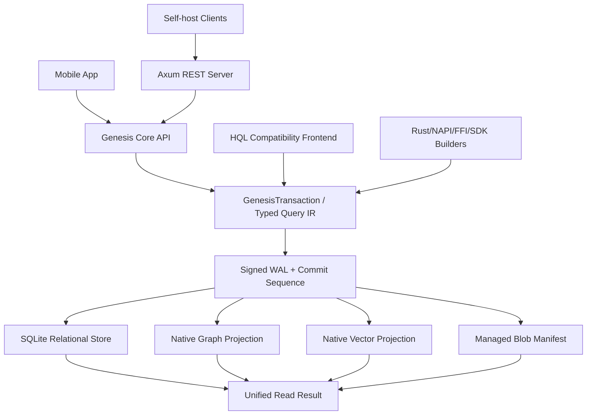

# SPEC - GenesisBlockDB Unified Operational Boundary v1

## 1. คำขออนุมัติ

อนุมัติให้ GenesisBlockDB v1 เป็น **database operational boundary เพียงจุดเดียว** สำหรับ
mobile embedded และ single-node self-hosted โดยมีสถาปัตยกรรมภายในดังนี้:

- SQLite รับผิดชอบ relational tables, joins, properties, schema migrations และ lexical data;
- native graph structures รับผิดชอบ domain edges, traversal และ graph indexes;
- native vector collections รับผิดชอบ embeddings, ANN/HNSW และ reranking;
- signed Genesis WAL รับผิดชอบ mutation order, durability, replay และ audit ภายใน;
- Genesis API เป็น write/query/lifecycle contract เพียงชุดเดียวที่ application เห็น;
- typed Query IR เป็น canonical query contract ส่วน HQL คงอยู่เป็น compatibility frontend;
- core และ data contract เดียวกันใช้ได้ทั้ง in-process mobile และ Axum self-host server.

เอกสารนี้เป็น candidate เท่านั้น การอนุมัติเอกสารเป็นเงื่อนไขก่อนเริ่ม implementation wave ถัดไป

หากอนุมัติ เอกสารนี้จะ supersede เฉพาะ **implementation sequencing หลัง SQLite S1** ใน
`ADR--GENESISDB-EMBEDDED-SQLITE-SUBSTRATE`: งาน SQL-backed HQL S2 และ text-query S3 จะย้ายไป
Phase U6 แบบ demand-gated ส่วน U2-U5 ในเอกสารนี้เป็นลำดับหลักใหม่

[ASSUMPTIONS]

1. เป้าหมาย v1 คือ mobile embedded และ self-hosted แบบ single-node ไม่ใช่ multi-node HA.
2. Mobile application ต้องใช้ relational tables และ joins จริง แต่ไม่จำเป็นต้องได้ raw SQLite
   write handle.
3. Application มอง GenesisBlockDB เป็น source of truth เพียงตัวเดียว ขณะที่ signed WAL เป็น
   internal durability authority.
4. SQLite เป็น implementation detail ที่เปลี่ยนได้ในอนาคตโดยไม่เปลี่ยน public query contract.
5. Graph และ vector เป็น specialized native indexes ไม่ใช่ฐานข้อมูลแยกที่ application ต้องดูแล.

## 2. บริบทและปัญหา

Mobile application ที่ต้องใช้ relational data, graph relationships และ vector retrieval มักต้อง
ประกอบอย่างน้อยสามระบบ แล้วรับผิดชอบ identity mapping, dual/triple write, migration, backup,
recovery และ consistency ระหว่างระบบเอง

GenesisBlockDB ต้องย้ายภาระนี้จาก application มาไว้ใน engine:

```text
ก่อน
Application -> SQLite
            -> Graph database
            -> Vector database
            -> Application-owned synchronization glue

เป้าหมาย
Application -> GenesisBlockDB -> relational + graph + vector internals
```

SQLite S0/S1 ใน working tree เป็น foundation ของเป้าหมายนี้ แต่ยังรองรับเพียง `props`,
`node_labels` และ projection state จึงยังไม่แทน relational database ของ mobile app ได้ครบ

## 3. เป้าหมาย

1. Application เปิด ปิด เขียน query backup และ restore ผ่าน GenesisBlockDB เพียงจุดเดียว.
2. Row, graph และ vector ใช้ canonical entity identity และ commit sequence เดียวกัน.
3. รองรับ app-defined relational schemas และ joins โดยไม่เปิด direct SQLite writes.
4. รองรับ cross-domain mutation ที่ durable จาก WAL record เดียวและ replay ได้แบบ idempotent.
5. ใช้ storage/core เดียวกันใน mobile embedded และ single-node self-hosted.
6. SQLite, graph indexes และ vector indexes สามารถ rebuild หรือ validate จาก Genesis-owned state.
7. HQL ไม่เป็น dependency ต่อ correctness ของ storage หรือ public typed APIs.
8. Backup/restore เป็นหนึ่ง logical unit แม้ภายในมีหลายไฟล์.

## 4. Non-goals ของ v1

- Multi-node HA, automatic failover หรือ distributed SQL.
- การเปิด SQLite connection/file ให้ application เขียนโดยตรง.
- Full arbitrary SQL DDL/DML จาก untrusted callers.
- Full Cypher/GQL compatibility หรือการขยาย HQL เป็น general-purpose language.
- การเขียน relational query planner, B-tree หรือ SQLite replacement ขึ้นใหม่.
- การใช้ NFS/SMB shared database file ระหว่าง Genesis processes.
- การเก็บ media files ขนาดใหญ่ทั้งหมดเป็น SQLite BLOB.
- Enterprise multi-tenancy ใน process เดียว.
- การอ้างว่า CRDT sync ปัจจุบันเป็น HA replication ที่ production-ready.

## 5. คำศัพท์เชิงสถาปัตยกรรม

| คำ | ความหมาย |
|---|---|
| Operational boundary | จุดที่ caller เปิด/ปิด/เขียน/query/backup/restore โดยไม่ดูแล internal stores |
| External source of truth | GenesisBlockDB contract ที่ application เชื่อถือ |
| Internal durability authority | Signed WAL และ commit sequence ที่กำหนดว่า mutation ใด durable |
| Relational store | SQLite ที่ Genesis เป็นเจ้าของ ใช้กับ tables, joins, properties และ migrations |
| Graph projection | Native node/edge adjacency และ graph indexes ที่สร้างจาก committed mutations |
| Vector projection | Native vector segments/arena/HNSW ที่สร้างจาก committed vector mutations |
| Stable frontier | Commit sequence สูงสุดที่ projections ที่ query ต้องใช้ apply ครบแล้ว |

## 6. Architecture decision



### 6.1 หนึ่ง product boundary ไม่ได้แปลว่าหนึ่ง storage format

Engine ใช้ specialized internal representations ได้ แต่ caller ต้องไม่ทำ synchronization ระหว่าง
representations เอง หาก caller ยังต้องเปิด SQLite หรือรักษา node/vector IDs แยกกัน ถือว่า design ล้มเหลว

### 6.2 SQLite decision

SQLite เป็น relational subsystem เริ่มต้นของ v1 เพราะให้ joins, transactions, foreign keys,
schema migration primitives, JSON/FTS capability, mobile maturity และ in-process deployment

SQLite ไม่ใช่ public product identity และไม่ปรากฏใน canonical query model ชื่อ table/field อาจ
ถูก expose ได้ แต่ SQLite-specific lifecycle และ direct connection ต้องไม่ถูก expose

### 6.3 Native graph/vector decision

Graph traversal และ vector retrieval ยังคงเป็น native paths ห้ามแปลง graph หรือ embeddings ทั้งหมด
เป็น relational rows เพียงเพื่อให้ใช้ SQL ได้ เพราะจะทำลาย performance characteristics และ engine moat

## 7. Authority และ durability contract

1. Caller ส่ง mutation ผ่าน Genesis API เท่านั้น.
2. Engine validate schema, identity, governance และ vector-space contract ก่อน commit.
3. Engine สร้าง canonical transaction event และกำหนด monotonic commit sequence.
4. Signed WAL append ต้อง durable ก่อน projection apply.
5. Relational, graph และ vector projections apply transaction ตาม commit sequence เดียวกัน.
6. Projection apply ต้อง idempotent; replay transaction เดิมให้ผลเท่าเดิม.
7. Success response แบบ `stable` ส่งหลัง projections ที่จำเป็นถึง transaction sequence แล้ว.
8. หาก crash หลัง WAL commit แต่ก่อน projection apply การเปิดครั้งถัดไปต้อง replay และ heal.
9. หาก projection ใด corrupt หรือหาย engine ต้อง rebuild ได้โดยไม่ให้ caller sync ข้อมูลเอง.
10. ห้าม SQLite write, graph mutation หรือ vector mutation ที่ข้าม canonical transaction path.

## 8. Canonical data contracts

### 8.1 Entity identity

ทุก domain ใช้ `EntityId` ที่ stable และไม่ขึ้นกับ SQLite rowid, graph slot หรือ vector arena id

Internal numeric IDs เป็น optimization เท่านั้น การ rebuild ต้องสร้าง mapping ใหม่ได้โดยไม่เปลี่ยน
public identity

### 8.2 Relational schema package

Application schema ต้องลงทะเบียนผ่าน versioned schema package ที่ Genesis เป็นเจ้าของ:

```text
RelationalSchemaPackage
- namespace
- schema_version
- tables
- columns and types
- primary keys
- foreign keys
- indexes
- named read queries (optional)
- forward migration
- compatibility metadata
```

DDL ถูก apply ผ่าน migration path ของ Genesis ห้าม application รัน DDL โดยตรงใน production mode

### 8.3 GenesisTransaction

หนึ่ง transaction อาจประกอบด้วย:

```text
GenesisTransaction
- transaction_id
- expected_frontier (optional optimistic check)
- relational row mutations
- graph node/edge mutations
- vector upserts/deletes
- blob metadata mutations
- actor/governance context
- valid-time metadata
```

Canonical WAL event เก็บ logical mutations ไม่เก็บ raw SQL write text เป็น authority เพื่อให้ replay,
validation และ signature verification deterministic

### 8.4 File contract

ไฟล์ขนาดใหญ่เก็บใน Genesis-managed blob directory หรือ caller-provided sandbox directory ส่วน
SQLite เก็บ metadata เช่น logical id, relative path, hash, MIME type, size และ lifecycle state

Backup manifest ต้องรวมและ verify blob hashes ห้ามเก็บ absolute platform paths เป็น portable identity

## 9. Query contract

### 9.1 Canonical surface

Typed Query IR และ typed SDK builders เป็น source of truth สำหรับ query semantics:

- `RelationalQuery`: parameterized SELECT, joins, filters, projections, aggregates;
- `GraphQuery`: anchors, patterns, relationships, direction, depth, temporal visibility;
- `SemanticQuery`: collection/vector-space, query vector/entity, k, ef, rerank options;
- `UnifiedQuery`: fixed composition ของ candidate, graph constraint, relational filter และ return;
- `Consistency`: `eventual` หรือ `stable(frontier)`.

### 9.2 Relational reads และ writes

- v1 อนุญาต parameterized read-only SQL หรือ named read queries ผ่าน Genesis API.
- v1 ไม่อนุญาต raw SQL writes; writes ใช้ typed row mutations ใน `GenesisTransaction`.
- Query ต้องถูกจำกัดให้เข้าถึง namespace ที่ caller ได้รับอนุญาต.
- Statement timeout, row limit และ resource limits เป็น mandatory ใน self-host mode.

### 9.3 HQL

- Existing HQL commands คงทำงานเพื่อ compatibility.
- HQL parse เป็น Typed Query IR หรือเรียก typed engine operation ที่เทียบเท่า.
- ไม่มี HQL grammar growth ใน implementation wave ของ spec นี้.
- Agent context, prompt budget และ packet compression อยู่คนละ contract.
- Future GQL/Cypher-compatible surface ต้องผ่าน ADR แยกและใช้ Query IR เดียวกัน.

## 10. Deployment contracts

### 10.1 Mobile embedded

- Core รัน in-process ไม่มี localhost server.
- Caller ส่ง app sandbox path ให้ Genesis เปิด database root เดียว.
- SQLite ต้อง link และทำงานบน iOS/Android artifact ที่รองรับจริง.
- Background indexing ต้องเคารพ mobile lifecycle, memory budget และ shutdown signal.
- SDK ต้องไม่มี direct SQLite handle.
- Backup/export ต้องสร้างหนึ่ง Genesis backup bundle.

### 10.2 Single-node self-hosted

- `genesis-db-server` ใช้ core และ database layout เดียวกับ embedded mode.
- Data directory ต้องอยู่บน local filesystem หรือ persistent block volume.
- Process เดียวเป็น writer owner ของ database root.
- Server ต้องมี graceful shutdown, periodic checkpoint/snapshot และ startup recovery.
- Default bind ต้องปลอดภัย; public exposure ต้องมี API authentication และ TLS/reverse proxy posture.
- Health endpoint ต้องแยก process health, WAL health, projection lag และ index lag.

### 10.3 Multi-node boundary

- ห้ามหลาย node เปิด SQLite/database root เดียวผ่าน network filesystem.
- Replica ในอนาคตต้องมี local SQLite/graph/vector projections ของตัวเอง.
- Replication ต้องส่ง canonical signed events/transactions ไม่ส่ง shared-file writes.
- HA/failover ต้องมี ADR และ test suite แยกก่อนเรียก production-ready.

## 11. Backup, restore และ migration

หนึ่ง backup bundle ต้องมี:

- manifest และ schema version;
- authoritative WAL/snapshot segments;
- coherent SQLite snapshot;
- graph/vector projection files หรือ rebuild declaration;
- blob manifest และ hashes;
- projection/frontier watermarks;
- integrity hashes และ signer metadata.

Restore ต้องตรวจ manifest และ authority ก่อนเปิด projection Engine ต้องรองรับ rebuild mode ที่ลบ
rebuildable projections แล้วสร้างใหม่จาก authority โดยผล query ที่ deterministic ต้องเท่าเดิม

Schema migration ต้อง versioned, resumable หรือ atomic และมี compatibility check ก่อนเปิด database

## 12. Concurrency และ consistency

- v1 ใช้ serialized commit ordering ผ่าน Genesis writer path.
- Concurrent reads อนุญาตตาม internal store capability.
- REST async executor ห้าม block ด้วย storage work โดยตรง.
- Global REST lock ที่ทำให้ unrelated reads/writes serialize ต้องถูกถอดก่อน self-host production gate.
- Vector indexing ยังคง async ได้ แต่ `stable` query ต้องรายงาน/wait frontier ตาม contract.
- `eventual` query ต้องคืน projection lag และ index lag อย่างซื่อสัตย์.

## 13. Security

- Parameter binding เป็น mandatory; ห้ามต่อ SQL จาก untrusted strings.
- Raw DDL/DML ปิดโดย default.
- Relational namespaces และ graph/vector collections ต้องผ่าน authorization policy เดียวกัน.
- Self-host API keys/secrets ห้ามเก็บใน database payload แบบ plaintext โดย default.
- Encryption at rest เป็น design-gated follow-up; ต้องประเมิน SQLCipher/platform encryption.
- Backup ต้องไม่หลุดออกจาก sandbox หรือ data root ที่กำหนด.
- Signed event verification failure ต้อง fail closed และเปิด diagnostics ได้โดยไม่ apply event.

## 14. Observability

สถานะขั้นต่ำที่ต้อง expose:

- current durable WAL sequence;
- relational projection sequence/lag;
- graph projection sequence/lag;
- vector event sequence และ HNSW index lag;
- replay/rebuild state;
- last successful snapshot และ backup verification;
- SQLite size, WAL size, vector bytes และ blob bytes;
- transaction latency/error/retry counts;
- self-host request latency, queue depth และ lock contention.

## 15. Normative requirements และ acceptance criteria

### U1 - One operational boundary

WHEN application เปิด database THEN application SHALL เปิด GenesisBlockDB เพียง handle/endpoint เดียว
และ SHALL NOT ต้องเปิด SQLite, graph store หรือ vector store แยก

### U2 - One mutation path

WHEN caller เปลี่ยน relational, graph หรือ vector state THEN mutation SHALL ผ่าน canonical
`GenesisTransaction` path และ SHALL NOT bypass signed WAL authority

### U3 - Relational capability

WHEN mobile schema ประกาศ tables, primary/foreign keys และ indexes THEN Genesis SHALL apply
versioned migration และ SHALL execute parameterized joins ผ่าน public Genesis API

### U4 - Cross-domain identity

WHEN row, graph node และ vector representation อ้าง entity เดียวกัน THEN ทุก projection SHALL resolve
กลับสู่ `EntityId` เดียวโดยไม่ให้ application maintain mapping table เอง

### U5 - Cross-domain recovery

WHEN process crash หลัง WAL commit แต่ก่อน projection apply THEN reopen SHALL replay transaction
idempotently และ stable query SHALL ไม่เห็น partial cross-domain commit

### U6 - Projection rebuild

WHEN SQLite, graph index หรือ vector index ที่ระบุว่า rebuildable สูญหาย THEN engine SHALL rebuild
โดยผล logical query เท่าเดิมและ SHALL report verification result

### U7 - Mobile artifact

WHEN build iOS/Android production artifact THEN bundled relational store, graph และ vector core SHALL
link/run in-process และ pass physical-device create/write/join/search/reopen test

### U8 - Self-host artifact

WHEN deploy standalone server บน local persistent volume THEN create/write/join/search/snapshot/restart
SHALL pass ผ่าน REST/SDK โดยไม่ต้อง deploy external database server

### U9 - Backup unit

WHEN operator สร้าง backup THEN output SHALL เป็นหนึ่ง verifiable Genesis bundle ที่ restore relational,
graph, vector และ blob metadata สู่ coherent frontier เดียวกัน

### U10 - No shared SQLite

WHEN operator configure หลาย Genesis processes ให้เขียน database root เดียวกัน THEN startup SHALL fail
ด้วย named ownership/locking error ไม่ใช่ทำงานต่ออย่างเสี่ยง corruption

### U11 - Query surface independence

WHEN HQL parser ถูกปิดใน build หรือ caller ใช้ typed API THEN relational, graph, vector และ unified query
capabilities ที่อยู่ใน scope SHALL ยังทำงานได้

### U12 - Honest product claim

WHEN v1 ถูกประกาศว่า mobile/self-host ready THEN physical mobile artifact และ single-node server artifact
SHALL ผ่าน acceptance suites; passing core unit tests อย่างเดียวไม่เพียงพอ

## 16. Implementation sequence หลังอนุมัติ

### Phase U0 - Truth sync และ contract freeze

- อัปเดต C4, master spec, mobile spec และ SQLite ADR ให้ใช้คำว่า external boundary/internal authority ตรงกัน.
- Freeze Typed Query IR, `EntityId`, commit sequence และ consistency vocabulary.
- Mark HQL causal-language proposal เป็น design-gated ไม่ใช่ implementation prerequisite.

### Phase U1 - ปิด SQLite S0/S1 ให้สมบูรณ์

- Review working-tree implementation เทียบ S0/S1 invariants.
- แก้ replay/rebuild/snapshot gaps ที่พบจาก independent review.
- รัน targeted tests, full relevant Rust tests และ mobile feature build.
- เก็บ benchmark evidence โดยไม่กล่าวว่า SQLite ชนะ alternative หากยังไม่มี A/B.

### Phase U2 - Relational application contract

- เพิ่ม versioned relational schema package และ migration registry.
- เพิ่ม typed row mutation/batch APIs.
- เพิ่ม parameterized read-only joins/named queries พร้อม limits.
- Wire Rust, NAPI, REST และ FFI contract parity ตาม deployment scope.

### Phase U3 - Unified transaction และ stable frontier

- เพิ่ม canonical transaction event สำหรับ row/graph/vector/blob metadata.
- เพิ่ม idempotent per-projection apply และ watermarks.
- เพิ่ม stable/eventual consistency behavior และ fault injection tests.

### Phase U4 - Mobile proof

- Build iOS/Android artifacts ใน CI.
- Run physical-device smoke สำหรับ create, migration, join, graph, vector, reopen และ backup.
- วัด binary size, startup, RSS, ingest และ thermal/background behavior.

### Phase U5 - Single-node self-host production slice

- Package binary/container และ persistent-volume contract.
- เพิ่ม graceful shutdown, periodic snapshot, restore verification และ API auth posture.
- ถอด global async blocking/lock bottleneck ที่ขวาง concurrent server workload.
- Run restart, crash, load และ backup drills.

### Phase U6 - Optional retrieval enhancements

- FTS5/BM25 และ relational prefilter ทำหลัง U1-U5 correctness ผ่าน.
- HQL/Cypher/GQL syntax additions ต้องมี independent demand และ ADR.
- Historical/causal semantic evolution ยังคง design-gated.

## 17. Test strategy

| Suite | Proof |
|---|---|
| Schema/migration | forward migration, incompatible open, idempotent retry |
| Transaction | row+edge+vector commit, validation failure, optimistic conflict |
| Fault injection | crash before WAL, after WAL, mid-SQLite, mid-graph, before vector index |
| Rebuild | delete each projection independently แล้ว compare logical results |
| Query | joins, graph patterns, vector search, fixed unified composition |
| Mobile | real iOS/Android artifact and physical-device lifecycle |
| Self-host | REST concurrency, restart, graceful shutdown, backup/restore |
| Security | injection, namespace escape, invalid signature, path traversal |
| Performance | ingest, point read, join, traversal, ANN, RSS, disk amplification |

Independent architecture review เป็น mandatory ก่อน merge U2 และ U3

## 18. Success และ exit criteria

v1 สำเร็จเมื่อ:

1. Sample mobile app ไม่มี SQLite/graph/vector dependency หรือ synchronization glue ของตัวเอง.
2. Sample self-host deployment ใช้ Genesis binary + local persistent volume โดยไม่ต้องมี external DB.
3. One transaction update row+graph+vector แล้ว crash/reopen ได้ coherent result.
4. Join, traversal และ vector search ทำผ่าน public Genesis APIs ครบ.
5. Backup/restore กลับสู่ verified frontier เดียวกัน.
6. Physical mobile และ server artifact tests ผ่าน.
7. Known HA limitation ถูกระบุชัดและไม่มี shared-file deployment path.
8. Documentation, SDK contracts และ runtime behavior ตรงกัน.

## 19. Rollback strategy

- U1 ต้องอ่าน database snapshot/WAL format เดิมได้ หรือมี explicit migration gate.
- U2 schema features อยู่หลัง capability/version negotiation.
- U3 unified transaction shipping ต้องมี feature gate จน fault tests ผ่าน.
- หาก relational projection ทำให้ open/recovery ล้มเหลว engine ต้องเปิด recovery mode และ rebuild ได้.
- ห้าม rollback ด้วยการทำให้ caller dual-write กลับไปหลาย databases โดยไม่มี migration plan.

## 20. Alternatives considered

| ทางเลือก | Decision |
|---|---|
| SQLite | เลือกสำหรับ v1: feature fit และ mobile maturity สูงสุด |
| libSQL/Turso | defer จน cloud sync เป็น requirement; เพิ่ม replication/product dependency |
| DuckDB | defer สำหรับ analytics; workload ไม่ตรง mobile OLTP |
| redb/native KV | ไม่เลือกสำหรับ relational layer; ต้องสร้าง joins/schema/index planner เอง |
| SurrealDB | ไม่เลือกเป็น subsystem; ซ้อนทับ multi-model engine และ query surface |
| LadybugDB | ไม่เลือกเป็น relational subsystem; เท่ากับเปลี่ยน native graph/query engine |
| PostgreSQL | ไม่เลือกสำหรับ embedded/mobile; อาจเป็น future server-only backend หาก scale บังคับ |
| เขียน storage engine ใหม่ | ปฏิเสธใน v1; ไม่แก้ปัญหาผู้ใช้ที่เหนือ SQLite อย่างพิสูจน์ได้ |

## 21. Open questions ที่ยังไม่ block U1

1. Encryption at rest ใช้ SQLCipher, platform file protection หรือ encrypted VFS.
2. Public relational read surface ใช้ named queries เท่านั้นหรืออนุญาต constrained SELECT subset.
3. Blob manager อยู่ใน v1 release หรือเป็น follow-up หลัง metadata contract.
4. Stable vector reads รอ HNSW flush หรือใช้ exact committed-vector fallback.
5. Migration package signing ใช้ swarm identity เดิมหรือ application schema signer แยก.

คำถามเหล่านี้ต้องปิดก่อน phase ที่เกี่ยวข้อง แต่ไม่ขวางการ review/ปิด S0/S1 ใน U1

## 22. Parent และ peer impact

เอกสารที่ต้องอัปเดตหลังอนุมัติ:

- `docs/MASTER-SPEC--GENESIS-DB.md`: เพิ่ม unified operational boundary และ relational subsystem.
- `docs/C4--GENESISDB-ARCHITECTURE.md`: เพิ่ม relational store, transaction coordinator และ deployment modes.
- `docs/SPEC--MOBILE-SDK.md`: เปลี่ยนจาก graph/retriever-only proof เป็น one-database mobile proof.
- `docs/adr/ADR--GENESISDB-EMBEDDED-SQLITE-SUBSTRATE.md`: ชี้ external SOT vs internal authority
  ให้ชัด และเปลี่ยน sequencing หลัง S1 จาก HQL-first เป็น relational contract -> unified
  transaction -> artifact proofs.
- `docs/SPEC--SQLITE-SUBSTRATE-S0-S1.md`: ใช้เป็น U1 implementation contract ต่อไป.
- `docs/SPEC--HQL-V2.md`: HQL เป็น compatibility/query frontend ไม่ใช่ storage authority.
- `docs/PROPOSAL--HQL-CAUSAL-SEMANTIC-EVOLUTION.md`: mark design-gated จนมี non-Git use cases.

## Version diff

| From | To | Change |
|---|---|---|
| none | `0.1.0b` | สร้าง candidate unified database contract สำหรับ mobile embedded และ single-node self-hosted โดยใช้ SQLite relational subsystem, native graph/vector และ signed WAL authority. |

## CHANGELOG

| Version | Date | Status | Summary | Commit Hash | Agent |
|---|---|---|---|---|---|
| `0.1.1b` | 2026-07-20 | beta | Approved by Boss; U0 truth sync and U1 SQLite S0/S1 closure authorized. | working-tree | ATHER |
| `0.1.0b` | 2026-07-20 | candidate | Initial architecture, authority, query, deployment, recovery, security, test และ implementation contracts; no code authorized. | working-tree | ATHER |
