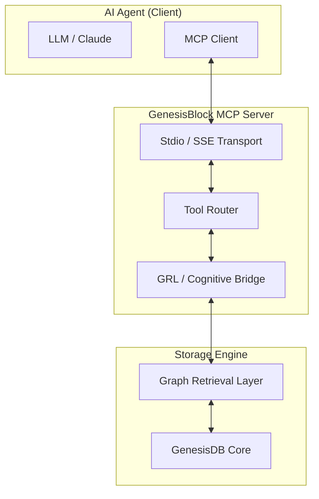

# Architecture Blueprint: Mark XI — Enterprise Integration (Step 1: MCP Server)

## 1. Introduction
The **Model Context Protocol (MCP)** is an open standard that enables AI models to interact with local data sources and tools. By implementing an MCP server for GenesisBlock, we enable any compliant agent (e.g., Claude Desktop, IDE extensions) to natively use GenesisDB as its long-term memory and reasoning substrate. This design follows the **C-3 (Architecture-Driven)** workflow.

## 2. Software Requirements Document (SRD)

### FR1: Tool Exposure
The MCP server must expose the following core engine capabilities as "Tools":
- `query_hql`: Execute raw HQL commands.
- `get_context`: Retrieve tiered context (H0-H5) for a given topic.
- `hybrid_search`: Perform semantic and lexical search.
- `add_knowledge`: Atomic injection of nodes and edges.

### FR2: Resource Mapping
- The knowledge graph should be browsable as a hierarchical resource (e.g., `genesisdb://clusters/{id}`).

### FR3: Transport Layer
- Support **Stdio** transport for local integration with desktop AI apps.
- Support **SSE (Server-Sent Events)** for web-based agent swarms.

---

# Technical Design Document (TDD): MCP Orchestrator

## 1. Internal Architecture


## 2. Tool Definitions (JSON Schema)

### 2.1 `retrieve_tiered_context`
```json
{
  "name": "retrieve_tiered_context",
  "description": "Retrieves an optimized knowledge fragment from the graph based on H0-H5 scaling tiers.",
  "input_schema": {
    "type": "object",
    "properties": {
      "target": { "type": "string" },
      "tier": { "type": "string", "enum": ["H0", "H1", "H2", "H3", "H4", "H5"] },
      "budget": { "type": "number", "description": "Token limit for compression." }
    },
    "required": ["target", "tier"]
  }
}
```

## 3. Implementation Strategy
1.  **Language:** Use the existing Node.js wrapper (`index.js`) to build the MCP server using the `@modelcontextprotocol/sdk`.
2.  **Stdio Bridge:** Create a small CLI entry point `bin/genesis-mcp`.
3.  **Authentication:** Leverage the Mark X ed25519 identities for secure agent-to-server handshakes.

---

## 4. Definition of Done (DoD)
1.  [ ] MCP Server implemented and successfully connects to Claude Desktop.
2.  [ ] Agent can explain a complex concept by calling `retrieve_tiered_context`.
3.  [ ] Multi-agent sync remains active during MCP sessions.
4.  [ ] Documentation updated in `MASTER-SPEC--GENESIS-DB.md`.

---
**Please review and approve this Mark XI Architecture Blueprint. I will begin implementation once approved.**
