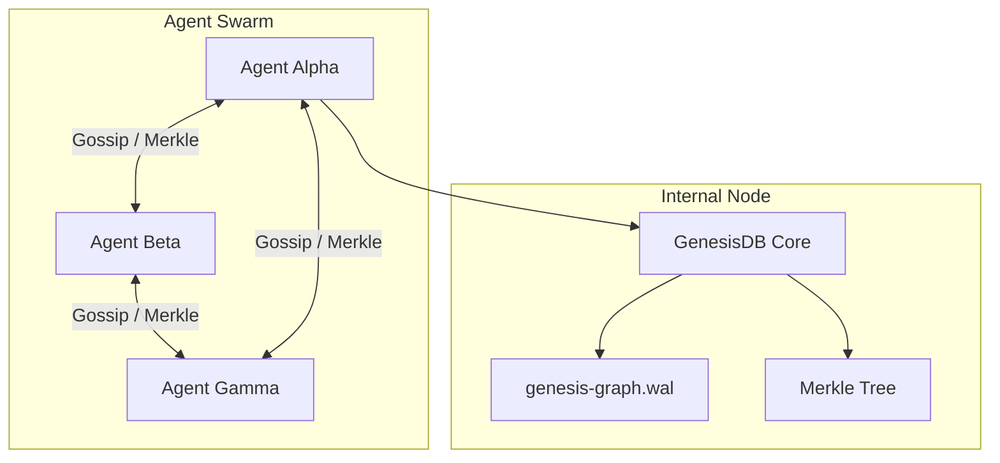

# Architecture Blueprint: P2P Gossip Protocol (Mark VIII, Step 3)

## 1. Introduction
The **P2P Gossip Protocol** is the communication layer of the Genesis Knowledge System (GKS). It enables distributed AI agents to discover each other, exchange knowledge fragments, and maintain a globally consistent state without a central server. This design adheres to the **C-3 (Architecture-Driven)** workflow.

## 2. Software Requirements Document (SRD)

### FR1: Peer Discovery
- Agents must be able to find each other on the local network (mDNS/UDP) or via a seed list of IP addresses.
- Every peer is identified by a unique `peer_id` (generated at engine start).

### FR2: State Reconciliation (Merkle Sync)
- Agents periodically exchange their **Merkle Root**.
- If roots differ, agents perform a binary search on the WAL to identify the specific events that are missing or conflicting.

### FR3: Gossip Mechanism
- **Epidemic Diffusion:** When an agent receives a new mutation, it "gossips" it to a random subset of known peers.
- **Damping:** Ensure messages have a TTL (Time-To-Live) or version check to prevent infinite loops.

---

## 3. Technical Design Document (TDD)

### 3.1 Network Architecture (Diagram)


### 3.2 Sync Sequence Diagram
```mermaid
sequence_diagram
    participant A as Agent Alpha
    participant B as Agent Beta
    
    A->>B: Heartbeat(MerkleRoot, PeerID)
    Note over B: Compare Root
    B->>A: PullRequest(MissingRange, MyRoot)
    A->>B: PushDelta(Vec<Event>, LogicalClock)
    Note over B: reconcile_state(Events)
    B->>A: SyncAck(NewRoot)
```

### 3.3 Message Schema (API Contract)
```rust
#[derive(Serialize, Deserialize)]
pub enum GossipMessage {
    Heartbeat { 
        peer_id: String, 
        merkle_root: String, 
        logical_time: u32 
    },
    StateRequest { 
        from_clock: u32, 
        limit: u16 
    },
    StateResponse { 
        events: Vec<Event>, 
        source_peer_id: String 
    },
}
```

---

## 4. Implementation Strategy
1.  **Network Transport:** Use `tokio::net::UdpSocket` for low-latency heartbeats and `TcpStream` for reliable state transfer.
2.  **Background Task:** A dedicated `gossip_manager` loop in `src/lib.rs`.
3.  **Conflict Resolution:** Leverage the existing `reconcile_state` (Mark VIII Step 1).

## 5. Definition of Done (DoD)
1.  [ ] Two independent GenesisDB instances can discover each other automatically.
2.  [ ] Adding a node to Instance A causes it to appear in Instance B within < 500ms.
3.  [ ] **Network Partition Test:** Disable network, mutate both, re-enable -> both instances converge to the same state.
4.  [ ] Documentation updated in `MASTER-SPEC--GENESIS-DB.md`.

---
**Please review and approve this C-3 Architecture Blueprint. I will generate the code once approved.**
