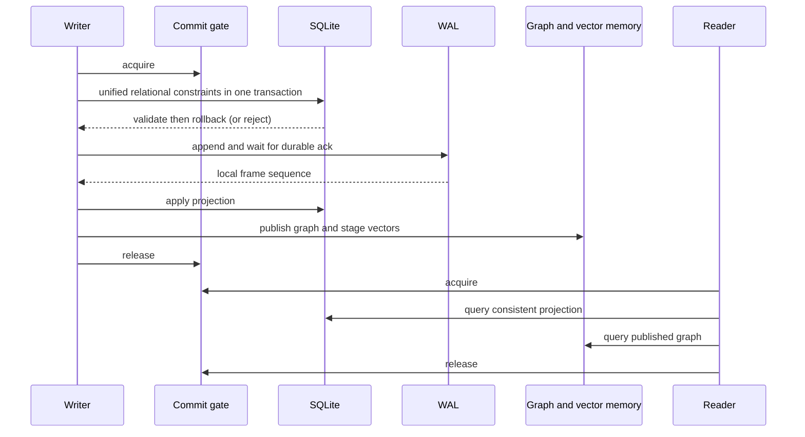

# Wave A — Commit correctness

User approved Wave A (R-01 and R-08) from the system review on 2026-09-07.
Complexity C-3; risk HIGH. This implementation record elaborates that approved
scope. It does not approve the other review waves or distribution changes.

## Parent and peer contracts

Parent: `C4--GENESISDB-ARCHITECTURE.md` and the unified transaction contract.
Peers: journal frame sequencing, epoch HNSW, node version history, relational
constraints, CRDT/consensus and backup/checkpoint contracts. Journal format,
transaction identity/hash, frame/transaction frontiers, public method signatures
and the two-frame supersede history remain compatible.

## Confirmed root cause and RED evidence

The original implementation appended unified transactions before SQLite checked
PK/unique/FK constraints. A rejected duplicate advanced the stable frontier from
1 to 2 and poisoned replay. Node/edge paths published memory before the WAL ack;
read APIs did not share the writer's publication boundary.

`tests/wave_a_commit_tests.rs` on unchanged base 79b41a3: 4 failures / 1 pass.
Failing cases reproduced rejected-frame advance, failed node upsert visibility,
failed edge adjacency visibility, and reading a node before the WAL ack.
RCA: `.brain/rca/RCA--GRAPH-VECTOR-SYSTEM-2026-09-07.md`.

## Commit and read boundary

The existing writer mutex becomes a reentrant mutex. Public query entry points
hold it for the complete query; nested HQL/Query IR/GRL calls reenter on the same
thread. Lock order is commit gate, then projection/maps/collection locks. The
asynchronous index worker does not take the commit gate, so flush barriers can
finish while a query or checkpoint holds it.

This is a correctness-first serialization decision: simultaneous read requests
also wait for one another. It is not MVCC and does not promise concurrent-read
throughput. Separate API calls are separate snapshots. HNSW remains asynchronous;
call flush_index or use the existing read-your-write query option for ANN results.
No stronger vector recall or temporal eligibility guarantee is introduced.

Low-level public Rust maps, identity helpers, persistence primitives, and external
SQLite connections are not supported atomic query/transaction interfaces. Direct
mutation through them bypasses the engine contract. Frontiers, collection metadata, Merkle/meta-history and journal
getters remain diagnostic interfaces available during recovery-required state. Option-returning node getters return None in
recovery-required state; Result-returning query APIs report an explicit error.

## Failure contract

| Failure | Result and recovery |
|---|---|
| Input or unified relational constraint rejection | No WAL frame, rows, graph or vector publication; corrected retry may reuse the transaction ID |
| WAL channel disconnected before send | Rejected write; no graph publication |
| Request sent but no successful WAL ack | `COMMIT_OUTCOME_UNKNOWN`; stop reads, writes and checkpoint; reopen to discover durable outcome |
| WAL ack received, projection apply fails | `DURABLE_COMMIT_APPLY_FAILED` with frame sequence; stop reads, writes and checkpoint; reopen after addressing the underlying storage error |
| Subsequent access to failed storage | `RECOVERY_REQUIRED`; do not fold incomplete live state over the durable journal |
| Second supersede frame fails | Closing frame remains durable; report durable partial completion and require reopen; do not publish the new live version |

Supersede keeps its established two-frame history and caused_by resolution. This
change does not claim atomicity across those two frames. Existing poisoned
databases are not repaired by silently dropping journal frames.

NAPI and REST call the same core and preserve the error text. Existing transport
status/exception shapes remain unchanged; clients must inspect the error code
prefix rather than infer rejection from HTTP status alone. No new NAPI/REST/FFI
method or on-disk schema is introduced.

## Acceptance and verification

Focused fault suite: 12 tests passed in the final full suite, including cross-group unique/FK rejection,
WAL failure, reader barrier, durable apply failure/reopen, and partial supersede.
NAPI/MCP: 24/24 tests passed on a newly built addon from this engine.
Host mobile/FFI cargo check and formatting passed. Documentation validator:
0 violations in 212 files using the bundled Python runtime directly (the npm
wrapper found a py launcher without an installed Python). Final `cargo test --no-default-features`: **598 passed, 0 failed, 3 ignored**;
the ignored tests are the existing light/medium/heavy soak cases. The total is
the sum of Cargo test result summaries, including the 12 Wave A regressions.
`cargo clippy --no-default-features --all-targets -- -D warnings`: exit 0.
The full Rust gate and final Clippy command both completed on the final engine.

Engine SHA256: `150C5C30CAB76E41714F5AC39C6D8F78A8E6834F0D3CC2577F556AB6B809DB3A`.
Evidence logs: `.brain/wave-a/red.txt`, `full-rust-final.txt`, `npm-tests.txt`,
`ldbc-final.txt`, `scientific-audit.txt` and `verification.json` in the worktree.
The original main engine SHA256 remains
`299B248E14876861F035149D36D61A0AE40C574E7B6BA82086B6A60AA4E00972`.

All approved local acceptance gates for R-01/R-08 are met. The changes are on
`codex/wave-a-commit-correctness`; no merge, push, release or deployment is included.
The other system-review waves remain proposed. Production deployment, hardware
power-cut durability and sustained concurrent-load capacity remain unverified.

### LDBC smoke measurement

Release Criterion `ldbc_lite --quick`, 1,000 nodes / 5,000 random edges:

| Depth | Base 79b41a3 | Final engine 150c5c30 (SHA256 prefix) |
|---|---|---|
| 1 hop | 44.559 us | 47.726 us |
| 2 hops | 529.39 us | 415.95 us |
| 3 hops | 2.3300 ms | 2.6307 ms |

Both runs completed. Each creates a different random graph and used quick
samples while other builds were running. These are smoke measurements, not a
controlled regression comparison or evidence of higher throughput. Criterion's
historical comparison is not treated as an acceptance verdict. The concurrency
cost of serializing reads remains an explicit limitation. Scientific audit completed: 5,000 vector-bearing nodes and 4,999 edges
(confirmed by read-only SQL counts), rebuild succeeded, checkpoint frame 9,999.
Observed ingestion was 10.50 nodes/s while the full debug suite and builds ran
concurrently; this is not an isolated throughput/SLA result. Industrial/SNB,
long sync stress and hardware power-cut campaigns were not run; this gate covers
local correctness, graph traversal and vector ingestion/rebuild, not capacity
or production soak acceptance.

## Version diff

| From | To | Change |
|---|---|---|
| none | 0.1.0b | Approved Wave A implementation contract, failure codes and verification boundary |
| Master spec 2.2.0 | 2.2.1 | Reflect the commit/recovery contract |
| C4 0.1.10b | 0.1.11b | Link the component and its verification boundary |
| Registry 0.3.1+draft | 0.3.2+draft | Register Wave A and synchronize parent versions |
| System review 0.1.0b | 0.1.1b | Record approval of R-01/R-08 |
