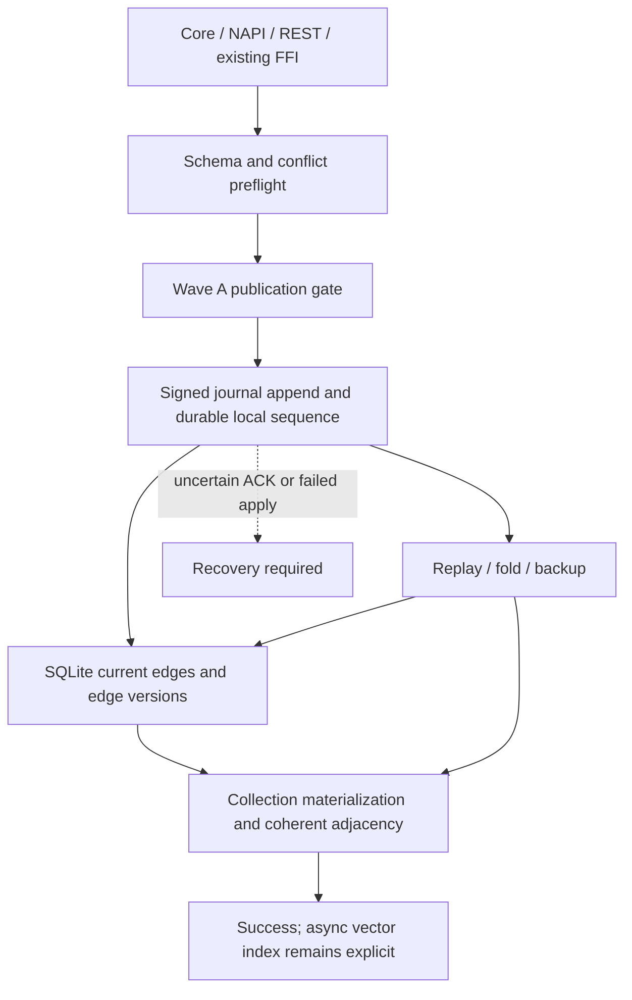

# Wave B — Durable collection definitions and edge history

## 1. Decision requested / ขอบเขตอนุมัติ

เสนอแก้ R-02 และ R-03 ต่อจาก Wave A ที่ commit `61d30c0` โดยให้ collection
config อยู่ใน journal และให้การเปลี่ยน endpoints ของ edge ID เดิมถูกต้องทั้ง
current view และ transaction-time history ภายใน horizon ที่ยังเก็บอยู่
เอกสารนี้เป็น **candidate**; ยังไม่มีการแก้ runtime หรือ migration ฐานผู้ใช้

Complexity **C-3**, risk **HIGH**: new event schema, internal projection migration,
replay/sync/fold compatibility. Approval covers B0–B4 below, including the narrowly
required collection validation from R-06. It does not authorize push, merge,
deployment, or migration of a consumer database.

[ASSUMPTIONS]

1. Wave A remains the implementation base and its publication gate/error contract applies.
2. Edge ID remains logical identity; replacing endpoints is supported upsert behavior.
3. Collection definitions are immutable after creation. Conflicting peer definitions
   must be rejected explicitly, not resolved by silently changing vector semantics.
4. History is replica-local, bounded by the existing journal horizon; destroyed
   legacy configuration or history cannot be reconstructed without evidence.

## 2. Parent and peer alignment

Parents: [Master spec](MASTER-SPEC--GENESIS-DB.md),
[C4](C4--GENESISDB-ARCHITECTURE.md), and
[system review](REVIEW--GRAPH-VECTOR-SYSTEM-2026-09-07.md).
Peers: [Wave A](SPEC--WAVE-A-COMMIT-CORRECTNESS.md),
[journal authority and horizon](adr/ADR--GENESISDB-JOURNAL-HISTORY.md),
[journal framing](SPEC--GENESISDB-JOURNAL-FORMAT-V1.md),
[multi-collection](SPEC--MULTI-COLLECTION-VECTOR-SPACE.md),
[edge projection](SPEC--GENESISDB-EDGE-PROJECTION.md),
[epoch candidates](SPEC--GENESISDB-EPOCH-HNSW.md),
[SQLite substrate](SPEC--SQLITE-SUBSTRATE-S0-S1.md), and
[backup](SPEC--GENESISDB-BACKUP-RESTORE-U9.md).

Keep one Rust storage core, one canonical journal, disposable SQLite/indexes,
original signed history bytes, and replica-local frame sequences. This proposal
extends the edge epoch overlay contract to complete version selection; it does
not introduce an external database or an application dual-write protocol.

Reference criteria: a collection's vector size and distance are part of its
configuration ([Qdrant collections](https://qdrant.tech/documentation/manage-data/collections/));
a graph relationship connects source and target with direction
([Neo4j concepts](https://neo4j.com/docs/getting-started/appendix/graphdb-concepts/)).
These support the review criteria, not a claim of feature parity or identical
upsert semantics with either product. Genesis-specific decisions follow its ADRs.

## 3. Confirmed defects and evidence boundary

All source anchors below refer to `src/lib.rs` at **61d30c0**.
Executable evidence is the earlier **79b41a3** diagnostic, run twice:
`G:/GenesisBlock_Dev/GenesisBlock/.brain/audit/graph-vector-2026-09-07/probe-output.txt`
and `probe-output-2.txt`. It was not rerun against Wave A this design turn.
The responsible code paths remain present at the inspected Wave A commit.

| ID | Observed evidence | Current mechanism |
|---|---|---|
| R-02 / P1 | Before child exit: `cos/model-x/2/Cosine/f16/ef=123`; reopen: `cos/recovered/2/L2/none/ef=null` | `create_collection` (3009–3059) publishes RAM only; `replay_vector` (3206–3261) guesses missing configuration from vector length |
| R-03 / P1 | Replace `e:A→B` with `e:C→D`; `neighbors(A)` returns C through edge C→D | `index_edge_internal` (7202–7209) adds new memberships only; current traversal (9190 onward) treats every non-source candidate as incoming |
| R-03 history gap | Source inspection, not a new runtime reproduction | `RetiredEdge` (924–936) retains only one retirement per ID; SQL edge projection (4372–4413) replaces current row; tx traversal (9379 onward) can select today's edge before retired state |
| Compatibility dependency | Source inspection, not a downgrade test | Schema version is 3 (83); gate reads `state.json` (3271, 5832); segment readers (2624–2678) do not validate header version; scanner (12737–12780) skips failed event deserialization |

RCA is recorded separately under `.brain/rca/RCA--WAVE-B-R02-R03.md`.

## 4. B0 — Compatibility and failure boundary

Reserve `SCHEMA_VERSION: 3 → 4`, `PROJECTION_SCHEMA_VERSION: 4 → 5`, and
collection-definition payload version 1. Keep existing frame layout/version 1;
a header-number bump alone cannot protect old readers that ignore that number.

Before the first v4-only event, create a verified upgrade snapshot and atomically
publish a durable `state.json` schema=4 marker. No schema event may be appended
before this guard. Existing v3 engines reject the intact upgraded bundle through
their existing schema gate. Backup manifests carry schema=4 and old restore rejects.
New engines preflight every journal source before opening a writable handle:
validate format versions and every event payload, and propagate unknown versions,
unknown variants and corruption as explicit errors. A failed preflight must not
truncate, fold, checkpoint, or rewrite source files.

**Downgrade limit:** existing binaries cannot be made to reject a manually stripped
journal-only copy by adding a field they ignore. Journal-only recovery is supported
with the v4 reader; running older engines after removing the guard is unsupported.
Do not advertise universal downgrade fail-closed behavior. Rollback uses a verified
pre-upgrade backup, never rewrites a v4 journal to fit an old binary.

For peer transfers, negotiate collection-definition-v1 support before sending v4
events. Missing/old capability rejects transfer with upgrade-required; do not send
unknown variants and assume the remote applied them. Direct signed-event ingestion
must validate schema dependencies before appending. Invalid event: no frontier
advance. A receiver reports a missing definition/conflict and does not advance its
sync cursor past the failing event. Retry/bootstrap restores the dependency.

Use Wave A's gate throughout: validate → WAL ACK → projection/materialization →
publish. Known pre-append rejection changes no visible collection/edge. Unknown ACK
or post-ACK failure enters recovery-required; reopen replays canonical state.

## 5. B1 — Canonical collection definition

Add `Event::CollectionDefinition` with explicit version, name, model, dimension,
canonical metric, canonical quantization, `ef_search`, effective rerank,
`sq8_calibrate`, and logical clock. Immutable identity is collection name plus a
canonical definition hash; the clock supports legacy Lamport delta selection,
not LWW replacement of incompatible vector spaces. Signature remains over original
event bytes; receiver commit sequences remain local.

Validate name, `1 <= dim <= u16::MAX`, known metric/quant aliases, and consistent
quantization/calibration fields before WAL. Preserve supported aliases and existing
defaults for omitted values; explicitly reject unknown supplied values. This is
the bounded R-06 dependency needed to prevent a durable truncated definition;
general vector finite-value/query validation stays outside Wave B.

Public `create_collection` retains its existing duplicate-name error. Replay of an
identical definition is idempotent; a conflicting definition errors before vector
staging. Prevalidate resources without truncating existing sidecars; post-ACK
materialization errors use Wave A recovery-required behavior. Empty collections
are durable even if no node is ever written. Initialize and journal the actual
default collection too; reopen options cannot silently redefine a stored default.

Definitions precede dependent node/vector events in replay, fold and bootstrap.
Both sequence and Lamport sync must carry definitions, including empty collections.
A delta whose receiver lacks an older definition uses dependency bootstrap rather
than synthesizing defaults. Same-name conflicts leave the receiver unchanged at
the conflicting event and return a diagnostic requiring explicit resolution.

Snapshot definitions retain every field and provenance. Legacy manifests are an
evidenced source for upgrading currently known definitions, journaled as migration
materializations before v4 writes. A journal-only legacy collection without a
definition is **configuration unknown**: refuse normal queryable opening with an actionable
configuration-required error, preserve its bytes,
and require an explicit repair definition in a separate approved repair operation.
Do not label guessed L2/model='recovered' values as recovered original semantics.
Existing markers named 'recovered' are not proof of original configuration.

## 6. B2 — Fold, quantization and backup fidelity

A fold must emit every collection definition, including empty/default collections,
before dependent vectors. Snapshot and journal-only recovery must reach equivalent
configuration and ranking semantics. A creation event alone is insufficient for
calibrated SQ8/BQ after index compaction.

Include a versioned, derived collection materialization in the fold base containing
the active BQ center and SQ8 scale/bias (validated dimension and finite parameters).
Restore these before packing vectors. For rerank collections, reconstruct base
vector payloads from the exact f32 sidecar; reading only dequantized arena values
would discard rerank fidelity. Without a sidecar, preserve the existing documented
arena fidelity; never claim original f64 recovery. Metadata must distinguish raw
vector payloads from already-normalized/materialized values to avoid applying
normalization/centering twice. Do not write calibration changes as fabricated
original peer events. Full-history replay may rebuild derived acceleration state;
base materializations are explicitly derived and signed locally under the ADR.

Do not mutate immutable history segments. Fold durability and horizon advancement
retain their existing order. Snapshot files, journal materialization, sidecars and
backup export share one publication boundary. Test real BQ-centered and calibrated
SQ8 cases, not just f32/F16 config serialization.

## 7. B3 — Coherent edge upsert and transaction history

Keep edge ID and current `edges` SQL schema/API semantics. Centralize live edge
publication: inspect old endpoints, remove their memberships, replace edge payload,
then insert new memberships under the Wave A gate. Handle equal endpoints, reversed
direction and self-loops as sets. Every accepted add, batch, unified transaction,
consensus, reconcile and replay path uses this operation. Rejected/stale CRDT
events do not mutate current adjacency or create an accepted local history version.

Add derived SQLite `edge_versions`, keyed by `(id, tx_from)` with `tx_to` nullable,
string endpoints, and the complete `EdgeOutput` payload. Index both endpoint strings
with transaction bounds. Existing `edges` remains the current projection. On an
accepted local frame s, close the preceding version at s and open the new version
at s in the same projection transaction. Node retraction closes incident edge
versions at its frame; edge soft retraction creates the new payload version.
Multiple mutations of the same ID inside one batch/frame collapse to that frame's
final state: no query can observe intermediate operations. Retry is idempotent.

Historical candidate selection reads edge versions satisfying
`tx_from <= t && (tx_to IS NULL || t < tx_to)`, then applies existing valid-time
eligibility and historical node hydration. It must not prefer the live edge solely
because its ID exists. Replace the single-entry retired overlay's query role;
do not maintain two competing history authorities. Old overlay snapshot files may
be consumed only as compatibility evidence, never invented as a full version chain.

Every traversal path checks endpoint membership and requested direction before
choosing the opposite endpoint. This defensive check prevents a false path even
if a stale adjacency candidate exists; it does not substitute for index repair.
Existing BFS node dedup/self-loop result semantics remain, while index integrity
tests independently verify one membership per direction.

Migration rebuilds edge history from retained journal plus base, not from today's
SQL rows. Preserve a base version spanning the horizon; never invent its earlier
transaction timestamp. If legacy retained evidence cannot cover an advertised
interval, return history-unavailable with an explicit edge-history floor/capability
rather than returning the current edge. History older than the global horizon
still returns beyond-horizon. Do not lower the global horizon to make a test pass.
Projection rebuild must reproduce accepted LWW decisions in local arrival order,
including legacy streams containing losing events. Remote origin clocks are not
substitutes for the receiver's local tx_from.

## 8. B4 — Acceptance and verification matrix

| Area | Required RED → GREEN evidence |
|---|---|
| Collection durability | Empty and populated custom/default collections; child exit bypassing Drop before checkpoint; all fields equal after reopen |
| Vector semantics | Non-unit vectors: query [1,0], A=[10,0], B=[1,1]; Cosine favors A, L2 favors B; flush before search; ranking checked after crash, fold and rebuild |
| Quantization | none/F16/SQ8/SQ8-calibrated/BQ; rerank on/off where supported; compacted center/scale and sidecar fidelity survive snapshot, journal-only recovery and backup |
| Validation/conflict | Zero/oversized dimension, unknown supplied enums, identical/conflicting replay definition, default mismatch; rejection leaves frontier and visible state unchanged |
| Sync | Empty collection and primary/secondary vectors; sequence/Lamport deltas; missing definition, duplicate transfer, conflict, unsupported peer capability, bootstrap, reopen receiver |
| Edge current view | A→B to C→D, reversal, one unchanged endpoint, self-loop, repeated rebind; in/out/both; SQL/current adjacency agree |
| Edge history | Before/at/after each frame; multiple rebinds; soft/hard retract and recreation; within-frame repeated ID; full/budget/frontier-only retention and horizon boundaries |
| Write paths | Single add, batch, transaction, signed reconcile/consensus and replay reach equivalent accepted state; stale CRDT event does not create phantom version |
| Failure/migration | Pre-send, missing ACK, projection and materialization faults; schema guard crash points; v3 backup upgrade; new-reader unknown event/header rejection without rewriting input |
| Rebuild | Delete only disposable files in fresh test fixtures; journal-only recovery matches snapshot route for current and retained historical queries |

Implement separate focused R-02/R-03 regression files and preserve Wave A tests.
Then run full Rust no-default tests, rebuilt NAPI/MCP tests, REST regressions,
clippy, fmt, host mobile+FFI check and documentation validation. Wire exposed
capability/error metadata through NAPI and REST and check existing FFI behavior;
do not add unrelated FFI collection endpoints. Mobile cross-compilation remains
CI evidence, not a claim from a Windows host check.

Benchmark a fixed seeded graph before/after for current traversal, history queries,
rebind-heavy ingestion, replay and projection size; run appropriate LDBC/scientific
harnesses. Report workload, sample count, latency distribution, bytes and failures.
No no-regression claim from one random/quick run, and no production durability
claim from a child process exit test.

## 9. Delivery order and exit criteria

1. **B0:** fixtures and RED reproductions; strict reader and compatibility guard.
2. **B1:** durable definitions, validation and sync dependencies.
3. **B2:** complete fold/quantization/backup fidelity.
4. **B3:** coherent edge publication and rebuildable history.
5. **B4:** cross-surface regressions, full gates, controlled measurements and docs.

Approval is for this complete scope. Each packet must have RCA-linked evidence;
do not call R-02 complete after only adding a creation event or R-03 complete after
only removing stale adjacency. Update parent/peer implementation status only when
verified. No engine release number is assigned by this proposal.

Excluded: R-04 ANN filtering, general R-05 valid-time/GRL policy, R-07 batch
timestamp handling, R-09 query budgets, other review waves, broad refactoring,
changing retention defaults, and fixes to consumer data. Related failures found
during implementation must be recorded and resolved within approved dependencies
or returned as specific remaining blockers, never silently marked passed.

## 10. Version diff

| Artifact | Before | This proposal |
|---|---|---|
| Wave B spec | absent | 0.1.0b candidate |
| Document registry | 0.3.2+draft | 0.3.3+draft; candidate entry only |
| Engine / disk schema | Wave A / schema 3 | unchanged; schema 4 is proposed |
| SQLite projection | schema 4 | unchanged; schema 5 is proposed |

## CHANGELOG

| Version | Date | Status | Summary | Commit Hash | Agent |
|---|---|---|---|---|---|
| 0.1.0b | 2026-09-08 | candidate | Evidence-backed Wave B design for approval | base 61d30c0 | ATHER |
