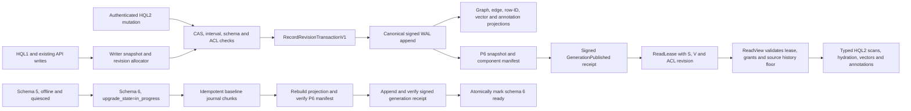
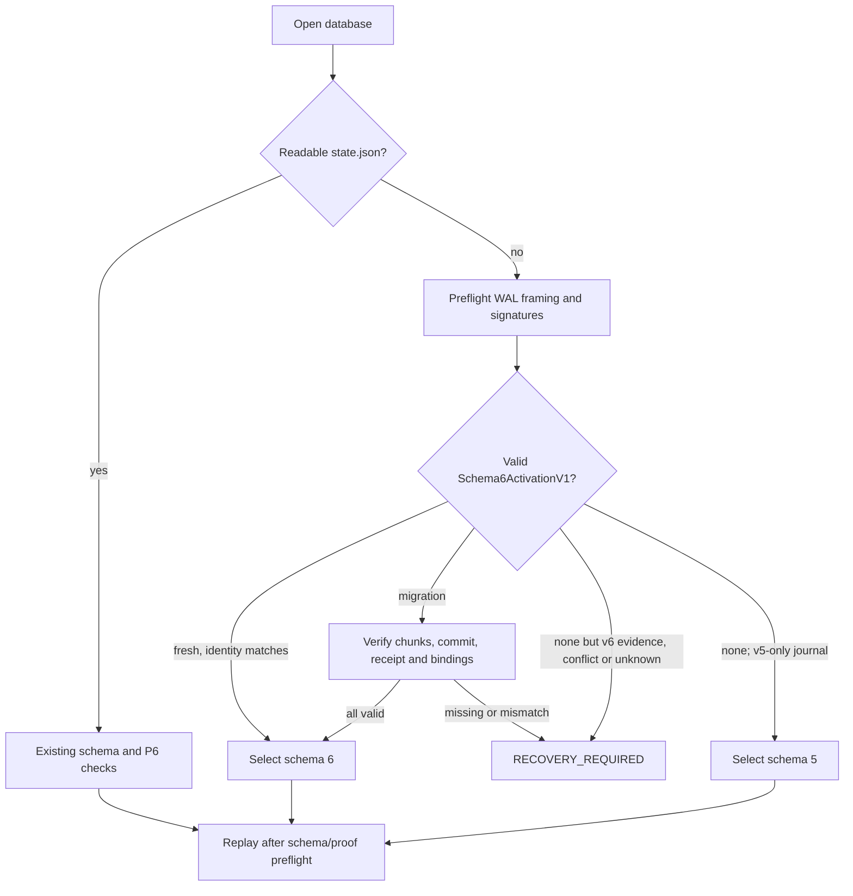

# HQL2 durable revision and annotation contract

## Approval and implementation boundary

The owner approved this H2-D11 contract on 2026-09-28 with “approve H2-D11
candidate”. It resolves the revision, row identity, annotation, retention and
schema-upgrade questions that block HQL2 storage-backed sources.

The owner approved the AnnotationPut evidence-field clarification with
“approve ADR addendum” on 2026-10-02. It clarifies R3's payload shape and
empty-evidence semantics only; the separate target/evidence projection and ACL
behavior were already implemented. It authorizes no schema migration,
transport rollout or change to existing user databases.

Approval authorizes the required P8/P6/plan truth-sync and implementation of
the stated additive schema-v6 migration using temporary fixture databases only.
It does not authorize invoking migration against any existing user database.
Deployment, transport enablement, release qualification, GBF2/GBO2 and a new
database format remain separate gates. The implementation remains partial:
database-bound record-reference validation, database identity, fail-closed
schema-v6 open gates, additive projection tables, runtime KeyCodec v1
validation, and revision-bearing local graph and relational-row writes with
replay/cold-rebuild coverage are implemented. Relational row IDs and exact
encoded keys are persisted in the registry; standalone batches and unified
transactions carry their row revisions, and upsert/update, tombstone/reinsert
and compaction receipts are covered by fixture tests. The amended schema-v5 to
v6 migration routine is now implemented and verified on temporary fixtures:
19 migration tests pass, including backup/manifest binding, chunk resume,
ordinary-open proof validation, fold/rebuild recovery and recursive peer
isolation. No existing user database has been migrated. Vector writes now
carry durable owner-bound revisions and collection-space fingerprints; two
focused tests cover distinct node/secondary vector revisions, exact fingerprint
binding, projection replacement, compaction/reopen and rejection of unversioned
local/peer ingress. Annotation writes now persist immutable CAS revisions with
engine-set `verified_actor`, separate normalized target/evidence rows, local
lineage and frozen-reference validation; cycle and payload checks run before
WAL append. Eight focused tests cover these cases and the version-2
`Annotation(namespace)` policy event through compact/reopen. P8 AnnotationScan
and AnnotationLookup enforce explicit Annotation(Read) for the annotation
subject and check target/evidence access under the same lease. ChangeScan also
requires the explicit annotation grant for Annotation subjects; the separate
Namespace(Read) query grant continues to cover same-namespace references but
does not substitute for Annotation(Read). Node/Edge/Row/Vector/Annotation scans
and typed field hydration are implemented. HistoryScan/ChangeScan enumerate the
supported retained revision kinds under P6; Artifact HistoryScan remains
unsupported. An earlier review concern that hidden Annotation candidates could
affect caller-budget outcomes is resolved by the owner-approved narrow policy
below: quota-result dependence is addressed, but timing noninterference remains
unclaimed. HQL and typed-IR AnnotationScan now match the independent P7 graph
oracle for a persisted annotation at one explicitly aligned transaction and
valid-time selector; this is focused evidence, not broad P8 closure.
Exact KNN and Original Rerank read original schema-v6 vectors under that P6
lease after owner-revision, namespace/node ACL, collection and fingerprint
validation. Artifact HistoryScan, additional unsupported P8 operators and
external surfaces remain open. Schema-6 peer ingress continues
to fail closed for unversioned folded graph/row materializations.

The owner directed ATHER to choose the narrow ChangeScan budget policy and
approved this addendum on 2026-10-03. Namespace(Read) continues to authorize a
ChangeScan of other readable record kinds; it does not authorize Annotation
subjects. Under enforced policy, when the lease lacks Annotation(Read),
Annotation revisions are excluded from candidate counting, byte reservation,
and row materialization before caller-selected query budgets are charged. The
runtime does not require Annotation(Read) for every ChangeScan. This addresses
quota-result dependence on hidden Annotation candidates; it does not claim
timing noninterference or change per-subject reference checks. No schema,
migration, or transport behavior changes. Adversarial threshold verification
passes: with Namespace(Read), three hidden Annotation revisions no longer
exhaust a one-node caller budget, while the readable Node ChangeEvent is
returned. Annotation ACL target passes 11/11; History/Change passes 14/14;
the 32-target HQL2 sweep passes 376/0/1 and selected P6/schema-v6 passes
43/0/0. This verifies quota-result behavior only, not timing noninterference.

The owner approved R6a version 0.3.0b on 2026-09-28. Independent review then
found missing fold/reopen, peer-boundary and authority-reverification
requirements. The owner approved this 0.4.0b amendment on 2026-09-29. Its
migration-specific WAL events and fixture-only migration implementation are
authorized; invocation against an existing user database remains unauthorized.

## Approved architecture flow



The diagram records the approved contract, not implemented or qualified
behavior. The migration-ready marker is the first point at which normal schema-6
reads and writes may open.

## Parent and peer contracts

- [HQL2 execution boundary](ADR--GENESISDB-HQL2-EXECUTION-BOUNDARY.md),
  H2-D04, D06, D09-D12: typed source identity, one read lease, fail-closed
  capability checks, authenticated mutation path and completion gates.
- [P8 typed boundary](../SPEC--GENESISDB-HQL2-P8-TYPED-BOUNDARY.md):
  `RecordRefV2`, source capabilities, annotations/history operators and
  catalog-bound execution.
- [P6 generations, leases and ACL](../SPEC--GENESISDB-P6-GENERATIONS-LEASES-ACL.md):
  local frame sequence, signed control-event authority, snapshot verification,
  fail-closed recovery and `history_horizon`.
- [Master architecture](../MASTER-SPEC--GENESIS-DB.md): current WAL is the
  authority; SQLite is rebuildable; node and edge IDs remain client identities.
- [190-obligation ledger](../UEE-HQL2-OBLIGATION-LEDGER-2026-09-22.md),
  DAT-001..012 and ANO-001..012.
- Owner-provided UEE-HQL2 Blueprint `0.1.0-proposed`, normative
  `02-data-model-annotations.md`, `03-storage-durability-recovery.md`,
  `08-transactions-temporal-security.md`, and `10-migration-implementation-roadmap.md`.
  Repository fixture provenance and source manifest are recorded in
  `tests/fixtures/hql2/README.md`.

The source code evidence is the integrated base `22bc11e` and checkpoint
`53078cb`. In particular, `node_versions` uses `(node_u32, frame_seq)`,
`edge_versions` uses `(id, tx_from)` and compaction rewrites surviving
`tx_from`; relational row changes have no row revision chain, and folded
`RelationalRows` materializations may have an empty `mutation_id`. None of
those projection coordinates or idempotency receipts is a portable immutable
revision identity.

## Proposed decisions

### R1 — identity and revision envelope

1. Keep the existing database identity and namespace rules. `database_id` is
   the current database's domain-separated hash of its persisted public
   verifying key. Node and edge records continue to use the existing default
   namespace until a separately approved graph-namespace migration. Relational
   rows use their registered namespace and table. An annotation and every one
   of its targets must share a namespace; cross-namespace targets fail before
   WAL append.
2. A logical identity is `(database_id, namespace, kind, id)`. Every committed
   revision receives a lowercase UUIDv4 `revision_id` from the engine before
   append. UUIDs are opaque identifiers, not content digests. Check conflicts
   at the writer boundary. They are never derived from wall time, Lamport
   clocks, `frame_seq`, `tx_from`, SQLite rowids, a payload hash or a vector
   index position.
3. Add `database_id` to `RecordRefV2`, preserving its existing field names:
   `{ database_id, namespace, kind, id, revision }`. Require `revision` to be
   a UUIDv4 string for durable sources. This prevents a reference copied from
   another database lineage from being mistaken for a local reference. Update
   the approved P8 type table and examples before implementation; do not accept
   missing database IDs by silently binding to the current database.
4. A revision envelope contains identity, `revision_id`, optional
   `predecessor_revision_id`, operation (`upsert` or `retract`), valid-time
   interval, schema reference/version and typed family payload. Updates and
   retractions require `expected_revision_id` to match the active revision at
   the transaction snapshot; stale expectations fail before append. HQL2
   callers provide that CAS value. Existing HQL1/API wrappers capture it
   internally under the writer snapshot and cannot bypass the revision check.
   Creates require no active revision. `tx_from` and `tx_to` are derived from
   this database's committed WAL frame ordering and remain local coordinates,
   never part of `revision_id`.
5. Revisions and mutation IDs are included in the canonical WAL mutation.
   Where existing sync/consensus signing applies, the revision IDs are inside
   the bytes already covered by that signature. Replay, retry, backup and
   restore preserve the exact IDs. A repeated transaction ID with a different
   semantic digest fails with the existing idempotency-conflict behavior. No
   revision metadata is reconstructed from a projection after WAL append.
   `origin_database_id` records the signed source lineage; the
   `RecordRefV2.database_id` returned by a query is the local database being
   read. A restored clone retains its database ID; an independently keyed
   replica has its own.
6. Old peers that cannot verify and preserve revision-bearing mutations must
   receive an explicit upgrade-required result before mutation ingress or
   egress. Do not silently strip revision IDs or reinterpret P6's local-only
   generation/policy events as peer mutations. Legacy revision baselines are
   database-local; a `RecordRefV2` includes `database_id` and cannot cross
   lineages.

### R2 — graph, row and vector revision semantics

| Family | Stable identity | Revision and correction rules |
|---|---|---|
| Node | Existing case-sensitive node `id` in the default namespace | Every accepted upsert or retract gets a new revision. Superseding does not mutate an earlier revision. Retraction is a durable tombstone; a later re-create keeps the logical node ID but receives a new revision. |
| Edge | Existing edge `id` in the default namespace | Every accepted correction or retract gets a new revision. Changing endpoints is an explicit replacement that closes the old adjacency revision and opens the new one atomically; endpoint rebinding is never silent. |
| Row | Registry-assigned UUID public row ID, scoped by namespace and table | Each extant row has its own ID, independent of SQLite `rowid` and primary-key bytes. First insert allocates it; an upsert conflict/update preserves it. A typed primary-key change is one atomic retract-old plus insert-new and allocates a new row ID. Delete/reinsert after deletion creates a new logical row ID. HQL2 addresses a row by this ID; the key codec is for typed lookup and uniqueness checks, never the public identity. |
| Vector | `(owner RecordRef, collection ID)` | Each embedding is a separately versioned value with its own UUID revision and collection-space fingerprint. Re-embedding closes the prior active vector revision in the affected valid interval. Exactness means the original committed scalar encoding is available; quantized codes do not qualify as original. |

For rows, `KeyCodec` v1 is a typed, collision-free encoding of primary-key
components in the schema-declared order: the bytes `HQL2RK1`, one component
count byte, then for each component a one-byte type tag, a four-byte unsigned
big-endian byte length, and the value bytes. Tags are fixed as null=0,
text=1, integer=2, real=3, boolean=4, JSON=5, blob=6, timestamp=7 and
entity-id=8. Text and entity IDs use their exact UTF-8 bytes (no Unicode
normalization); integers use signed i64 two's-complement big-endian; finite
reals use IEEE-754 binary64 big-endian with negative zero canonicalized to
positive zero; booleans use one byte 0 or 1; JSON uses the engine's compact
`serde_json` serialization; blobs use their raw bytes; timestamps use the
exact RFC3339 UTF-8 representation accepted and stored by the current engine.
Null has zero value bytes and is legal only for a nullable declared column.
The complete encoding is limited to 16 KiB. The codec version and exact bytes
are persisted with the row registry so a future codec change cannot silently
retarget an old reference. Namespace and table scope the key; the key bytes are
never used as the public row ID.

The current SQLite schema permits nullable primary-key columns, and SQLite
allows multiple rows when any primary-key component is NULL. Preserve that
behavior: equal key encodings containing NULL do not imply uniqueness. The
registry may therefore map such a key to multiple row IDs; only a row ID
identifies one row. For non-NULL tuples, enforce the existing schema's SQLite
primary-key uniqueness using the same typed values and default BINARY text
comparison. Do not add a collation, normalize timestamps or text, or change
the registered primary key as part of this contract.

The collection-space fingerprint is SHA-256 over the domain prefix
`genesis.hql2.vector-space.v1:` followed by compact JSON for the ordered tuple
`(collection name, declared model label, dimension, metric, quantization)` from
the verified collection manifest. This is a structural fingerprint, not proof
that the declared model generated the vector. A separate `model_fingerprint`
is optional and may be set only from verified source metadata; the engine must
not infer it from the model label. Vector reads never compare different
collection-space fingerprints. Quantized-only data does not satisfy exact
original-vector capability.

At one `(S,V)`, active revisions of the same logical identity cannot overlap
in valid time. Correcting a subinterval creates non-empty left/corrected/right
fragments as needed, each with a new revision ID; it never edits the previous
payload. A transaction that changes multiple families publishes all revisions
at one WAL frontier or publishes none. Writes preflight uniqueness, endpoint
visibility, typed keys, interval overlap and authorization before append.

The query engine returns graph/row owner `RecordRefV2` values and binds vector
results to the exact owner and vector revision under the same P6 lease. Current
P8 exact KNN omits input candidates with no original vector; Original Rerank
fails closed if any requested candidate lacks one. Neither substitutes current
state for a historical selection. Explicit history requests with an unavailable
original vector, record revision or history window return a typed
capability/history error. Mutation boundaries accept explicit-offset RFC3339
instants and normalize comparisons to UTC; timezone-less strings and
empty/reversed half-open intervals are rejected.

### R3 — annotations are versioned records

An annotation has a stable client `id` (UTF-8, 1..256 bytes), namespace, kind,
one or more targets, typed body, asserted author, verified actor, created time,
valid interval and its own engine-issued revision ID. Optional fields are
confidence `[0,1]`, client-schema-controlled status, evidence references,
generator name/version/fingerprint and `supersedes` annotation revision.
`targets` and `evidence` are separate arrays of `{ref, binding, selector}`
objects. `targets` contains 1..128 items; `evidence` is optional and may contain
0..128 items. The same reference may appear once in each list, but duplicates
within one list are rejected. Both arrays are normalized into
`hql2_annotation_targets`; `is_evidence` distinguishes their role. ACL checks
cover their union and hide the entire annotation if any reference is denied.
Status, confidence, asserted author and a signature do not confer authority.

The persisted event is an immutable annotation revision. Amend creates a new
revision and retires the previous annotation revision; retract writes a
tombstone. Annotation IDs may target node, edge, row or annotation revisions.
Artifact/event targets remain capability-gated until their source adapters
have an approved storage contract. Annotation-to-annotation target graphs are
cycle-checked at commit; HQL2 never recursively expands annotation targets.

The storage envelope is one or more typed mutations in the enclosing
all-or-nothing transaction:

```text
RecordRevisionTransactionV1 = {
  transaction_id, origin_database_id, mutations: [RecordRevisionMutationV1]
}
RecordRevisionMutationV1 = {
  namespace, kind, id, revision_id, expected_revision_id?,
  predecessor_revision_id?, operation, valid_from, valid_to,
  schema_ref?, schema_version?, payload
}
```

For `kind=annotation`, `payload` carries the annotation fields, required
`targets` array, and—when supplied—a distinct top-level `evidence` array; the
journal frame supplies local transaction order. Omitted `evidence` means an
empty evidence set. Evidence is never inferred from, copied from, or merged
into `targets`. Each supplied array retains its `{ref, binding, selector}`
items in the signed revision payload, is normalized with its role bit, and is
included in the same pre-append and P6 read-time reference authorization; a
denied reference hides the whole annotation. The normative fixture includes
both fields at
[`tests/fixtures/hql2/blueprint/examples/annotation.json`](../../tests/fixtures/hql2/blueprint/examples/annotation.json).
The request cannot supply `revision_id` or `verified_actor`. Engine-issued
UUIDs and the authenticated actor enter the canonical event before append. The
public annotation request retains the Blueprint fields (`id`, `namespace`,
`kind`, `targets`, `body`, asserted `author`, timestamps, confidence/status,
optional `evidence`, supersedes and generator); `verified_actor` is an
engine-owned stored field. `origin_database_id` comes from the trusted local
database identity on local writes or the verified origin on peer ingress; it
is not request JSON.

For `kind=row`, `id` is the registry `row_id` and the payload carries the
namespace/table schema reference, typed key tuple, `key_codec_version`, and
either a complete typed after-image or a tombstone. The key tuple locates or
checks the row but does not replace `row_id` as its identity. Other kinds carry
their complete typed family payload; a projection is never the sole source of
a revision.

Target binding has two modes:

- `frozen` requires an existing `RecordRefV2` including revision. It remains
  evidence for that exact revision only. It is never retargeted to the latest
  record.
- `live` stores logical identity without revision. Resolution uses the
  selected query `(S,V)` and the result explicitly reports live binding. If
  the identity has no visible revision, the annotation remains a historical
  reference; no replacement revision or hidden target is exposed.

Selectors are a closed tagged union: `whole`; `text_position` with
`[start,end)` Unicode-scalar offsets, `content_hash`, `extraction_id` and
`normalization_id`; `byte_range` with `[start,end)` and `content_hash`; or
RFC6901 `json_pointer`. Reject negative, reversed, out-of-range and unknown
selectors. Image, timecode and code-line selectors require future versioned
contracts. A text/byte hash verifies only the specified immutable source bytes;
it is not a record ID or revision ID. Never normalize, retarget or recalculate
evidence offsets at query time. An unavailable artifact/extraction is marked
unverified or fails a selector that requires its bytes; remote URIs are never
dereferenced by the query executor.

Text bodies are bounded at 1 MiB; JSON and link bodies follow the owner
annotation schema and configured schema limits. The engine sets `verified_actor`
from authenticated context. Client `author` remains asserted data and cannot
override that actor. If `generator` is present, preserve name/version exactly;
`model_fingerprint` is opaque caller evidence and is never inferred from a
model name. A missing or unverified fingerprint cannot be advertised as
verified provenance.

### R4 — annotation access, joins and indexes

Add `AccessResource::Annotation(namespace)` to the P6 grant model. Annotation
read requires both `Read(Annotation(namespace))` and `Read` access to every
target and evidence reference exposed, under the same lease/policy revision.
The HQL2 namespace-wide query grant is a separate query-boundary requirement:
it may authorize same-namespace target/evidence references, but cannot replace
the explicit Annotation grant for an annotation source or ChangeScan subject.
If any reference in an annotation is outside the read scope, hide the whole
annotation row; do not return a partial target list or leak its cardinality.
Access to one record does not imply annotation-body access; annotation access
does not reveal a forbidden target. Unauthorized and absent annotations are
indistinguishable to optional lookup. HQL filters on `status` or confidence
never change policy.
For this version the whole annotation body is one protected resource; separate
field-level body permissions require a later contract.

The `ReadView` owns annotation enumeration, lookup and history access. One
annotation scan emits an annotation once per matching input path; multi-target
duplicates do not multiply one match, while duplicate input paths remain
duplicates until explicit `DISTINCT`. Optional lookup preserves an unmatched
input with a typed NULL annotation. Every scan, target join and evidence lookup
uses the same pinned S,V and revalidates the lease before returning bytes.

Required derived indexes are `(namespace,target_kind,target_id,target_revision,kind)`,
`(namespace,kind,status,author)` and valid/transaction interval indexes.
Multi-target relationships are normalized; they are not encoded into one
string. Inverted postings and annotation vector indexes are separate future
index capabilities with their own lifecycle/coverage contract and do not block
exact annotation reads.

### R5 — retention, folding, backup and restore

`tx_from/tx_to` and valid intervals are half-open. Query visibility requires
`tx_from <= S < tx_to` and `valid_from <= V < valid_to`; open upper bounds
mean infinity. Current policy applies to historical reads. Below the source's
retained history floor, return `BEYOND_HORIZON`/`HISTORY_UNAVAILABLE` before
reading; never fall back to live state.

The P6 `history_horizon` remains authoritative for node/edge history. A
per-source `row_history_floor` begins at the schema-v6 cutover because the
current projection has no historical row chain. Row scans at current S work;
row history before cutover is unavailable. Annotation/vector history floors
are recorded when their versioned source is activated. For any source, an
historical selector below that source's recorded floor returns
`HISTORY_UNAVAILABLE`; an in-range selector with no matching revision returns
an empty result. No deleted revision is served below its applicable floor.

For P8 HQL2 and typed-IR execution through `Storage::query_v2`, let `L` be the
pinned generation WAL frontier and select transaction frontier `S` as
`tx_as_of` when supplied, otherwise `L`. Require
`history_horizon <= S <= L` before source access. The lease, catalog and
current policy revision remain bound to the validated generation at `L`,
while every revision-backed source, property hydration, graph/vector/
annotation operator and result `Snapshot.tx` uses the same selected `S`.
There is no fallback to current rows. Legacy `execute_hql`, relational query,
`node_view` and `node_versions` keep their separate selector-rejection
behavior unless their own contracts change.

For HQL2 HistoryScan, the selected WAL frontier `S` is the transaction upper
bound and the selected valid time `V` chooses revisions whose valid interval
contains `V`. Enumeration intentionally includes rows whose `tx_to <= S` and
includes retract tombstones, while retaining the exact subject revision and
metadata. Reading properties from a historical upsert resolves that exact
revision under the same lease/current policy; a tombstone has no user
properties and no current-state fallback is allowed. Node/Edge use the P6
graph floor; Row/Vector/Annotation use their H2-D11 floors, each checked
against `S`. Vector history is addressed by the compact JSON encoding of the
ordered `(owner_id, collection_id)` pair, and its current owner-node ACL is
checked under the same P6 lease. Artifact remains
unsupported until its storage source and floor have a separate approved
contract.

HQL2 ChangeScan is a derived query value over revision rows, not a persisted
`Event` record kind. It returns one event per revision created in
`(after_seq,S]`, where `S` is the selected frontier; it does not synthesize an
event for `tx_to` closure. Upserts with a predecessor are exposed as
`correct`, first upserts as `upsert`, and tombstones as `retract`. Events carry
the exact subject `RecordRefV2` and local sequence, sort by
`(tx_from,kind,record_id,revision_id)`, and require a cursor at or above every
participating source floor. A floor is the minimum accepted exclusive cursor:
equality is valid and returns only rows with a greater `tx_from`. Therefore a
migration baseline at frontier `F` is readable by HistoryScan at `F`, but is
not presented as a ChangeScan event to a consumer starting at `F`.
Unsupported/unknown families fail closed. Current
ACL is evaluated at the same P6 lease: edge endpoints, vector owners, and
annotation targets/evidence are recursively authorized before an event is
visible. This decision was made under the owner's 2026-09-29 delegation and
does not widen the H2-D11 migration or transport approval.

At a fold to F, retain the current live revision identity and all revisions at
or above the retained floor. Prune older versions and corresponding annotation
targets/evidence only as the existing explicit retention policy permits. Edge
compaction may rewrite its local interval coordinate, but never its revision
UUID. Fold materializations carry the surviving revision IDs, row IDs,
annotation IDs and schema/catalog state. Retention never invents a predecessor
or claims old source bytes still exist.

An engine-owned backup pins one frontier, includes the journal authority,
snapshot/P6 manifest and all required projection/original-vector artifacts,
then verifies counts and digests. Restore is into a new directory followed by
normal recovery, P6 generation publication and independent validation; all
UUIDs and database identity are preserved. A raw SQLite copy is not a backup.
The bundle's `stable_frontier` is its declared WAL-frame frontier. Normal
recovery must first reproduce that exact frame frontier; a truncated or
otherwise incomplete WAL suffix is rejected before publication. Restore then
publishes a new local P6 generation whose `wal_frontier` equals the manifest
frontier, or reuses a valid terminal `GenerationPublished` receipt whose
`publication_seq` equals it. Either path changes no graph, vector or relational
data and leaves `txn_frontier` unchanged. Restore independently reopens
staging read-only and validates the lease. It prepares the complete
`BackupBundleInfo` before atomically renaming staging into the caller-visible
target, so no later bundle I/O can turn a published restore into an error.
Backup compatibility is checked using the supported format, matching engine
name, and readable schema version. The manifest's `engine_version` is audit
provenance, not an exact-match gate; an older engine build may restore when its
schema is supported. Newer unreadable schemas fail before target creation.
Physical erasure across retained history, artifacts, backups and replicas is a
separately authorized administrative workflow, not annotation retraction.

### R6 — versioned WAL and legacy upgrade

Keep the current journal/snapshot files and current event authority in this
slice. Add a versioned revision-bearing event envelope and additive rebuildable
projection tables/indexes. Do not switch to GBF2/GBO2, change vector block
layout, or use SQLite as the authority. Every committed revision is recoverable
from the journal; the projection is rebuilt from it. P6 control events remain
local-only and their signatures, materializations and snapshot checks are
unchanged.

All existing in-process and HQL1 write paths in a migrated schema-6 database
must emit revision-bearing journal mutations internally while preserving
their existing visible HQL1/API behavior. They cannot bypass the new revision
envelope. A local graph API write may use the transaction envelope for atomic
revision application without being a transaction-API commit: it sets
`advances_txn_frontier=false`, while the frame frontier still advances. The
field is omitted from legacy transaction events and defaults to `true`; its
value is preserved in the rebuildable projection and compact receipts. For
relational writes, a row mutation carries the registry `row_id`,
typed key encoding/version and either the complete typed after-image or a
tombstone; an HQL1 batch resolves every affected row ID and after-image before
append, then commits those row revisions atomically with the original batch.
Upsert conflicts preserve the row ID; inserts, including SQLite-permitted
NULL-key duplicates, allocate a new one. If an affected row cannot be bound
unambiguously, reject before append. The disk state schema advances from 5 to
6. Schema-6 readers understand every new event and fail closed on unknown
required versions. Existing schema-5
databases continue to open for legacy APIs without automatic migration; HQL2
operators requiring durable revisions return `CAPABILITY_UNSUPPORTED` until
explicit migration completes. Older readers reject schema 6 before exposing a
partial view. No HQL2 mutation API is enabled until the caller has an
authenticated principal and the versioned transaction path is atomic.

The later migration command is explicit, offline with writers quiesced, and
requires a verified engine-owned backup plus a dry-run manifest. It must be
idempotent and crash-resumable:

1. Capture source schema, database ID, frontier F, history floors, record
   counts, retained node/edge version counts, row counts, vector fingerprints
   and P6 manifest digest.
2. Before appending any v6-only event, atomically mark the disk state
   `schema_version=6, upgrade_state=in_progress` with the `migration_id`,
   source schema and F. Old binaries must reject that state before replay or
   exposing data; v6 binaries must keep normal reads and writes closed and
   resume only this migration, or return `RECOVERY_REQUIRED`.
3. Assign UUIDs for every retained node/edge revision from the verified
   projection/journal at or above `history_horizon`. These UUIDs are migration
   baseline identities local to this database lineage; local frame keys locate
   source rows during migration but never become public IDs. Create one row ID
   and one baseline revision per row present at F. Persist these exact IDs in
   the journal records in step 4. Rows with
   NULL-containing keys receive distinct IDs even when their key encodings are
   equal. Mark `row_history_floor=F`; do not manufacture per-row versions or
   deletes from current row payloads. Annotation history starts empty unless a
   separately inventoried authoritative annotation source exists. For each
   vector whose original scalar bytes and owner/collection can be verified,
   create a baseline vector revision ID and collection-space fingerprint;
   preserve a model fingerprint only if source metadata actually contains one.
   Otherwise set the vector history floor to F and report unavailable identity
   or provenance instead of inventing it. Verify non-NULL key uniqueness and
   fail closed on malformed rows or conflicting keys.
4. Write chunked, idempotent baseline records to the authority journal with a
   final commit record containing chunk count and digest.
5. Rebuild projection state and verify baseline completeness and the P6
   manifest. Append and verify the matching signed `GenerationPublished`
   materialization, then atomically change `upgrade_state` to `ready`. That
   ready marker is the only point at which v6 reads/writes may open. A crash
   before it leaves the database fail-closed and resumable. Emit a
   machine-readable report with counts, source/target frontiers, per-source
   history floors and all unsupported/omitted families. Never drop unknown
   fields silently.

No in-place downgrade is allowed after the first schema-6 mutation. Rollback
uses the verified pre-migration backup into a separate directory; loss of
post-upgrade writes requires explicit operator authorization. This document
does not authorize running that command against any existing user database.

### R6a — Proposed migration WAL envelope and source-coordinate binding

**Status: owner-approved beta 0.4.0b; fixture-only implementation authorized.**

The approved migration requires retained graph history to remain visible at its
source transaction coordinates. The current revision projection derives
tx_from from the newly appended WAL frame; that coordinate is later than source
frontier F and cannot stand in for a retained node_versions.frame_seq or
edge_versions.tx_from. Row history begins with one baseline at F. Reusing a
normal write transaction for these baselines would therefore make the
projection history floor disagree with its visible records.

The repository's committed baseline and available release tags use schema 5;
schema 6 exists only in uncommitted worktree changes. This contract keeps the
schema-5-to-6 target: released v5 readers reject schema 6 before replay, and
pre-release schema-6 builds are not a supported rollback target after H2-D11
events are written. New readers must reject unknown complete signed control
events before exposing data; they must never deserialize-skip one and continue.
If a schema-6 build is released before this migration ships, advance the disk
schema version before implementation instead of relying on this boundary.

Add two schema-v6, signed, local-only event forms:

1. Schema6MigrationChunkV1 carries migration_id, source_database_id,
   source_schema=5, source_frontier=F, chunk_index, total_chunks, chunk digest,
   and bounded baseline records. Each record contains its revision mutation
   plus source_tx_from and optional source_tx_to. The journal frame sequence
   remains the append/recovery coordinate; the source coordinates are the
   HQL2 temporal coordinates. Retained node/edge records preserve their
   verified source intervals. Each row present at F gets one baseline with
   source_tx_from=F and no source_tx_to. No pre-cutover row history is
   manufactured.
2. Schema6MigrationCommitV1 carries migration_id, source_database_id,
   source_schema, F, total_chunks and an aggregate SHA-256 over the ordered
   chunk indexes and chunk digests. It is appended only after every planned
   chunk is durable.

Chunk content is canonically serialized before hashing. An exact duplicate
chunk at the same migration_id/index is idempotent; a different digest for an
already observed index, a gap or a conflicting commit fails closed with
RECOVERY_REQUIRED. Replay verifies each event signature and requires the
persisted local signer. Migration authority events are excluded from peer
delta/anti-entropy export and rejected at every peer/application ingress,
including recursively nested batches and alternate write paths.

The dry-run manifest binds migration_id, database identity, source schema,
frontier, source history floors/counts, vector provenance outcomes and P6
manifest digest. Before the first schema-v6 event, the engine verifies an
engine-owned backup whose identity, schema, frontier and artifact digests
match that manifest. The in-progress marker stores the same migration_id and
manifest digest. A migration-only open may resume only that exact pair; every
normal open remains closed while the marker is in_progress. Before exposure,
every ordinary reopen independently verifies the marker's database identity
and manifest digest, the complete ordered chunk set and commit digest, and the
qualifying signed generation receipt. A missing, stale or mismatched proof
returns RECOVERY_REQUIRED; state.json alone never proves migration completion.

Replay projects baseline tx_from/tx_to from the verified source coordinates,
not from the later chunk frame. Projection rebuild must prove the ordered chunk
set and aggregate digest before applying the final commit. Compaction preserves
or re-emits every signed migration chunk and commit authority payload, including
migration/chunk IDs, digests, revision IDs, row IDs, source coordinates and
history floors; it may not replace these records with current-state-only
materializations. A WAL-only cold reopen after fold must reconstruct identical
revision/registry projections and commit proof. Snapshot publication keeps
upgrade_state=in_progress through snapshot write and receipt append. The signed
GenerationPublished receipt covers the final migration-commit frame
(`publication_seq = wal_frontier + 1`) and binds the verified post-migration
snapshot manifest digest. Only after verifying that receipt may the final state
marker atomically change to ready. Normal reopen rechecks all proofs. The
migration report includes source and target frontiers, counts, floors and
unsupported provenance families.

Required fixture-only discriminators include: source-coordinate visibility at
F and each retained graph interval; one row baseline at F; exact duplicate
chunk replay; conflicting duplicate/gap/commit digest rejection; crash before
marker, between chunks, after commit and after generation receipt; matching-ID
resume; mismatched-ID rejection; normal-reader closure until ready; rejection
of unknown signed control events; signature/local-signer enforcement; recursive
peer and application-ingress rejection plus peer-export exclusion; ordinary
reopen proof validation; fold followed by WAL-only cold reopen with identical
revision/registry/commit digests; and schema-5 compatibility. No existing user
database may be used for migration tests or execution under this approval.

### R6b — Authenticated schema selection when `state.json` is absent

**Status: owner-approved addendum, 2026-10-02; implemented and fixture-verified in the isolated worktree.**

R6 requires every schema-6 revision to be recoverable from the authority journal.
P6 also requires complete WAL replay when a snapshot is invalid. These rules
must remain compatible when the final `state.json` marker itself is missing:
the reader cannot silently select schema 5 merely because the marker no longer
provides a schema number, and it cannot infer schema 6 from an arbitrary single
revision event.

Introduce one signed, local-only `Schema6ActivationV1` authority event. Its
canonical payload binds `schema_version=6`, the database identity, and an
activation kind:

- `fresh`: the database identity and schema version; append this event as the
  first durable schema-6 authority record before exposing schema-6 reads or
  accepting schema-6 writes.
- `migration`: migration ID and manifest digest, source database/schema/frontier
  and history floors, verified backup and source-P6 manifest digests, migration
  commit frame, and the matching `GenerationPublished` receipt sequence and
  post-migration manifest digest. Append it only after validating the complete
  ordered local-signer chunk/commit proof and matching signed generation
  receipt; publish `upgrade_state=ready` only after the activation event is
  durably appended and verified. The event attests the already-verified backup
  and source manifest at cutover; it does not claim that those external backup
  bytes are stored in the WAL.

The frame sequence is derived from the journal, not duplicated in the signed
payload, so fold may relocate the record without changing its signature. Fold
must retain or canonically re-emit exactly one valid activation event along
with the migration authority and required generation receipt. Activation
events are local-only: exclude them from peer delta/anti-entropy export and
reject them at all peer/application ingress paths, including nested batches.

On open, select schema before mutating projections and apply these rules:

1. With a readable state marker, keep the existing forward-version, migration
   marker, ready-proof and P6 snapshot checks. A schema-6 ready marker must
   match its signed activation event and the event's referenced proof.
2. With no readable state marker, preflight all available journal sources for
   framing/sequence integrity and verify the local signature and database
   identity of any activation. A valid `fresh` activation selects schema 6. A
   `migration` activation selects schema 6 only after the full migration
   chunks, aggregate commit digest, source bindings, and matching generation
   receipt are independently verified from the journal.
3. If there is no activation and the journal contains only schema-5-compatible
   events, replay in schema-5 mode. If any v6-only revision, migration, or
   policy event exists without a valid activation, or if activation evidence is
   incomplete, conflicting, unknown, or unverifiable, return
   `RECOVERY_REQUIRED`; never downgrade to schema 5 or expose a partial view.
4. A torn final frame may be discarded only under the existing WAL torn-tail
   rule. It cannot substitute for activation proof: a complete activation
   before the tail permits recovery; a v6-only event without that proof fails
   closed. A genuinely fresh empty directory may initialize schema 6 only by
   durably writing its activation event before normal operations are exposed.



Required temporary-fixture tests: markerless schema-5 raw-event replay; fresh
schema-6 cold reopen from WAL alone; complete and torn-tail schema-6 WAL-only
recovery; v6-only events without activation; invalid signature, wrong database
identity, conflicting activation and unknown control event; migration recovery
with the marker removed and with each proof component missing/mismatched; fold
followed by markerless cold reopen; activation peer-export/ingress rejection;
and no partial projection exposure on failed preflight. This addendum does not
authorize migration of an existing user database, downgrade, merge, release,
or deployment.

## Compatibility and open boundaries

- HQL1, existing APIs, current node/edge IDs and signed P6 control-event
  locality remain unchanged. Existing HQL2 source types receive a versioned
  update for `RecordRefV2.database_id`; transport schemas remain a P13 gate.
- Historical node/edge revisions retain exact existing horizon semantics.
  Pre-cutover row history does not exist and is explicitly unavailable.
- This contract defines annotation identity/body/targets/selectors and exact
  read authorization, not an extraction engine, tokenizer registry, analyzer,
  model registry, blob store or automatic model verification.
- Artifact/event RecordRefs, hard-erasure, GBF2/GBO2, new backup formats,
  online migration, multi-writer conflict resolution and remote deployment
  need separate contracts. Their presence in the Blueprint does not activate
  them here.
- P6 now accepts `AccessResource::Annotation` under signed policy-event schema
  v2 and the crate-private HQL2 ReadView checks target/evidence references under
  the same lease. HQL2 still requires the broad namespace query grant; a
  query surface authorized solely by exact per-record grants is not enabled.

## Risk, dependencies and acceptance

Risk is **HIGH**, complexity **C-3**: this changes durable event/schema
compatibility, row identities, ACL materialization, temporal reads and
recovery. The serialized `src/lib.rs` owner remains the only source writer.

Before source changes after approval, update P8/P6 contracts and the
implementation plan so the exact field, event, policy and migration schemas
match this decision. Then implement in dependency order: record revision
events/projections; schema-v6 migration/recovery; row and vector history;
annotation WAL/projection/ACL; ReadView operators; HQL2/IR differential tests;
compatibility/recovery review. Do not parallel-edit `src/lib.rs`.

Minimum Verify/Review/Final evidence:

1. RED/GREEN tests for UUID preservation, transaction atomicity, conflicting
   revision IDs, expected-predecessor checks, tombstones/recreate, interval
   splits and duplicate/idempotent replay.
2. Fold/rebuild/cold-open/backup/restore parity tests proving revision IDs,
   row IDs, schema, retention floors and annotation selectors are stable.
3. Crash each migration phase/chunk and prove resumability, no partial reads,
   no silent schema downgrade and correct backup restore. Include legacy v5,
   v6 and unsupported future schema/event cases.
4. Differential tests for frozen/live targets, every selector, Unicode scalar
   offsets, multi-target multiplicity/cycles, verified versus asserted author,
   body/target/evidence ACL combinations and optional lookup.
5. Current P6 generation/lease/visibility/peer-authority tests; WAL authority,
   invalid signature, tampered manifest, query cancellation and one-S,V tests.
6. Rust feature builds and later P13 adapters only when separately specified;
   no Node/device/hosted/release evidence is inferred from local Rust tests.

## Document version diff

| Artifact | Approved version | Synchronized version/status |
|---|---|---|
| This H2-D11 addendum | `0.3.0b` candidate, owner-approved | `0.8.25b` beta, R5 restore compatibility and stale History/Change status reconciled; AnnotationScan has focused P7 parity evidence; U9 target passes 7/7 |
| P8 completion addendum | `0.1.13b` accepted | `0.1.14b` accepted, records differential-tested zero-hop property and exact-seed depth-one traversal extensions |
| P8 typed boundary | `0.2.0b` beta | `0.2.63b` beta, records G4/D7 and AnnotationScan P7 evidence; full source/operator oracle remains partial |
| P6 generations/leases/ACL | `0.5.0b` beta | `0.5.34b` beta, D7 synchronization only; no ACL/schema/migration change |
| U9 backup/restore spec | `0.1.1b` approved | `0.1.8b` beta, format/engine-name/schema gates distinguished from audit-only engine version |
| HQL2 orchestration plan | `0.5.0b` beta | `0.8.75b` beta, records current D7/G4/restore and AnnotationScan P7 evidence; broader phase gates remain open |
| C4 architecture index | `0.1.20b` | `0.1.71b`, indexes current HQL2/P6 restore result and open gates |
| DOC registry | `0.5.6+draft` | `0.5.82+draft`, synchronized current HQL2/P6/plan/report/U9 entries |
| Master specification | — | `2.3.42b`, architecture summary synchronized to D7 and R5 restore evidence |
| HQL2 P8 checkpoint | — | `0.1.67b`, records G4/D7, U9 and AnnotationScan P7 evidence; broader acceptance remains open |
| Engine/storage | `0.2.9` | remains unchanged until implementation and release gates; no user database is migrated here |

Version diff `0.8.19b -> 0.8.20b`: accept a valid terminal
`GenerationPublished` frame as the manifest WAL frontier, preserve the
transaction frontier, and finish fallible bundle-info work before target
publication. Extend the restore regression and synchronize current evidence.

Version diff `0.8.18b -> 0.8.19b`: implement the approved R5 restore order in
staging: normal recovery, generation publication at the manifest `wal_frontier`,
then independent read-only lease validation before target rename. Clarify that
the local P6 publication frame may advance restored live `stable_frontier`
without changing the bundle's declared data frontier.

Version diff `0.8.17b -> 0.8.18b`: fix the restore-validation checkpoint to
use full retention, so opening/dropping the temporary staging database cannot
fold the only restored journal copy or advance the H2-D11/P6 history floor.
The H2-D11 backup/restore fixture now proves stable graph history floor,
revision/row/schema/selector/source-floor identity and HQL/typed-IR
HistoryScan/ChangeScan parity; the focused backup, revision, History/Change,
row-history and annotation targets pass 59/59 across seven targets, the explicit
HQL2 sweep passes 389/0/1 across 35 targets, and the full locked/offline Rust
suite exits 0. No backup format, schema or migration change; broad P14 rehearsal,
P8/P13, hosted CI and independent-review gates remain open. See
`.brain/rca/RCA--hql2-backup-restore-history-floor.md`.

Version diff `0.8.16b -> 0.8.17b`: select the narrow ChangeScan budget policy:
retain namespace-only ChangeScan for other readable kinds, exclude unauthorized
Annotation revisions before caller-budget accounting/materialization, and do not
require Annotation(Read) for every stream. The threshold regression and focused
ACL/history tests pass (11/11 and 14/14); the explicit HQL2 sweep passes 376/0/1
and selected P6/schema-v6 tests pass 43/0/0. No schema or migration change;
hosted CI for this source revision, independent review and broad P8/P13 remain open.

Version diff `0.8.15b -> 0.8.16b`: record the H2-D11 R4/P6 ACL conformance
fix: Namespace(Read) remains a separate HQL2 query requirement and broad
same-namespace reference grant, while annotation subjects require explicit
Annotation(Read) in AnnotationScan and ChangeScan. The regression passes;
HQL2 is 375/0/1 across 32 targets and the selected P6/schema-v6 suite is 43/0/0.
No contract/schema/migration change. A possible ChangeScan budget side channel
remains outside this fix: candidate count/bytes are reserved before subject ACL
filtering, so hidden Annotation-event counts may be inferred through quota
errors. The gate awaits a contract decision and adversarial verification.
Hosted worker CI and Windows Rust are not green on the prior PR head; broad
P8/P13 and review remain open.

Version diff `0.8.14b -> 0.8.15b`: synchronize current HQL2/P6/plan, C4,
master, report and registry versions; record PR #194 run 37083654705 at
docs-only head 43cc6e8. Four worker checks fail at fresh schema-v6 bootstrap;
Windows Rust fails the Join differential with `query_limit`, while local
reproduction passes 5/5 and the exact budget dimension remains unconfirmed.
No H2-D11 contract, schema or migration change; worker correction and broad
P8/P13/review gates remain open.

Version diff `0.8.12b -> 0.8.13b`: record storage-backed HQL/typed-IR
Row HistoryScan/ChangeScan parity for retained insert/update revisions, exact
row-property hydration and durable Row subject identity (1/1); synchronize P8,
plan, report and registry versions. No schema or migration change; broader
P8/P13 and review gates remain open.

Version diff `0.8.11b -> 0.8.12b`: record implementation and local verification
of the accepted P8 transaction-time contract: one validated frontier `S`
governs HQL2/IR source reads, graph/vector/annotation operators, hydration and
`Snapshot.tx`, while the P6 generation/current policy stays pinned; per-source
floors fail closed, no current-state fallback is allowed, and no schema or
migration change is introduced. Focused 56/56, History/Change 14/14, HQL2
373/0/1 and P6/compatibility 194/0/0 pass; broad P8/P13 and review remain open.

Version diff `0.8.9b -> 0.8.10b`: synchronize Vector HistoryScan's canonical
H2-D11 tuple ID, P6 vector floor and current owner-node ACL with locally verified
HQL/typed-IR runtime support; no schema or migration change. `tx_as_of` and full
P8/P13 qualification remain open.

Version diff `0.8.8b -> 0.8.9b`: record schema-v6 consensus revision
transformation before signing, stale-CAS rejection before WAL append, and final
full locked/offline Rust plus strict Clippy verification; `probe_vs_recall` is
NOT_RUN and broader acceptance/release gates remain open.

## CHANGELOG

Version diff `0.8.24b -> 0.8.25b`: record the test-only HQL/typed-IR
AnnotationScan differential against independent P7 at an explicitly aligned
S,V. The focused source/ACL target passes 7/7; this does not close broad P8
exact-oracle gates and changes no runtime, schema, migration or transport.

Version diff `0.8.23b -> 0.8.24b`: reconcile the opening H2-D11 status with
the later approved implementation evidence. History/Change covers retained
Node, Edge, Row, Vector and Annotation revisions; Artifact HistoryScan remains
unsupported. The ChangeScan quota-result concern is addressed by the approved
pre-budget ACL exclusion, while timing noninterference remains unclaimed. No
runtime, schema, migration or transport behavior changed.

| Version | Date | Status | Summary | Commit Hash | Agent |
|---|---|---|---|---|---|
| 0.8.25b | 2026-10-06 | beta | Record HQL/typed-IR AnnotationScan P7 differential at explicit S,V; focused source/ACL target passes 7/7; no runtime/schema/migration/transport change; broad P8 acceptance remains open | working-tree | ATHER |
| 0.8.24b | 2026-10-06 | beta | Reconcile stale H2-D11 status: History/Change supports Node/Edge/Row/Vector/Annotation while Artifact History remains unsupported; quota-result concern addressed, timing noninterference unclaimed; no runtime/schema/migration change | working-tree | ATHER |
| 0.8.23b | 2026-10-06 | beta | Clarify R5 backup compatibility: enforce format, engine name and readable schema; treat engine_version as audit provenance; U9 target passes 7/7; no schema/migration/format change | working-tree | ATHER |
| 0.8.22b | 2026-10-05 | beta | Revalidate approved R5 restore and D7 extension after mainline replay; U9 restore 7/7, generation 3/3, revision/backup 1/1, HQL2 404/0/1 across 39 targets; synchronize document versions; no schema/migration/format change; independent review and broad HQL2 gates remain open | working-tree | ATHER |
| 0.8.21b | 2026-10-05 | beta | Record final R5 restore verification: restore/P6 21/21 across five targets, HQL2 393/0/1 across 37, full Rust suite exit 0 with `probe_vs_recall` filtered; note best-effort cleanup failure-path test gap; no schema/migration/format change; broad HQL2 gates remain open | working-tree | ATHER |
| 0.8.20b | 2026-10-05 | beta | Accept a valid terminal P6 generation receipt, preserve transaction frontier, and prepare restore result before target rename; restore/P6 20/20 across five targets, HQL2 392/0/1 across 37; full Rust suite NOT_RUN; no schema/migration/format change; broad HQL2 gates remain open | working-tree | ATHER |
| 0.8.19b | 2026-10-05 | beta | Implement approved R5 restore order: publish the P6 generation at the manifest WAL frontier and independently pin/validate read-only before target rename; 15 focused passes across four targets, HQL2 391/0/1 across 37 targets; full Rust suite NOT_RUN on this patch; no schema/migration/format change | working-tree | ATHER |
| 0.8.18b | 2026-10-05 | beta | Preserve packaged P6/H2-D11 history floor during writable restore validation by using full retention; 59 focused passes, HQL2 389/0/1 across 35 targets and full Rust suite exit 0; no schema/migration/format change; P14 rehearsal, hosted CI, independent review and broad P8/P13 remain open | working-tree | ATHER |
| 0.8.17b | 2026-10-03 | beta | Implement and verify narrow ChangeScan budget policy: preserve namespace-only reads for other readable kinds; exclude Annotation subjects lacking Annotation(Read) before caller-budget accounting; ACL 11/11, History/Change 14/14, HQL2 376/0/1 and selected P6/schema-v6 43/0/0; hosted CI/review and broad P8/P13 remain open; no schema/migration change | working-tree | ATHER |
| 0.8.16b | 2026-10-03 | beta | Record approved H2-D11 R4/P6 ACL conformance: require Annotation(Read) for annotation scan and ChangeScan subjects separately from Namespace(Read), retain recursive reference access; regression and HQL2 375/0/1 plus selected P6 43/0/0 pass; possible ChangeScan budget side channel and hosted/review/P8/P13 gates remain open | working-tree | ATHER |
| 0.8.15b | 2026-10-03 | beta | Synchronize current HQL2/P6/plan/C4/master/report/registry versions; record 374/0/1 across 32 targets and PR #194 run 37083654705 with four worker bootstrap plus one Windows Join-budget failure; no contract/schema/migration change; broad gates remain open | working-tree | ATHER |
| 0.8.14b | 2026-10-03 | beta | Synchronize current HQL2/P6/plan/C4/master/report/registry versions and record 374/0/1 across 32 targets; PR #194 core CI passes but four worker checks fail at fresh schema-v6 bootstrap; no contract/schema/migration change; broad gates remain open | working-tree | ATHER |
| 0.8.13b | 2026-10-03 | beta | Verify storage-backed HQL/typed-IR Row HistoryScan/ChangeScan parity, exact row-property hydration and durable Row identity (1/1); synchronize HQL2 plan/P8/report/registry evidence; no schema/migration change; broad P8/P13 gates remain open | working-tree | ATHER |
| 0.8.12b | 2026-10-03 | beta | Implement and locally verify HQL2/IR `tx_as_of` through one no-fallback source/operator/hydration/snapshot frontier under pinned P6 policy; focused 56/56, History/Change 14/14, HQL2 373/0/1, compatibility 194/0/0; no schema/migration change; broad gates open | working-tree | ATHER |
| 0.8.11b | 2026-10-03 | beta | Synchronize accepted P8 `tx_as_of` selection: one no-fallback frontier across HQL2/IR sources, hydration and snapshot while lease/current policy stay pinned; runtime verification pending, no schema/migration change | working-tree | ATHER |
| 0.8.10b | 2026-10-03 | beta | Synchronize Vector HistoryScan runtime status and current P8/P6/plan/registry versions; canonical tuple ID, vector floor and owner ACL verified without schema/migration changes; tx_as_of and broad acceptance remain open | working-tree | ATHER |
| 0.8.9b | 2026-10-02 | beta | Verify schema-v6 consensus revision envelopes are transformed before signing and stale CAS fails before WAL append; full locked/offline Rust suite and both strict Clippy modes pass, with `probe_vs_recall` NOT_RUN; no user database migration | working-tree | ATHER |
| 0.8.8b | 2026-10-02 | beta | Implement signed local schema-v6 activation preflight and fold-preserved markerless WAL recovery; crash tests 17/17, migration tests 19/19 and selected 40-target HQL2/durability/authority aggregate pass; fixture-only, no user DB migration | 0135c29 | ATHER |
| 0.8.6b | 2026-10-02 | beta | Owner-approved clarification: AnnotationPut carries a distinct optional evidence payload, omission means no evidence references, and the existing ACL path covers both arrays; no schema or migration change | working-tree | ATHER |
| 0.8.7b | 2026-10-02 | beta | Owner-approved R6b: bind schema-v6 selection to signed local WAL activation and full migration proof when state.json is absent | working-tree | ATHER |
| 0.8.5b | 2026-09-30 | beta | Record implemented lease-bound HistoryScan/ChangeScan over exact retained revisions, recursive current reference ACL and 9/9 focused tests; broader P8 and transport gates remain open | working-tree | ATHER |
| 0.8.4b | 2026-09-29 | beta | Clarify source floors as minimum accepted exclusive ChangeScan cursors; migration baselines remain HistoryScan-only at the cutover cursor | working-tree | ATHER |
| 0.8.3b | 2026-09-29 | beta | Record delegated HistoryScan/ChangeScan semantics over retained durable revisions; preserve source floors, current ACL and separate transport/release gates | working-tree | ATHER |
| 0.8.2b | 2026-09-29 | beta | Record exact KNN/Original Rerank original-vector reads under P6 lease, collection fingerprint checks, AnnotationLookup/source authorization and open History/Change/P8 gates | working-tree | ATHER |
| 0.8.1b | 2026-09-29 | beta | Record Node/Edge/Row/Annotation source scans, P6 reference checks, payload precharge and typed identity/property regressions; retain selective typed hydration and full P8 gates | working-tree | ATHER |
| 0.8.0b | 2026-09-29 | beta | Record CAS-bound annotation writes, target/evidence normalization, pre-WAL lineage/cycle checks, P6 policy-event v2 and 8/8 focused tests; keep annotation reads/source adapters open | working-tree | ATHER |
| 0.7.0b | 2026-09-29 | beta | Freeze owner-approved separate annotation targets/evidence arrays and normalized ACL role bit; storage implementation remains gated | working-tree | ATHER |
| 0.6.0b | 2026-09-29 | beta | Record durable owner-bound vector revisions and 2/2 focused tests; vector reads, annotation/ACL and HQL2 source adapters remain open | working-tree | ATHER |
| 0.5.0b | 2026-09-29 | beta | Record 19/19 fixture-verified schema-v5-to-v6 migration/recovery tests; keep vectors, annotations/ACL and storage-backed HQL2 adapters open | working-tree | ATHER |
| 0.4.0b | 2026-09-29 | beta | Owner-approved amended migration envelope with fold/cold-reopen retention, reader compatibility, ordinary-open proof, recursive peer isolation and exact receipt binding; implementation limited to temporary fixtures | working-tree | ATHER |
| 0.3.0b | 2026-09-28 | approved candidate | Owner-approved versioned migration chunk/commit WAL events, source coordinates, backup/manifest binding and migration-only resume; implementation still requires complete recovery and peer gates | working-tree | ATHER |
| 0.2.3b | 2026-09-28 | beta | Record verified row identity, KeyCodec persistence, relational revision binding and cold-rebuild coverage; keep vectors, annotation/ACL, adapters, migration and peer-fold gaps explicit | working-tree | ATHER |
| 0.2.2b | 2026-09-28 | beta | Record verified local graph revision writes/replay and transaction-frontier preservation; clarify peer-fold, row/vector, annotation, adapter and migration gaps | working-tree | ATHER |
| 0.2.1b | 2026-09-28 | beta | Correct implementation status: distinguish the implemented schema gate and KeyCodec foundation from the pending WAL revision flow, row registry, annotation ACL, source adapters and migration routine | working-tree | ATHER |
| 0.2.0b | 2026-09-28 | beta | Record owner approval, architecture flow, concrete revision identities, row/vector history, annotation schema/ACL, retention and explicit v5-to-v6 migration under H2-D11 | working-tree | ATHER |
| 0.1.0b | 2026-09-28 | candidate | Propose concrete revision identities, row/vector history, annotation schema/ACL, retention, restore and explicit v5-to-v6 migration under H2-D11 | working-tree | ATHER |
