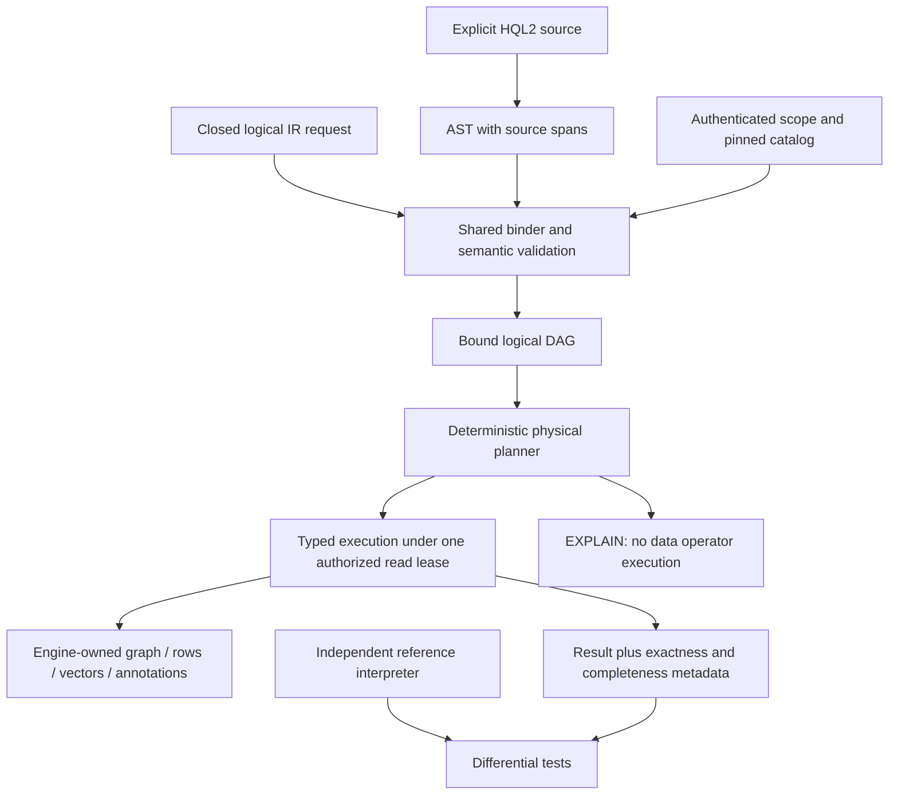

# HQL2 execution boundary and completion contract

## Status and requested decision

The owner requested completion of HQL2 on 2026-09-28 and approved this ADR with
"ลุย" after reviewing the proposal. Implementation within the decisions below
is authorized; this records AGENTS.md R5 and the existing P8 architecture gate.

The approved scope is an explicitly selected HQL2 execution boundary with an exact reference
interpreter, one typed binder, a deterministic initial planner, and truthful
EXPLAIN. Implementation then proceeds in dependency order through the existing
P7-P16 gates. Technical failures return to implementation; they do not require a
fresh choice of architecture unless the approved contract must change. Existing
owner acceptance and independent review barriers remain in force. Publishing,
deployment, and migration of a user's database require separate authorization.

## Parent and peer evidence

- [Master specification](../MASTER-SPEC--GENESIS-DB.md), section 4: one engine
  owns WAL and projections; supported reads currently serialize at the commit boundary.
- [C4 map](../C4--GENESISDB-ARCHITECTURE.md): core and transport ownership.
- [Existing HQL v2 specification](../SPEC--HQL-V2.md), sections 1 and 6:
  compatibility extensions explicitly exclude a planner and EXPLAIN.
- [Query IR v1](../SPEC--GENESISDB-TYPED-QUERY-IR-V1.md), TQIR-010 and section 7:
  differential evidence is required before retiring direct HQL dispatch.
- [Staged adoption ADR](ADR--GENESISDB-UEE-HQL2-STAGED-ADOPTION.md): P8 requires
  a separate superseding decision.
- [P6 contract](../SPEC--GENESISDB-P6-GENERATIONS-LEASES-ACL.md) and
  [approved locality addendum](../SPEC--GENESISDB-P6-PEER-LOCALITY-ADDENDUM.md):
  leases, temporal visibility, ACL, and local-only control-event authority.
- [G0 contract](../SPEC--GENESISDB-UEE-HQL2-G0-CONTRACTS.md): structural v2
  validation is isolated from execution.
- [Existing execution plan](../IMPLEMENTATION-PLAN--UEE-HQL2-ORCHESTRATION-2026-09-22.md)
  and [190-obligation ledger](../UEE-HQL2-OBLIGATION-LEDGER-2026-09-22.md).

Observed baseline: `fc851e9139041624f3459a7f8cae7e062220c1f8`, local `main`,
one commit ahead of its tracking ref. `src/uee_v2.rs` contains the 23 wire
operator discriminators and structural DAG validation. Operator configuration
is still a generic map, with binding/execution explicitly deferred. Existing
`src/query/hql.pest` remains the compatibility grammar. Source presence does
not certify P7 or P8. The protected untracked `tests/zz_probe_discriminates.rs`
is excluded from inspection and changes.

The target is Blueprint `0.1.0-proposed`, prepared 2026-09-22, under:

```text
C:\Users\freshair\.codex\codex-remote-attachments\01a0c605-0ad8-7e10-996d-3a8d61c1eb28\95E99B61-E433-4133-BBFE-4C4273CF8D52\UEE-HQL2-Blueprint-extracted-20260922-review\GenesisBlockDB-UEE-HQL2-Blueprint
```

Its `SHA256SUMS.txt` has SHA-256
`AA80EF1ACB238B0EF2F4F37CE78B7BCD2486A8C8EB0228125985C8C22B9C4BB3`.
Read-only verification checked all 91 listed files: 88 match, and three
validation-output files differ: `VALIDATION-REPORT.md`,
`tests/blueprint-validation.json`, and `tests/reference-test-output.txt`.
The cause of those differences was not established. All other listed files,
including grammar, normative specs, contracts and reference helper sources,
match the manifest. Do not claim whole-package byte identity or reuse the
changed reports as freshly verified evidence. Reproduce validation in an
isolated copy after approval, retaining the source/output distinction.

Current hashes of the three differing outputs are, respectively:

```text
88785A15C890D12F79166C55E12ED2D12FE4F371971010664DBC057E29BE42B3
42BE00631AFA17BE2DC033D3060574EE14E6BE6451E1E584007B9BACB548BAC6
6A7D31BF93327EC18084E64ACA2F48661B7C53E977E945A8312003E92FC4A7D5
```

Vendor the necessary grammar, contracts, examples and reference fixtures with
their provenance into the isolated implementation checkout. Local attachment
paths must not become runtime or CI dependencies. Package validation and
engine acceptance retain separate results.

## Decisions

| ID | Proposed contract |
|---|---|
| H2-D01 | Retain current HQL, `/v1`, `query-ir.v1` and storage semantics. Select the new pipeline explicitly using `genesis.api.v2` plus `hql.v2` or `query-ir.v2`; never detect versions from query text. |
| H2-D02 | On approval, supersede the no-planner/no-EXPLAIN restriction only for this explicit v2 boundary. Keep it in force for compatibility callers. Reconcile parent/peer documentation before implementation. |
| H2-D03 | Keep the current Rust crate; add cohesive query modules as needed. No crate split or storage rewrite is required merely to introduce a planner. |
| H2-D04 | Separate source AST, bound logical DAG and physical plan. HQL2 and JSON IR use the same binder and runtime. Decode per-operator config into closed types before execution; generic maps cannot bypass binding. |
| H2-D05 | Start with deterministic scans and rule planning. Exactness gates precede indexed shortcuts, ANN, cost tuning and parallel execution. |
| H2-D06 | Execute storage-backed queries inside one authorized P6 read boundary, including final result validation. Current serialized readers are acceptable initially; do not advertise concurrent immutable generations without implementation evidence. |
| H2-D07 | Preserve legacy post-top-k filtering, fuzzy identity resolution, ALPHA score meaning, ordering and errors. Keep existing routes unchanged while equivalent lowering is incomplete. Mark the shared-pipeline obligation partial until every declared supported legacy form has differential evidence. |
| H2-D08 | EXPLAIN validates/binds and reports the chosen plan without opening data operators or mutating state. ANALYZE executes a read query and reports measured counters separately from estimates. Write ANALYZE is rejected. |
| H2-D09 | Parse the entire pinned grammar and validate all examples. Parsing a statement does not advertise execution support. Unsupported operators, mutation families, selectors or policy combinations fail explicitly before effects. |
| H2-D10 | HQL2 mutations lower to one typed, idempotent transaction path. Transport-provided actor strings never become authenticated principals. No mutation adapter is enabled until authorization, revision identity and atomicity are verified. |
| H2-D11 | Preserve signed-WAL authority and local-only P6 events. The owner-approved [durable revision/annotation contract](ADR--GENESISDB-HQL2-DURABLE-REVISIONS-ANNOTATIONS.md) resolves the revision, row-ID, annotation, history-floor and additive schema-v6 design. Implement only after P8/P6/plan truth-sync; do not run migration on a user database. GBF2/GBO2 remain excluded, and missing source fingerprints/history remain unavailable rather than inferred. |
| H2-D12 | Completion means verified declared HQL2 semantics and surface parity. Full Blueprint R1 additionally requires all 190 obligations and P16 qualification; grammar-only or core-only completion cannot satisfy that claim. |

## Execution and trust boundary



Snapshot, security and budget barriers are inserted by the engine. A caller
cannot supply a physical plan or remove barriers. Historical data is checked
against current authorized policy. Unsupported historical enumeration fails
before execution rather than reading the current records as a substitute.

## P7: exact reference semantics

P7 is a deterministic, test-only interpreter over explicit fixtures. It must
not call the production evaluator to calculate expected answers. Reuse the
package's independent semantic examples after provenance checks; extend them
to cover the full declared operator set. Seeds, input order, clock, snapshot,
schema, policy, vector fingerprints and expected rows/errors are fixture data.

| Contract | Required distinguishing fixture |
|---|---|
| NULL and bags | Three-valued AND/OR/NOT; FILTER retains TRUE only; duplicates survive until DISTINCT; missing optional JSON property differs from declared-field binding error. |
| Scalar types | Checked integer overflow and division by zero; finite floats; no implicit string/numeric or vector-space casts; schema and comparator agreement. |
| Projection and grouping | PROJECT replaces scope; duplicate outputs reject; empty global count is 0 and sum/avg/min/max are NULL; empty grouped input has no groups. |
| Joins | INNER/LEFT/SEMI/ANTI multiplicity and NULL keys; right aliases unavailable after SEMI/ANTI; one null extension for an unmatched outer row. |
| Ordering | Explicit NULL order and stable ranking ties; TAKE/TOP 0 valid; preserve declared input-stage order. |
| KNN | A=.1/en, B=.2/th, C=.3/th: filter after top-2 returns B; filter before top-2 returns B,C. Duplicate input rows count toward k. |
| Vector fidelity | Reject wrong space/dimension, nonfinite input and zero cosine norm even on empty input. Exact rerank retains approximate candidate lineage. |
| Graph | Direction, parallel edges, cycles, zero-hop, bounded TRAIL/SIMPLE/WALK, optional compound paths, shortest-path tie rule and endpoint visibility. |
| Temporal | Half-open valid/transaction intervals, subinterval correction, retired candidates and horizon refusal at one S,V. |
| Annotations | Frozen revision versus live identity, one result per matching input row, optional lookup, Unicode scalar offsets, source hashes and combined target/body authorization. |

P7 test-local annotation and revision fixtures do not create a durable
annotation subsystem. Storage support is tracked separately. P7 exits only
with non-tautological expected results, deterministic property cases and a
review showing that production and reference computations are independent.

## P8: typed frontend and execution acceptance

1. Parser preserves source spans, rejects trailing statements and malformed
   Unicode/numbers, and matches the pinned 35 positive and 6 negative syntax
   fixtures. Parameters remain values, never query-string substitution.
2. Binder validates root reachability, cycles, ordered input arity, scope,
   closed operator config, types, catalog dependencies, temporal selectors,
   dimensions and authorization. Bound limits are 10,000 IR nodes and depth
   128; reject excess before recursive evaluation or unbounded allocation.
3. Cover all 23 logical wire operators: AnnotationLookup, AnnotationScan,
   Aggregate, ChangeScan, ContextPack, Distinct, EdgeScan, Expand, Filter,
   HistoryScan, Join, Knn, LexicalMatch, Match, NodeScan, Offset, Project,
   Rerank, RowScan, Sort, Take, UnionAll and Values. Each has an explicit
   supported/unsupported state until its differential execution tests pass.
4. Stage storage-backed execution behind prerequisite source capabilities.
   Annotation/lexical/history support cannot be inferred from enum presence.
   An unsupported dependency blocks that operator's completion, even when
   syntax and test-only oracle fixtures pass.
5. HQL2 and equivalent IR produce equal result bags and equal declared order,
   stable error codes and matching completeness metadata for each supported
   feature. Use typed internal values; JSON is a boundary/property value,
   not an intermediate per-operator serialization protocol.
6. EXPLAIN actual counters are absent before execution. ANALYZE counters come
   from operator execution. Unsupported stats remain unknown; no fabricated
   zero costs, B-tree access paths or index coverage claims.
7. Query-local budgets cover scan work, intermediate rows, distance calls,
   graph expansion, memory and output. Cancellation and errors release the
   lease and resources. Resource exhaustion cannot return a successful
   partial aggregate. Detailed spill/scheduling work remains P12.
8. Result metadata separates candidate approximation, original/quantized
   distance fidelity, index coverage, execution completeness and rerank scope.
   Registered tokenizers are required for hard ContextPack token budgets.

Initial integration is a typed Rust core boundary under an authorized read
view. P13 adds transports after runtime conformance. The implementation design
must freeze the exact Rust signatures and per-operator config/result/error
schemas as part of the P8 review before source changes; this ADR is not a
license to invent undocumented public fields.

## Remaining completion gates

| Phase | Dependency and exit evidence |
|---|---|
| P6 revalidation | G0 plus generation/lease/visibility/peer-authority tests on the selected base; no promotion from historic results alone. |
| P7 | Independent exact oracle and fixture set as above. |
| P8 | Reviewed concrete APIs plus HQL2/IR binding/execution/EXPLAIN parity; compatibility regression suite. |
| P9-P10 | Index access proof and cross-domain composition match the oracle; no illegal top-k/outer-join/security rewrite. |
| P11-P12 | All index lifecycle paths, coverage/delta semantics, explicit ANN, budgets, cancellation, spill and measured costs. |
| P13 | Rust/REST/NAPI/C/mobile/SDK/MCP parity and clean consumer evidence for each supported target. |
| P14 | Reviewed persistence/migration contract; new-directory import, independent restore, shadow comparison and rollback after new writes. |
| P15-P16 | Independent security review, crash windows, 24-hour soak, licensed/pinned workload data and platform qualification; complete obligation ledger. |

Every test result records revision, features, target, command, test count and
failures. Each advertised obligation links code plus executed tests. A skipped,
missing, zero-test or environment-blocked result does not close a gate.

### Baseline revalidation on 2026-09-28

At baseline `fc851e9`, the existing command below passed 36 tests: generation 6,
lease 6, visibility 14, peer authority 5, and G0 contracts 5; zero failures or
ignored tests. This is focused local prerequisite evidence, not full P6 review
or HQL2 runtime acceptance. No source was changed during this revalidation.

Documentation validation passed with `0 violations in 231 files` using the
installed Python 3.13 executable directly and `-B scripts/validate_doc_status.py docs`.
The Node wrapper could not resolve Python through `py`/`python`; that wrapper
failure does not invalidate the successful direct validator run. The new ADR
also passed whitespace checking. Hosted, device and release gates were not run.

## Verification commands and ownership

Existing baseline command (does not run the protected probe):

```powershell
cargo test --locked --no-default-features --test uee_g0_contract_tests --test p6_generation_tests --test p6_lease_tests --test p6_visibility_tests --test p6_peer_authority_tests
```

Proposed new test targets, to be created only after their contract approval:

```powershell
cargo test --locked --no-default-features --test hql2_oracle_tests
cargo test --locked --no-default-features --test hql2_parser_tests --test hql2_binder_tests
cargo test --locked --no-default-features --test hql2_execution_tests --test hql2_explain_tests --test hql2_compatibility_tests
```

Existing compatibility gate:

```powershell
cargo test --locked --no-default-features --test hql --test hql_p0_tests --test hql_filter_tests --test hql_cypher_tests --test hql_collection_tests --test hql_fuzz_tests --test query_ir_tests
node scripts/docs-validate.mjs
git diff --check
```

Run the full Rust test gate in an isolated implementation worktree where
protected caller WIP is absent. Add transport tests as P13 adds each surface.
There is no performance claim from these commands; use the qualification
workload manifests and preserve existing benchmark output separately.

One owner writes `src/lib.rs`; one owner writes `src/query/*`. Oracle fixtures
and transport tests use disjoint files. Preserve the existing implementation
plan's independent Verify/Review/Final gates.

## Version diff and changelog

Version diff: `0.1.0b` candidate -> accepted with owner approval. This approves
the P7/P8 decision and completion gates without changing the engine's version.

| Version | Date | Status | Summary | Commit Hash | Agent |
|---|---|---|---|---|---|
| 0.1.0b | 2026-09-28 | candidate | Proposed explicit HQL2 execution boundary, P7 oracle, P8 binder/planner contract and remaining completion gates | working-tree | ATHER |
| 0.1.0b | 2026-09-28 | accepted | Owner approved with "ลุย"; implementation may proceed within this ADR | working-tree | ATHER |
| 0.1.1b | 2026-09-28 | accepted | Resolve H2-D11 by reference to the owner-approved durable revision/annotation contract; preserve migration and release gates | working-tree | ATHER |
