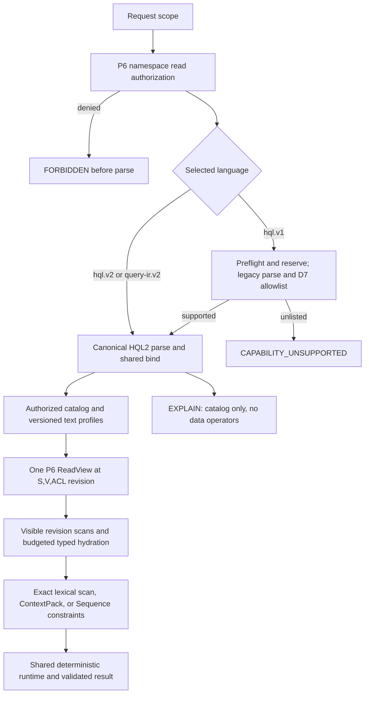

# HQL2 P8 completion addendum: typed semantics and actor-scoped HQL1 bridge

## Status and approval boundary

The owner approved this addendum with "approve ADR addendum" on 2026-10-02.
This accepted contract authorizes source changes within D1-D7 and the
synchronized P8/P6/plan documents. The approved HQL2 execution-boundary ADR,
P8 typed boundary, P6 contract and H2-D11 durable-revision/annotation contract
remain governing parent documents. No H2-D11 WAL/schema/migration change is
proposed here, and no user database may be migrated.

The owner subsequently approved the actor-scoped HQL1 bridge by replying
"approve ADR addendum" on 2026-10-02. This authorizes only the initial D7
allowlist below; it does not claim that all legacy HQL forms share the runtime.
The D7 implementation now passes nine focused tests: legacy/HQL2 differential
for zero-hop and bounded one-hop projections, including exact endpoint-ID
string equality on either endpoint, authorization and namespace checks before
parse, malformed syntax classification, fail-closed rejection of unlisted
forms, and pre-parse resource rejection of a broad legacy pattern. The explicit
root-HQL2 sweep passes 361/0/1 across 27 targets; the separate 11-target
P6/schema-v6/compatibility sweep passes 190/0/0. Broader shared-runtime, P8 and
P13 acceptance remains open, and D7 has not received independent review.

The objective is to close the currently documented P8 semantic gaps without
weakening the P6 namespace query grant or changing the closed Query IR v2 wire
schema. P8 completion still requires its approved HQL1/HQL2/IR shared-runtime,
EXPLAIN, oracle, resource, compatibility and independent-review gates. H2-D12
surface parity remains sequenced after P12 at P13; P9-P13 are not skipped by
this addendum. Full Blueprint R1/P16 qualification is not claimed.

## Context and evidence

- P8 already defines the closed `LexicalMatch` and `ContextPack` configs, but
  production binding rejects both pending analyzer/tokenizer/source metadata.
- The independent P7 rank fixture defines BM25 over fingerprinted,
  pretokenized documents (`k1=1.2`, `b=0.75` in its golden helper), with
  natural-log positive IDF, distinct query terms, OR matching, and all visible
  revisions—including empty documents—in corpus statistics. It is not a
  production tokenizer and does not claim Thai word segmentation.
- The P7 context fixture defines ordered greedy prefix packing, `[n]`
  citations, newline separators, Unicode-scalar counting over final rendered
  text, and source revision/hash/scalar-range evidence. Its tokenizer is not
  an LLM model tokenizer.
- The approved P6 matrix requires `Namespace(namespace) Read` for HQL/Query IR
  before parsing. That grant is broad within the namespace; exact record grants
  do not create an exact-grant-only query surface.
- The frozen Compact wire config has no node/edge property maps. Sequence wire
  nodes and edges do have property maps. HQL constrained patterns already lower
  to Sequence rather than extending the Compact wire shape.

## Accepted decisions

### D1 — preserve P6 authorization-before-parse

Keep the existing namespace-wide query grant and its position before HQL/IR
parse, bind or data access. Do not add scoped-read filtering or a direct
pattern-ID lookup in this addendum.

Replace the infeasible “ACL-hidden existing ID and absent ID both return
`NO_MATCH`” fixture. Under current P6, an exact-Node-only actor without
Namespace(Read) receives the same `FORBIDDEN/authorize` result before parsing
for both query strings; an actor with Namespace(Read) can read the namespace
under the current grant model. Tests must assert this boundary, not claim a
record-hidden query result that the approved policy model cannot produce.

### D2 — bounded, code-registered lexical profile; no durable index in P8

1. Add an immutable engine-code profile `unicode-whitespace-bm25-v1`. It splits
   on Unicode White_Space, preserves token bytes exactly, and performs no
   normalization, case-folding or dictionary segmentation. This profile makes
   no Thai-segmentation claim. Its stable profile/analyzer fingerprint is part
   of the authorized catalog stamp; it is not persisted in WAL or schema-v6.
2. In P8, the `index` symbol resolves only to this registered logical profile.
   The physical implementation is `ExactLexicalScanV1`, not a fabricated
   persistent-index access path. Unknown profile, absent source capability or
   fingerprint mismatch returns `CAPABILITY_UNSUPPORTED`; there is no fallback
   to another tokenizer or current unpinned data.
3. Read only exact text values from revision-bound P6-visible source rows at
   the pinned `(S,V,ACL revision)`. Query and document tokens use the same
   profile. Corpus statistics include every visible revision in the selected
   namespace/source profile, including empty text; missing text is a
   non-match and is absent from the corpus. The operator returns only matching
   candidate rows, with OR matching, natural-log positive IDF, `k1=1.2`,
   `b=0.75`, and the P7 deterministic score/tie order. Candidate, text-byte,
   corpus and score work is budgeted before allocation; exhaustion is an error,
   never partial output.
4. Future persisted indexes belong to P11. They may replace the exact scan only
   after output parity at the same source revisions, policy, valid time and
   lease frontier, plus index lifecycle/watermark verification.

### D3 — provenance-preserving ContextPack profile

1. Register the deterministic `unicode-scalar-v1` counter in engine code and
   include its fingerprint in the authorized catalog stamp. One token is one
   Unicode scalar; this is not a model tokenizer or Thai word segmenter.
   Unknown tokenizer IDs fail even on empty input.
2. For this profile, `text` must be the exact UTF-8 text field of the evidence
   `RecordRefV2` at the same P6 lease/revision. Transformed or cross-record text
   fails closed until an exact source-offset mapping is specified.
3. `source_hash` is lowercase SHA-256 of those exact source-text UTF-8 bytes;
   `start_scalar`/`end_scalar` address that source text by Unicode scalar.
   Preserve the P7 ordered greedy prefix rule, `[n]` citations, newline
   separators, `omitted_refs`, and token counting over the final rendered text
   including citations/separators. The package schema and H2-D11 storage remain
   unchanged.
4. Reserve text, evidence, citation and result-budget bytes before loading or
   appending. Any budget failure returns an error and no partial package.

### D4 — typed Sequence property constraints; keep Compact wire closed

1. Implement the existing `PatternNode.properties` and `PatternEdge.properties`
   maps for HQL and typed IR Sequence patterns. Each expected expression is
   bound against the existing input/parameter scope; it cannot reference an
   alias introduced by the same pattern. Values use exact typed JSON equality
   with no numeric/string coercion. A missing property is a non-match; an
   explicitly stored JSON null matches only an explicit JSON-null expectation.
   Unsupported expression/value families fail closed at bind.
2. Read properties only after the record is visible in the same P6 ReadView.
   Hydration is selective and budgeted before payload access. Apply node and
   edge predicates while enumerating candidate paths and before SHORTEST
   endpoint-pair deduplication. Preserve optional/required expansion and
   deterministic path ordering.
3. Do not add fields to Compact. HQL patterns that contain constraints lower
   to Sequence; typed IR Compact remains the frozen unconstrained form.
   Property access never performs a direct ID lookup or bypasses the P6 lease.

### D5 — contextual HQL literal typing

1. A bare `NULL` is accepted only when its exact nullable type follows from a
   unique operator/field context; otherwise binding returns `BIND_ERROR`.
2. Non-empty list literals require one exact element type. Empty lists require
   an unambiguous contextual `List<T>`; heterogeneous lists and implicit casts
   reject.
3. Object literals are explicit `Json` values only. They cannot construct
   `Entity`, `Path`, `Score`, `Context`, `HistoryRevision` or `ChangeEvent`.
   Preserve every object key/value as JSON; do not silently discard keys or
   coerce the object into a domain value. Depth/size limits apply before
   recursive execution.

### D6 — completion gates remain the approved P8-P13 plan

This addendum does not waive the approved H2-D04/D07 shared binder/runtime and
legacy compatibility requirements. Every declared supported HQL1 form must
retain its observable behavior and have differential evidence before it is
claimed to use the shared pipeline. P8 also retains all 23 closed-config
checks, authorization/lease/resource/EXPLAIN gates, broad HQL2/JSON-IR oracle
coverage and independent implementation review. P9-P12 remain dependencies of
P13 surface parity. No REST/NAPI/FFI/SDK/MCP/mobile endpoint is implied by
these P8 decisions alone.

### D7 — actor-scoped HQL1 lowering; extend only with differential evidence

1. Accept `hql.v1` only on `Storage::query_v2`, using the caller-supplied
   `AccessContext`. Validate `Namespace(Read)` and request/actor namespace
   equality before invoking the legacy HQL parser. Never synthesize an actor,
   call the unscoped public `execute_hql`, or route through an existing v1
   transport.
2. The initial allowlist was the zero-hop, unlabeled, unconstrained
   `MATCH (<identifier>) RETURN <same-identifier>.id` form. Following the D7
   differential-extension rule, the verified allowlist now also includes one
   unlabeled, unconstrained hop with named, distinct endpoint aliases, optional
   plain-ASCII relation identifier or wildcard, and exactly one endpoint `.id`
   projection. Direction may be outgoing, incoming or undirected. Zero-hop
   retains the same-alias rule. A one-hop form may additionally contain one
   exact string-equality predicate `WHERE <endpoint>.id = "<string>"` on either
   endpoint; all other predicates remain unsupported. Both forms reject
   `ORDER BY`, `LIMIT`, `AS OF`, labels, node properties, edge aliases,
   multi-hop paths and non-ID/multi-column projections. The envelope must have no parameters,
   temporal selector, transaction ID, explicit budget or EXPLAIN;
   `allow_partial` may be omitted/false and format may be omitted or JSON. The
   actor/request namespace must be `default` for this graph form.
3. After actor/envelope validation, run the allocation-free parser preflight
   and reserve its conservative heap estimate before invoking the legacy HQL
   parser. Verify the complete AST against the allowlist, then lower to the
   equivalent canonical HQL2 node scan or one-hop path and ID projection using
   fixed internal aliases. Execute only through the existing HQL2 parser,
   binder, planner, runtime and P6 read-lease path; then rename the single typed
   result column to the legacy projection key (`<identifier>.id`). The lowerer
   must construct names from validated AST identifiers, never splice unchecked
   query text. The canonical HQL2 parser reservation remains in force after
   lowering.
4. Malformed HQL1 within parser limits remains `HQL_PARSE_ERROR`; parser
   resource/work-limit failures return `QUERY_BUDGET_EXCEEDED` before legacy
   AST construction. A valid but unlisted form within those limits or
   unsupported envelope option returns `CAPABILITY_UNSUPPORTED` with no
   compatibility fallback. Add each future HQL1 form only after differential
   evidence against `execute_hql` verifies row multiplicity, projected values,
   ordering where specified, and observable errors.
5. Existing `execute_hql`, `/v1/query/hql`, N-API and SDK behavior is unchanged.
   This first allowlisted form does not close the shared-runtime, broad P8 or
   P13 parity gates.

## Data flow

## Acceptance and verification

- RED/GREEN tests for the two pre-parse authorization outcomes, lexical profile
  fingerprint/empty corpus/missing text/score ties/budgets, context tokenizer
  unknown-on-empty/source hash/Unicode offsets/truncation, and Sequence node
  plus edge property matches/misses/JSON null/SHORTEST/optional/budget behavior.
- HQL and typed-IR results match the independent P7 oracle for each new
  supported case. The oracle remains test-only and must not import production
  binder/executor code.
- ContextPack proves its text and evidence refer to the same pinned source
  revision. No stale/current fallback or unauthorized-owner diagnostics.
- Contextual NULL/list/object tests cover unique inference, ambiguous/empty
  cases, exact type preservation, limits and fail-closed domain-value
  construction.
- Existing HQL1 compatibility tests remain unchanged and pass. The shared
  pipeline is not declared complete until every supported legacy form has
  differential coverage.
- D7 HQL1 tests prove `Namespace(Read)` denial before parsing, zero-hop and
  one-hop direction/relation/wildcard differential parity (including parallel
  row multiplicity, endpoint projections and one exact string-equality filter
  on either endpoint ID), namespace mismatch before parsing, malformed syntax
  classification, fail-closed unsupported predicate shapes and valid-unlisted
  behavior, and parser resource rejection before AST allowlist handling;
  existing v1 transports remain unchanged.
- Run focused new targets, all explicit root HQL2 targets with the protected
  probe excluded, P6/schema-v6 and HQL1/Query-IR compatibility targets,
  `cargo check --locked --offline --no-default-features --jobs 1 --target-dir
  target/hql2-execution`, documentation validation and `git diff --check`.
  These local results do not imply P13,
  production migration or P16 qualification.
- Obtain independent architecture/security review before claiming P8 closure.

## Initial D1-D6 synchronization record

The table below records the initial D1-D6 approval checkpoint. D7 and later
implementation evidence are tracked in the version history; the entries below
are not the current document versions.

| Artifact | Current | Proposed after approval |
|---|---:|---:|
| P8 typed boundary | 0.2.27b | 0.2.28b |
| P6 generations/leases/ACL | 0.5.12b | 0.5.13b |
| Pattern constraints ADR | 0.1.2b | 0.2.0b |
| Orchestration plan | 0.8.26b | 0.8.27b |
| Master specification | 2.3.16b | 2.3.17b |
| C4 architecture index | 0.1.42b | 0.1.43b |
| P8 core report | 0.1.23b | 0.1.24b |
| Document registry | 0.5.34+draft | 0.5.35+draft |
| This addendum | 0.1.1b accepted | 0.1.2b accepted |

Engine version remains unchanged. H2-D11 migration remains fixture-only; no
user database, merge, deployment or release action is authorized.

## CHANGELOG

| Version | Date | Status | Summary | Commit Hash | Agent |
|---|---|---|---|---|---|
| 0.1.6b | 2026-10-02 | accepted | Implement D7's one-hop endpoint-ID string equality filter after legacy/HQL2 differential; record 9/9 adapter tests and 361/0/1 across 27 root HQL2 targets plus 190/0/0 across 11 compatibility targets; retain shared-runtime/P8/P13 and review gates | working-tree | ATHER |
| 0.1.5b | 2026-10-02 | accepted | Extend D7 conditionally with one one-hop endpoint-ID string equality filter after legacy/HQL2 differential evidence; adapter implementation and focused verification pending | working-tree | ATHER |
| 0.1.4b | 2026-10-02 | accepted | Extend D7 with differential-proven one-hop forms and reserve parser resources before legacy AST construction; record 8/8 focused, 361/0/1 across 27 HQL2 targets and separate 190/0/0 compatibility sweep; retain shared-runtime/P8/P13 and review gates | working-tree | ATHER |
| 0.1.3b | 2026-10-02 | accepted | Implement D7's actor-scoped `query_v2` adapter for the initial differential-tested zero-hop node-ID projection; record 5/5 focused and 354/0/1 across 27 root HQL2 targets; retain full shared-runtime, P8/P13 and independent-review gates | working-tree | ATHER |
| 0.1.2b | 2026-10-02 | accepted | Owner approved D7 actor-scoped HQL1 lowering through query_v2; allow only a differential-tested zero-hop node-ID projection and retain all other HQL1/P8/P13 gates | working-tree | ATHER |
| 0.1.1b | 2026-10-02 | accepted | Owner approved D1-D6; authorize bounded P8 lexical/context, Sequence-property and contextual-literal implementation while preserving P6 grant order, closed Compact wire, no migration and P9-P13 gates | working-tree | ATHER |
| 0.1.0b | 2026-09-30 | candidate | Propose P6 authorization-fixture correction, bounded P8 text profiles, provenance-preserving ContextPack, Sequence property semantics and contextual HQL literal typing; source changes remain gated on owner approval | working-tree | ATHER |
