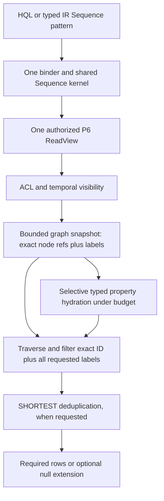

# HQL2 Sequence-pattern identity, label and property constraints

## Status and approval boundary

The owner delegated the bounded pattern-slice decision on 2026-09-30 with
"ตัดสินใจเลย". Sequence ID and conjunctive-label predicates are implemented
through HQL and typed IR under one P6 snapshot. The owner then approved the P8
completion addendum D4; Sequence node/edge property constraints are implemented
with exact JSON equality, selective lease-bound hydration and pre-SHORTEST
filtering. The focused P8 completion target passes 9/9, including a property
work-budget no-partial-result case; the latest explicit 26-target root HQL2
sweep passes 348/0/1. Compact-pattern constraints remain unsupported and fail
closed. These local fixture results do not qualify full HQL2 or P8.
H2-D11 durable identity, WAL, schema-v6 and migration contracts remain
unchanged; no user database migration is in scope.

The owner-approved execution ADR requires explicit HQL/IR parity, one
P6-bound execution path, an exact reference oracle and fail-closed
capabilities. P8 0.2.26b recorded pattern constraints as unsupported; this
addendum selected the bounded next slice and the current checkpoint records
its local implementation without claiming P8 closure.

## Evidence and decision

- The typed wire schema carries ID/label/property constraints through binding
  to the shared Sequence kernel; HQL retains and lowers all supported members.
- The P6 graph snapshot reads labels only for already-visible node revisions
  when the bound plan has label constraints. It never performs a query-ID
  lookup, and compact/unconstrained graph plans do not load label payloads.
- Production pattern execution still receives no raw Storage. Property
  hydration uses binder-issued fields only after P6 visibility and is charged
  to the shared query budget.

Decision: retain node ID and node-label predicates on Sequence Match and
Sequence Expand through both HQL and typed IR, and add the Sequence-only
property semantics approved by P8 completion addendum D4. Compact wire shapes
remain closed. A constrained HQL Expand lowers to Sequence rather than adding
fields to Compact.

## Requirements

1. A typed Sequence PatternNode id, when present, must bind to a non-null Utf8
   expression. No implicit casts or stringification are permitted. HQL spells
   this selector as an id member in the node object, for example:

       USE default MATCH (a {id: "doc:a"})-[:LINK]->(b:Person)
       |> RETURN a, b

   The id member selects RecordRefV2.id; it is not a stored user property.
   Other members in a HQL pattern node object map to stored properties and use
   the exact JSON property rules below; they are not identity selectors.

2. PatternNode.labels is conjunctive: every listed label must exactly match a
   label on that node revision. Matching is case-sensitive. An empty list adds
   no restriction; duplicate requested labels do not change the result. HQL's
   current node-pattern grammar expresses zero or one label; typed IR may
   express multiple labels.

3. ID and label predicates apply to the start node and every node reached by
   every sequence step. Root Match has no input scope, so ID expressions there
   may use only literals or declared parameters. Expand ID expressions may
   additionally reference pre-existing input bindings, but may not reference
   aliases introduced by the same pattern.

4. Predicates are evaluated only against nodes already visible in the same
   authorized P6 ReadView, at its pinned transaction frontier and valid-time
   instant. The executor must not perform a direct lookup by pattern ID.
   Missing and ACL-hidden IDs both produce no matching row with the same safe
   error/result shape; the pattern must not become an existence oracle.

5. Apply node predicates while enumerating candidate paths and before
   SHORTEST endpoint-pair deduplication. Existing deterministic path ordering
   and full RecordRefV2 identity checks remain unchanged.

6. For optional Expand, a failed start or step predicate is an unmatched
   expansion: preserve the original input row, preserve existing bindings,
   and null-extend only aliases introduced by that Expand. Required Expand
   drops the unmatched input row. Root Match is never optional.

7. The P6 snapshot supplies labels only for its already-authorized,
   revision-bound visible nodes. Snapshot memory, candidate checks and label
   comparisons charge the query's existing budget. Exhaustion returns
   QUERY_BUDGET_EXCEEDED and no partial result.

8. Sequence PatternNode/PatternEdge property maps follow the approved
   completion-addendum D4 contract: typed scoped expressions, exact JSON
   equality without coercion, missing-property non-match, explicit-null
   equality, same-ReadView visibility, selective budgeted hydration and
   filtering before SHORTEST. Unsupported expressions fail closed. Compact
   remains the frozen unconstrained form; H2-D11 persistence/recovery is
   unchanged.

## Data flow

The labels added to the internal graph snapshot are execution metadata only;
they do not become user-visible columns unless separately projected through
the existing typed property interface.

## Acceptance and verification

- The P8 completion target passes 9/9, covering HQL/typed-IR exact node and
  edge property values, missing/null behavior, contextual literals and a
  property-work budget failure after candidate production; the independent
  pattern oracle target also passes its HQL/IR parity cases.
- The latest explicit root-HQL2 sweep passes 348/0/1 across 26 named targets.
  It excludes the protected probe; the ignored parser child entrypoint is
  exercised by its parent. A query-result fixture for an ACL-hidden ID is not
  valid under the current P6 grant model; D1 instead verifies exact-record-only
  actors receive `FORBIDDEN/authorize` before HQL/IR parsing.
- Compact remains the frozen unconstrained form. H2-D11 persistence and
  external/production qualification remain outside this slice.
- Compare the production outputs with independent P7 graph-oracle expectations;
  the reference evaluator must not import production binding or execution code.
- Run focused parser/lowering/binder/execution/P6 tests, the explicit HQL2
  regression sweep excluding the protected probe, docs validation and diff
  checks. Record local results separately from P8 closure and external
  qualification.
- Independent architecture review remains required before P8 closure.

## Impact and synchronization

Risk is HIGH because this crosses HQL parsing/lowering, typed binding,
lease-bound graph metadata, traversal ordering, ACL behavior and budget
accounting. Complexity is C-3; this diagram and contract are required before
source work.

The approved contract and existing implementation evidence are synchronized
across:

| Document | Before implementation evidence | Synchronized version |
|---|---:|---:|
| P8 typed boundary | 0.2.28b | 0.2.29b |
| P6 generations/leases/ACL | 0.5.13b | 0.5.14b |
| HQL2 orchestration plan | 0.8.27b | 0.8.28b |
| Master specification | 2.3.17b | 2.3.18b |
| C4 architecture index | 0.1.43b | 0.1.44b |
| P8 core report | 0.1.24b | 0.1.25b |
| Document registry | 0.5.35+draft | 0.5.36+draft |
| This ADR | 0.2.0b | 0.2.1b |

The P8 completion addendum authorizes LexicalMatch and ContextPack semantics;
this pattern ADR incorporates only its Sequence-property portion. No transport
enablement, merge, deployment, release qualification or database migration is
authorized.

## Version diff

0.0.0 -> 0.1.0b: propose exact Sequence node ID/label semantics, HQL spelling,
P6 visibility/no-probe boundary, optional/SHORTEST ordering, budget behavior,
acceptance tests and cross-document synchronization. Pending owner decision.
0.1.0b -> 0.1.1b: record the owner's delegated decision to implement only
Sequence node ID/label predicates; synchronize governing docs before code and
retain property/Compact fail-closed behavior.
0.1.1b -> 0.1.2b: record the HQL/typed-IR implementation, P6 snapshot label
loading, focused 7/7 tests and 338/0/1 across 25 HQL2 targets; note remaining
ACL-hidden fixture, independent review and P8 qualification gates.
0.1.2b -> 0.2.0b: incorporate owner-approved addendum D4 for typed Sequence
node/edge property constraints, selective P6 hydration and pre-SHORTEST
filtering.
0.2.0b -> 0.2.1b: implement D4 properties under the P6 snapshot, add exact
JSON/missing/null and budget regressions, and record 9 focused passes plus
348/0/1 across 26 root HQL2 targets; keep Compact closed and broader P8/P13
gates open.

## CHANGELOG

| Version | Date | Status | Summary | Commit Hash | Agent |
|---|---|---|---|---|---|
| 0.2.1b | 2026-10-02 | beta | Implement approved D4 Sequence node/edge JSON property constraints under P6; record focused parity, no-partial budget evidence and 348/0/1 across 26 root HQL2 targets; retain Compact and broad P8/P13 gates | working-tree | ATHER |
| 0.2.0b | 2026-10-02 | beta | Incorporate owner-approved P8 D4 Sequence node/edge property contract; retain closed Compact wire and mark implementation/tests pending | working-tree | ATHER |
| 0.1.2b | 2026-09-30 | beta | Implement Sequence node ID/labels through HQL and typed IR under the authorized P6 snapshot; record 7 focused passes and 338/0/1 across 25 HQL2 targets; retain ACL-hidden fixture, property/Compact and P8 gates | working-tree | ATHER |
| 0.1.1b | 2026-09-30 | beta | Record delegated decision for lease-bound HQL/IR Sequence node ID and label predicates; sync governing docs before implementation; keep property and Compact constraints fail-closed | working-tree | ATHER |
| 0.1.0b | 2026-09-30 | candidate | Propose lease-bound HQL/IR Sequence node ID and label predicates; source changes remain gated on owner approval | working-tree | ATHER |
