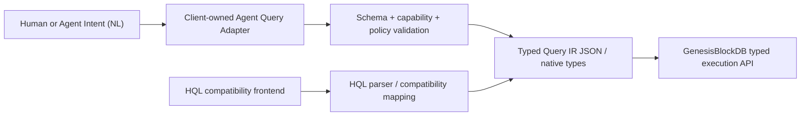

# ADR — Typed Query IR and Agent Query Boundary

## Context

GenesisBlockDB currently exposes HQL through the core, REST, SDK and MCP surfaces. HQL P0 is
shipped and remains useful for existing callers, debugging and human-authored queries. However,
making a text query language the primary agent-facing contract couples clients to parser syntax,
makes capability negotiation harder and encourages Natural Language (NL) concerns to leak into
the database engine.

The product PRD and SRS already identify typed Query IR as the intended public boundary. A final
decision is required before extending HQL or adding an NL entry point.

## Decision

GenesisBlockDB SHALL use a versioned typed Query IR as its primary query contract.

The boundary is governed by these rules:

1. Typed Query IR is the canonical machine-to-engine query representation.
2. JSON is the transport representation; Rust, N-API and SDK surfaces MAY expose equivalent
   generated or hand-written typed structures.
3. The engine SHALL validate contract version, operation kind, required fields, capability support,
   namespace scope and bounded resource parameters before execution.
4. The GenesisBlockDB core SHALL NOT interpret free-form NL, invoke an LLM, select a model provider,
   manage prompts or repair ambiguous user intent.
5. NL-to-IR conversion belongs in a separate client adapter or package. Its output is untrusted
   until validated against the Query IR schema and caller authorization policy.
6. HQL remains a compatibility frontend. Existing HQL routes, bindings and command semantics remain
   supported until a separately approved deprecation decision and migration window exist.
7. New HQL grammar work is deferred. Only correctness, security and compatibility fixes are allowed
   without a new ADR demonstrating a use case that typed Query IR cannot satisfy.
8. HQL compatibility execution SHOULD converge on the same typed executor as Query IR. Temporary
   direct dispatch is permitted while parity tests prove equivalent observable behavior.
9. Query IR SHALL expose bounded database capabilities; it SHALL NOT become arbitrary SQL, arbitrary
   executable JSON or a client-domain ontology.

## Compatibility posture

HQL P0 is the compatibility baseline. P1/P2/P3 language expansion remains deferred. The following
surfaces remain valid compatibility entry points during migration:

- core/N-API `execute_hql` or equivalent binding;
- REST `/v1/query/hql`;
- SDK HQL helpers;
- MCP `query_hql`.

Compatibility means preserving documented behavior, not promoting HQL as the preferred contract for
new integrations. New SDK and MCP examples SHOULD prefer Query IR after its implementation ships.

## Agent Query Adapter boundary

The separate NL adapter owns:

- intent interpretation and clarification;
- model/provider selection and prompt policy;
- conversion to `QueryRequestV1`;
- client authorization and domain-policy checks;
- schema validation before calling the engine;
- bounded retry or repair of invalid model output;
- audit metadata linking source intent to the submitted IR.

The adapter SHALL fail closed on ambiguous, unsupported or unauthorized intent. It SHALL NOT send
arbitrary HQL or SQL as a fallback.

## Consequences

### Positive

- Public contracts become versionable, introspectable and consistent across transports.
- Agents can use constrained structured output without moving LLM behavior into the database.
- HQL compatibility is preserved while future integrations avoid parser coupling.
- Capability and authorization checks occur before execution.

### Negative

- A typed executor and cross-surface conformance suite must be implemented before the contract is
  considered shipped.
- HQL and Query IR require parity coverage during migration.
- NL quality remains the responsibility of each adapter and model configuration.

## Rejected alternatives

### Continue expanding HQL as the primary agent API

Rejected because parser syntax is not the most stable machine contract and would mix query-language
evolution with agent-context concerns.

### Put NL-to-JSON conversion inside GenesisBlockDB

Rejected because it would introduce model/provider dependencies, non-deterministic interpretation and
client-domain policy into a local-first domain-neutral database core.

### Accept unrestricted JSON or SQL

Rejected because an unbounded executable payload defeats capability validation and fail-closed safety.

## Approval and implementation state

This ADR is accepted by the product authority on 2026-08-14. Acceptance authorizes the boundary and
the implementation plan; it does not claim that Query IR or the NL adapter is already implemented.

## CHANGELOG

| Version | Date | Status | Summary | Commit Hash | Agent |
|---|---|---|---|---|---|
| 1.0.0 | 2026-08-14 | accepted | Established typed Query IR as primary, HQL as compatibility and NL conversion as a separate adapter. | working-tree | ATHER |
| 1.0.1 | 2026-08-14 | accepted | Recorded the partial search/traverse implementation while retaining planned status for remaining V1 operations and the NL adapter. | working-tree | ATHER |
