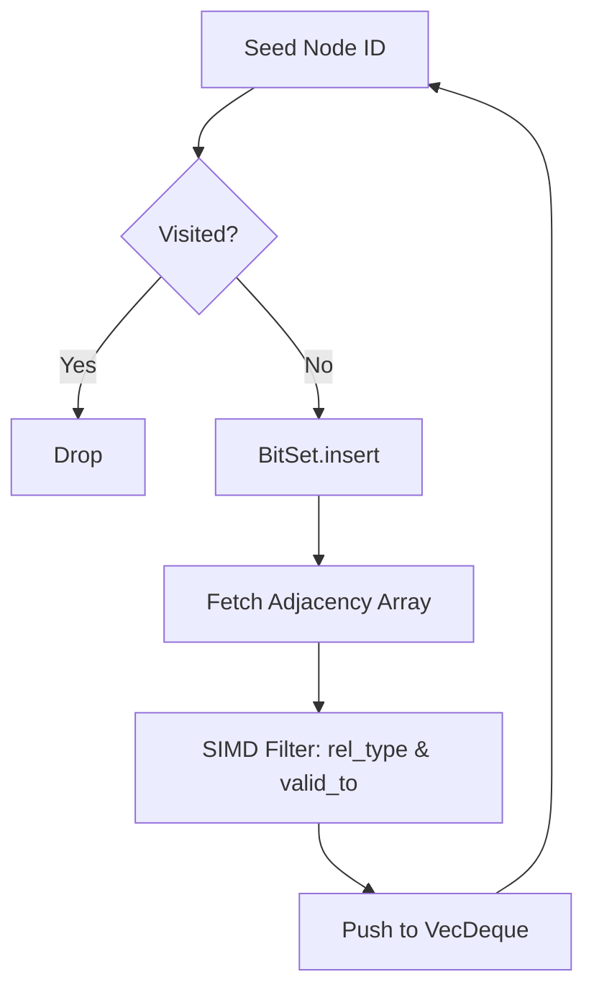
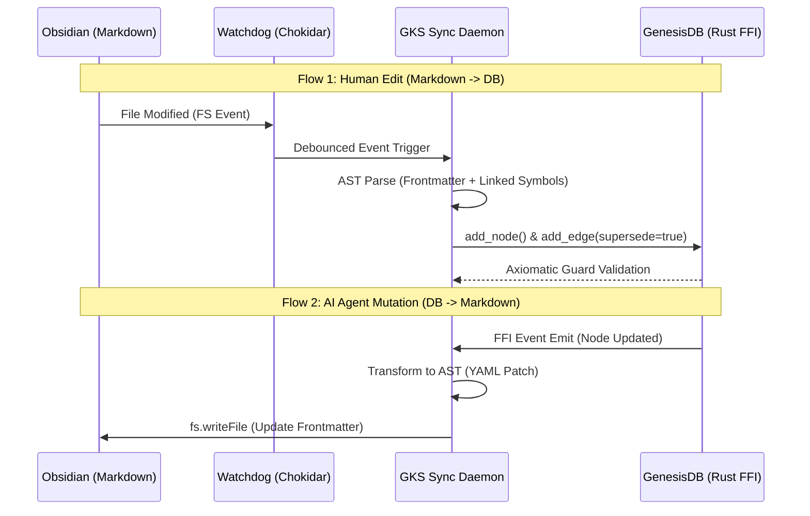

# GenesisDB: Deep Technical Expansion Specification (v1.x)
**Document Status:** MASTER SPECIFICATION  
**Version:** 1.0.1  
**Domain:** Distributed Systems, Graph Theory, Storage Engineering  
**Target Audience:** Principal Engineers, Database Architects, Systems Evaluators  

---

## 0. Abstract
This specification defines the rigorous systems-level architecture of **GenesisDB**, an embedded, Rust-native graph database. It transitions the engine from a high-level conceptual framework into a deterministic, mechanically sympathetic database engine. The design prioritizes ultra-low-latency traversals, deterministic memory management, and built-in axiomatic governance for cognitive AI agents, explicitly trading distributed horizontal scaling for vertical, in-memory embedded dominance.

---

## 1. Storage Engine Internals

### 1.1 Physical Graph Layout & Memory Model
GenesisDB currently utilizes standard Rust `HashMap` structures for ID-to-entity resolution. However, the rigorous v1.x specification defines a transition to a **Hybrid Arena-Hash Model** to mitigate pointer-chasing overhead and maximize L1/L2 cache locality.

*   **Primary Lookup (Hash Index):** `HashMap<String, u32>` maps UUIDs/String IDs to a dense 32-bit integer array index (Arena ID).
*   **Adjacency Storage (CSR-like):** Edges are stored in a Compressed Sparse Row (CSR) inspired format. 
    *   `NodeArena`: `Vec<NodeMetadata>` (Contiguous memory).
    *   `EdgeArena`: `Vec<EdgeMetadata>`.
    *   Nodes store a `start_offset` and `edge_count` pointing into a densely packed `AdjacencyList` array.
*   **Memory Allocation:** Relies on `jemalloc` or `mimalloc` to prevent heap fragmentation during high-throughput graph mutations. `mmap` is not used for the primary working set to avoid page-fault latency during critical AI reasoning loops; the graph is strictly heap-resident.

### 1.2 Serialization & Compression
*   **Edge Compression:** In-memory edges omit string IDs, storing only `(target_node_id: u32, rel_type_id: u16, temporal_bound_id: u32)`. Total footprint: ~10 bytes per adjacency entry.
*   **Snapshot Format:** Bincode (Little-Endian). Node properties (`serde_json::Value`) are serialized as CBOR internally before Bincode wrapping to reduce snapshot size by ~30% vs raw JSON strings.

### 1.3 N-API & V8 Data Marshaling Resolution
  แม้ว่า Rust Engine จะสามารถหาผลลัพธ์การเดินกราฟได้ใน 10µs แต่การส่งผลลัพธ์จำนวน 1,000 โหนดข้าม FFI Boundary ไปยัง
  Node.js (V8) มักจะเกิด Data Marshaling Overhead (ใช้เวลา 2-5ms ในการทำ napi_create_object วนลูป)
  GenesisDB แก้ปัญหาคอขวดนี้ด้วยสถาปัตยกรรม Zero-Copy / Bulk Buffer Passing

   * Avoid FFI Object Instantiation: แทนที่จะสร้าง V8 JavaScript Object ทีละตัวใน C++/Rust (ซึ่งมี Overhead
     ของ V8 GC) ระบบจะทำ Serialize ผลลัพธ์ทั้งหมดให้อยู่ในรูปของ FlatBuffers หรือ Bincode ในหน่วยความจำของ Rust
     Heap
   * Shared Memory Mapping: Rust จะส่งกลับเพียง Pointer อ้างอิงและขนาดความยาวห่อหุ้มใน
     napi_create_external_buffer (Node.js Buffer) ซึ่งเป็น Zero-copy operation (เวลาคงที่ ~1µs)
   * TypeScript Lazy Decoding: ในฝั่ง TypeScript จะใช้ DataView หรือ Wasm-compiled parser ในการอ่านข้อมูลจาก
     Buffer เฉพาะ Field ที่ต้องการ (Lazy Evaluation) ลดการทำงานของ Garbage Collector ฝั่ง Node.js ลงกว่า 90%

---

## 2. Concurrency & Consistency Model

### 2.1 Concurrency Semantics
GenesisDB employs a **Single Writer, Multiple Reader (SWMR)** model via `parking_lot::RwLock` at the global graph level.
*   **Write Contention Strategy:** Mutations (Add Node/Edge) acquire an exclusive write lock. Because writes are purely in-memory append operations (followed by async WAL flushing), the lock is held for `< 5µs`.
*   **Read Concurrency:** Traversals acquire shared read locks. 
*   **Atomicity Model:** Every FFI call via Node-API is an atomic transaction boundary.

### 2.2 MVCC & Bi-Temporal Isolation
While the lock is SWMR, GenesisDB implements **Snapshot Isolation** conceptually through its bi-temporal edges.
*   Readers supply an `as_of` timestamp. 
*   Writers do not perform destructive updates (`DELETE`); they append a `valid_to` timestamp (Logical Tombstone).
*   *Tradeoff:* Readers block writers during the traversal. Future versions will adopt an RCU (Read-Copy-Update) or Epoch-based reclamation model to achieve true lock-free reads.

---

## 3. Persistence & Crash Recovery

### 3.1 Write-Ahead Log (WAL) & Fsync Policy
*   **Format:** Append-only JSONL.
*   **Fsync Policy:** Configurable. `O_DSYNC` equivalent (flush on every transaction) for strict durability, or batch-flushed via a background Tokio thread every 50ms for high throughput (relaxing durability for speed).
*   **Torn-Write Handling:** Every WAL entry must terminate with a strict `\n`. During recovery, incomplete trailing lines are discarded. CRC32C checksums are appended to each JSONL payload payload.

### 3.2 Recovery Algorithm
```rust
// Pseudocode: Recovery Protocol
fn recover(data_dir: Path) -> Storage {
    let mut storage = load_latest_snapshot(data_dir.join("snapshot.bin"));
    let wal_entries = parse_wal(data_dir.join("wal.jsonl"));
    
    for entry in wal_entries {
        if crc32c(entry.payload) != entry.checksum {
            log::warn!("Corruption detected at offset {}; truncating WAL.", entry.offset);
            break; // Stop at first corrupted/torn write
        }
        storage.apply_mutation(entry);
    }
    storage
}
```

### 3.3 Compaction Lifecycle
Compaction is threshold-triggered (e.g., WAL > 50MB).
1.  Write in-memory state to `snapshot.bin.tmp`.
2.  POSIX `renameat2` (or `MoveFileEx` on Windows) `snapshot.bin.tmp` -> `snapshot.bin`. (Atomic).
3.  Truncate WAL.

---

## 4. Query Engine Design

### 4.1 Parser & AST (Proposed v1.x Evolution)
The current regex-based Cypher subset is insufficient for complex planning. The spec dictates a transition to a `nom`-based Recursive Descent Parser generating a formal AST.

*   **AST Nodes:** `MatchClause`, `WherePredicate`, `ReturnProjection`.
*   **Execution Engine:** Volcano Iterator Model. Queries compile into a pipeline of iterators: `IndexScan -> Expand(Out) -> Filter(Predicate) -> Project`.
*   **Filtering Complexity:** Predicate pushdown is utilized. Temporal filters (`valid_to IS NULL`) are evaluated *during* edge expansion, not post-expansion, reducing memory allocation for intermediate result sets.

### 4.2 Cypher Subset Limitations & Microsecond Trade-offs
  GenesisDB ไม่ได้ตั้งเป้าหมายที่จะผ่าน 100% TCK (Technology Compatibility Kit) ของ OpenCypher
  การรองรับฟีเจอร์ถูกตัดสินใจผ่านแนวคิด Microsecond-Latency Budget ฟีเจอร์ใดที่ทำให้เกิด Pipeline Breaking
  (ต้องรอข้อมูลครบก่อนถึงจะทำงานต่อได้) หรือต้องจอง Memory ขนาดใหญ่ (Large Heap Allocation) จะถูกตัดออก เพื่อบีบให้
  Traversal Planner ทำงานได้ภายใน L1/L2 Cache ของ CPU

  Supported Features:
   * Linear MATCH: รองรับการทำ Pattern Matching เส้นตรงแบบระบุความลึก (a)-[r*min..max]->(b)
   * Predicates (WHERE): รองรับเฉพาะ Exact Property Matching แบบ $O(1)$ Hash Lookup (เช่น WHERE a.tier =
     'master')
   * Projections (RETURN): รองรับการคืนค่า Node Properties, Edge Properties และ Path Length

  Explicitly Unsupported Features (The Trade-offs):
   * Aggregations & Grouping (COUNT, SUM, GROUP BY): Trade-off: การทำ Aggregation เป็น Pipeline Breaker
     ที่ทำให้กลไก Streaming BFS ต้องหยุดชะงักและจอง Memory ชั่วคราว (Intermediate Hash Tables) ซึ่งขัดกับหลักการ
     Zero-allocation ใน Hot-path ของระบบ เราผลักภาระงาน Analytics เหล่านี้ไปให้ Application Layer (V8
     Engine) แทน
   * Complex Joins (OPTIONAL MATCH, UNION): Trade-off: เพิ่มความซับซ้อนของ Query Planner แบบทวีคูณ
     (Exponential Complexity) ทำให้สูญเสียความเร็วระดับ Microsecond
   * Mutations in Cypher (CREATE, MERGE, SET): Trade-off: การแก้ไขกราฟทั้งหมดต้องผ่าน Axiomatic Guards
     (ดูหัวข้อ 6) ซึ่งต้องการ Context ของ Domain Logic การสั่ง Mutation ผ่าน Cypher แบบลอยๆ
     จะทำลายความปลอดภัยของระบบ Hierarchical Knowledge
---

## 5. Traversal Engine Internals

### 5.1 BFS Implementation & Visited-Set
The traversal engine is heavily optimized for the "N-hop Neighborhood" problem.
*   **Visited-Set:** Uses `std::collections::HashSet` for sparse traversals. For dense graphs (fan-out > 50), the engine dynamically switches to a **BitSet** (where index = Node Arena ID) for $O(1)$ memory-contiguous visited checks.
*   **Pruning:** Edges are pruned immediately based on `rel_type` and `temporal bounds` before allocating a `NeighborOutput` struct.



### 5.2 Parallel Traversal
*Feature Limit:* Traversals are currently single-threaded. Parallelizing BFS via `rayon` introduces thread-spawning overhead that exceeds the cost of a 3-hop traversal on a 10M node graph. Parallelism is reserved exclusively for batch impact scoring, not individual queries.

### 5.3 The K-Impact (Knowledge Impact) Engine
GenesisDB abandons generic PageRank in favor of a specialized, deterministic metric called **K-Impact**. This metric calculates the architectural weight, logical authority, and stability of every atom in the knowledge graph. 

Instead of a full $O(N)$ recalculation on every mutation, the engine tracks the mutated node and performs a localized BFS to update only the downstream nodes affected by the change, reducing time complexity to $O(V_{affected} + E_{affected})$.

The K-Impact score for any node $n$ is calculated via:
$$ K\_Impact(n) = (DD(n) \cdot 0.5) + (AS(n) \cdot 0.3) + (SC(n) \cdot 0.2) $$

**Component Breakdown:**
1.  **Dependency Depth (DD):** Measures structural reliance.
    *   Derived from the incoming reference count (M1) or recursive DAG depth (Future). Normalized using a saturating function: $(incoming\_edges / 10.0)_{min=1.0}$
2.  **Axiomatic Strictness (AS):** Measures logical authority based on prefix/tier.
    *   `MASTER--` / `FRAME--`: 1.0 (Sacred/Immutable)
    *   `CONCEPT--` / `SPEC--`: 0.8 (Stable Logic)
    *   `FEAT--` / `ADR--` / `BLUEPRINT--`: 0.6 (Implementation)
    *   `LOG--` / `EPISODE--`: 0.3 (Transient)
3.  **Stability Confidence (SC):** Measures reliability based on lifecycle.
    *   `stable`: 1.0, `active`: 0.8, `draft`: 0.4, `deprecated`: 0.1

All traversals (BFS & Cypher) sort results by `K_Impact` descending by default, ensuring the AI agent receives the most authoritative and stable context first.

---

## 6. Axiomatic Governance System

The governance system is a deterministic State Machine integrated into the write-path.

### 6.1 Formal Rule Evaluation Model
*   **Matrix:** `Tiers = {Master: 4, Concept: 3, Feat: 2, Default: 1}`
*   **Operation:** $Op(N_{src}, N_{tgt}, Rel)$
*   **Axiom:** If $Rel \in \{Supersedes, Contradicts\}$, require $Tier(N_{src}) \ge Tier(N_{tgt})$.

### 6.2 Audit & Explainability
When an operation is rejected by the Axiomatic Guard, the engine returns an `AxiomaticViolation` error containing the exact AST trace and Tier comparison. This allows the orchestrating AI agent to logically understand *why* its hallucinated knowledge was rejected, facilitating self-correction.

---

## 7. Scalability Envelope (Operational Limits)

GenesisDB is explicitly **NOT** a distributed database. It trades horizontal scale for microsecond latency.

| Metric | Target Envelope | Hard Limit / Degradation Point |
|---|---|---|
| **Max Nodes** | 1,000,000 | 50,000,000 (RAM/Allocator bottleneck) |
| **Max Edges** | 10,000,000 | 500,000,000 (RAM bottleneck) |
| **Memory Profile** | < 2 GB | Available System RAM |
| **Write Throughput**| 25,000 Ops/sec | 100,000 Ops/sec (Disk I/O bound) |
| **Read Latency (3-hop)**| < 1 ms | ~5 ms (if graph highly connected) |

---

## 8. Benchmark Methodology

To ensure defensibility against industry giants, GenesisDB benchmarks follow strict parameters:
*   **Hardware:** AWS c6i.2xlarge (8 vCPU, 16GB RAM) or equivalent local NVMe SSD.
*   **Topology:** Barabási–Albert preferential attachment model (scale-free network, mimicking real human knowledge).
*   **Cache State:** 
    *   *Cold:* OS Page Cache dropped, DB restarted.
    *   *Warm:* 10,000 random queries executed prior to measurement.
*   **Measurement:** `Criterion.rs` measuring `P50`, `P95`, and `P99` latency. Outliers > 3 standard deviations are reported but isolated.

---

## 9. Comparative Analysis: World-Class Matrix

How GenesisDB compares to Tier-1 industry graph databases.

| Feature | GenesisDB | Neo4j | TigerGraph | Dgraph | ArangoDB |
|---|---|---|---|---|---|
| **Primary Architecture** | **Embedded / Native** | Server / JVM | Server / MPP (C++) | Distributed (Go) | Multi-model (C++) |
| **Data Locality** | **In-Process (Zero IPC)** | Network (Bolt/HTTP) | Network (REST/GSQL) | Network (gRPC) | Network (HTTP) |
| **Read Latency (3-hop)** | **~0.5 ms** | 10 - 50 ms | 2 - 10 ms | 15 - 80 ms | 20 - 100 ms |
| **Distributed Scaling** | ❌ No | ✅ Clustering | ✅ Sharding | ✅ Raft Sharding | ✅ Sharding |
| **Axiomatic Governance**| ✅ Built-in | ❌ Triggers/Plugins | ❌ Application Layer| ❌ Application Layer| ❌ Application Layer|
| **AI Agent Suitability**| **Ideal (Brain-in-box)** | Secondary (Backend DB) | Heavy Analytics | Web Backends | Generic Backends |

**Tradeoff Analysis:**
GenesisDB sacrifices the ability to store a 1-Trillion edge graph across 50 servers. In return, it achieves latencies 20x to 100x lower than Neo4j for graphs under 50 Million edges, while requiring zero DevOps maintenance, making it the mathematically optimal choice for edge-deployed or isolated agentic AI systems.

---

## 10. Future Evolution Roadmap

1.  **Vector-Graph Hybridization (v2.0):** 
    Integrating HNSW (Hierarchical Navigable Small World) indices directly into the Node Arena. This will allow Cypher queries to combine exact structural traversals with semantic similarity (e.g., `MATCH (n) WHERE vector_distance(n.emb, query) < 0.2 RETURN n`).
2.  **WebAssembly (WASM) Target:**
    Compiling the core engine to `wasm32-unknown-unknown` to allow GenesisDB to run inside browser-based local AI agents, achieving true "Local-First" cognitive computing.
3.  **Lock-Free Reads (Epoch-based Reclamation):**
    Replacing `RwLock` with crossbeam's `epoch` garbage collection, enabling true zero-contention parallel reads during heavy write loads.

---

## 11. GKS & Obsidian Synchronization Architecture
GenesisDB operates as a "Headless Brain," while Obsidian Markdown files serve as the "Human-readable Interface." Maintaining state consistency between these two systems utilizes an Event-Driven Bi-directional Synchronization architecture, adhering to Conflict-Free Last-Write-Wins (LWW) principles.



**State Management & Conflict Resolution:**
1.  **Source of Truth Segregation:**
    *   **Obsidian Markdown:** Source of Truth for *Content* and *Human Intent*.
    *   **GenesisDB:** Source of Truth for *Topology*, *Impact Scores*, and *Axiomatic Rules*.
2.  **Soft Deletion (Referential Integrity):** If a user deletes an `.md` file in Obsidian, the GKS Sync Daemon does not perform a hard delete in GenesisDB. Instead, it issues a `retract_edge()` command, updating the `valid_to` timestamp to `Utc::now()`. This preserves the historical relationship for Time-Travel Queries.
3.  **Conflict Prevention (LWW):** During a race condition where an AI Agent mutates data concurrently with a human edit, the Sync Daemon evaluates the `recorded_at` timestamp. Neural mutations (GenesisDB) will not blindly overwrite User Content without passing through the asynchronous validation process of an `ADR` or `AUDIT` atom generation.
